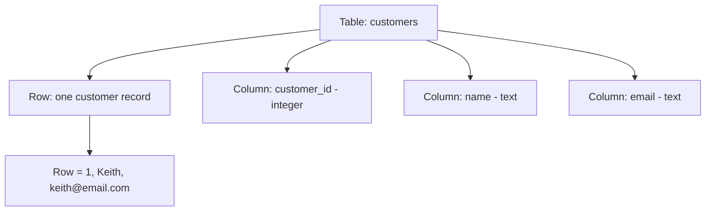

# Pillar 5 — Databases & Storage

## Section 1: Relational Databases & SQL Fundamentals

### Section Checklist

- [x] What a database is and why it exists
- [x] The relational model (tables, rows, columns, data types)
- [x] Primary keys — purpose and properties
- [x] SQL command families (DDL, DML, DQL, DCL)
- [x] CREATE TABLE syntax
- [x] INSERT syntax
- [x] SELECT syntax and core clauses (WHERE, ORDER BY, LIMIT)
- [x] Hands-on SQLite practice in Codespace
- [x] DevOps connection noted

---

## 1.1 What is a Database, Really?

A database is **organized, persistent storage** — a system that keeps data on disk (so it survives a restart) and lets you retrieve, add, change, or delete it in controlled ways.

You could store data in a plain text file, but databases solve three problems text files don't:

1. **Structure** — enforced schema (a defined shape for the data), instead of freeform text.
2. **Concurrency** — many users/programs reading and writing at once, safely, without corrupting data.
3. **Querying** — asking complex questions ("all orders over $50 from Nairobi customers") without custom parsing code.

## 1.2 The Relational Model

A **relational database** organizes data into **tables** (aka relations):

- **Row** = one record (one instance of a thing).
- **Column** = one attribute (a property every record has).
- Each column has an enforced **data type** (integer, text, date, boolean, etc.).



**Example — `customers` table:**

| customer_id | name  | email           |
| ----------- | ----- | --------------- |
| 1           | Keith | keith@email.com |
| 2           | Amara | amara@email.com |

## 1.3 The Primary Key

A **primary key (PK)** is a column (or set of columns) that **uniquely identifies each row**. Rules:

- Must be unique across all rows.
- Can never be null (empty).

> **⚠️ Callout — Why not use "name" as a key?**
> Names collide (two people named Keith), can change (legal name change), and can be blank. A good primary key is stable, unique, and never changes — which is why systems typically use auto-incrementing integers or generated IDs instead of "real world" data.

## 1.4 SQL — Structured Query Language

**SQL (Structured Query Language)** is used to communicate with a relational database. It is **declarative** — you describe _what_ you want, not _how_ to retrieve it.

| Family                           | Purpose                 | Example commands                            |
| -------------------------------- | ----------------------- | ------------------------------------------- |
| DDL — Data Definition Language   | Define/change structure | `CREATE TABLE`, `ALTER TABLE`, `DROP TABLE` |
| DML — Data Manipulation Language | Change data             | `INSERT`, `UPDATE`, `DELETE`                |
| DQL — Data Query Language        | Read data               | `SELECT`                                    |
| DCL — Data Control Language      | Permissions             | `GRANT`, `REVOKE`                           |

## 1.5 Creating a Table (DDL)

```sql
CREATE TABLE customers (
    customer_id INTEGER PRIMARY KEY,
    name TEXT NOT NULL,
    email TEXT UNIQUE
);
```

- `customer_id INTEGER PRIMARY KEY` — integer column, uniquely identifies each row.
- `name TEXT NOT NULL` — text column, cannot be left empty.
- `email TEXT UNIQUE` — text column, no two rows may share a value.

> **⚠️ Callout — NOT NULL vs UNIQUE vs PRIMARY KEY**
>
> - `NOT NULL` — value required, duplicates allowed.
> - `UNIQUE` — duplicates forbidden, empty/null generally allowed.
> - `PRIMARY KEY` — required **and** unique, combined. Every table should have exactly one.

## 1.6 Inserting Data (DML)

```sql
INSERT INTO customers (customer_id, name, email)
VALUES (1, 'Keith', 'keith@email.com');
```

## 1.7 Querying Data (DQL) — `SELECT`

```sql
SELECT name, email
FROM customers
WHERE customer_id = 1;
```

Reads as: "Select the `name` and `email` columns, from the `customers` table, where `customer_id` equals 1."

| Clause     | Purpose       | Example                 |
| ---------- | ------------- | ----------------------- |
| `SELECT`   | which columns | `SELECT name, email`    |
| `FROM`     | which table   | `FROM customers`        |
| `WHERE`    | filter rows   | `WHERE customer_id = 1` |
| `ORDER BY` | sort results  | `ORDER BY name ASC`     |
| `LIMIT`    | cap row count | `LIMIT 10`              |

`SELECT *` = all columns. Fine for exploring, but real applications should name only needed columns.

## 1.8 Hands-On Practice (Codespace Terminal)

SQLite is a full relational database engine in a single file — no server setup needed.

```bash
# Check installation
sqlite3 --version

# Create and open a new database file
sqlite3 practice.db
```

Inside the `sqlite3` prompt:

```sql
CREATE TABLE customers (
    customer_id INTEGER PRIMARY KEY,
    name TEXT NOT NULL,
    email TEXT UNIQUE
);

INSERT INTO customers (customer_id, name, email)
VALUES (1, 'Keith', 'keith@email.com');

INSERT INTO customers (customer_id, name, email)
VALUES (2, 'Amara', 'amara@email.com');

SELECT * FROM customers;
```

### Progressive Exercises

1. Insert a third customer of your choice.
2. Select only the `name` column for all customers.
3. Select the customer where `customer_id = 2`.
4. Try inserting a customer with a `NULL` name — what happens?
5. Try inserting two customers with the same email — what happens?
6. Use `ORDER BY name DESC` to sort customers in reverse alphabetical order.

<details>
<summary>Answers</summary>

```sql
-- 1
INSERT INTO customers (customer_id, name, email) VALUES (3, 'Zainab', 'zainab@email.com');

-- 2
SELECT name FROM customers;

-- 3
SELECT * FROM customers WHERE customer_id = 2;

-- 4 — ERROR: "NOT NULL constraint failed: customers.name"
INSERT INTO customers (customer_id, name, email) VALUES (4, NULL, 'test@email.com');

-- 5 — ERROR: "UNIQUE constraint failed: customers.email"
INSERT INTO customers (customer_id, name, email) VALUES (5, 'Test', 'keith@email.com');

-- 6
SELECT * FROM customers ORDER BY name DESC;
```

</details>

Exit with `.quit`.

## 1.9 DevOps Connection

Almost every deployed application — web apps, APIs, CI/CD metadata stores — sits on a relational database. Understanding schemas and constraints here directly prepares for reading infrastructure-as-code database configs and debugging application connection issues later in Phase 2.

---

**Next section:** Section 2 — Joins & Relationships
