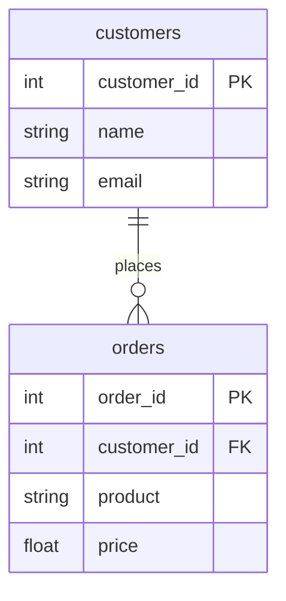
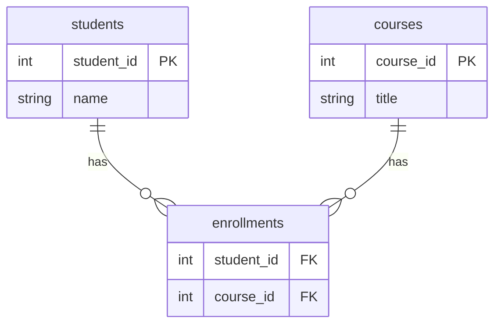
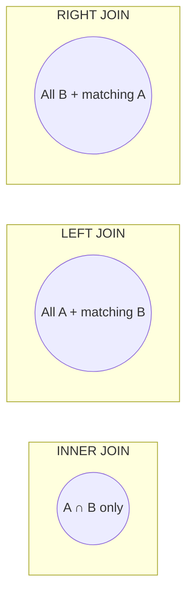

# Pillar 5 — Databases & Storage

## Section 2: Joins & Relationships

### Section Checklist

- [x] Why data is split across multiple tables (redundancy problem)
- [x] Foreign keys and referential integrity
- [x] Relationship types: one-to-many, many-to-many, one-to-one
- [x] Junction tables for many-to-many relationships
- [x] JOIN syntax and semantics
- [x] Join types: INNER, LEFT, RIGHT, FULL OUTER
- [x] SQLite-specific gotchas (foreign key enforcement, join support)
- [x] Hands-on practice
- [x] DevOps connection noted

---

## 2.1 Why Split Data into Multiple Tables?

A single flat table repeats data unnecessarily:

```
| order_id | customer_name | customer_email      | product | price |
|----------|----------------|---------------------|---------|-------|
| 1        | Keith          | keith@email.com     | Laptop  | 900   |
| 2        | Keith          | keith@email.com     | Mouse   | 20    |
```

"Keith" and his email repeat on every order — this is **redundancy**. Problems it causes:

- Update anomalies: changing Keith's email means updating every row; miss one and data becomes inconsistent.
- Wasted storage.

Fix: split into separate tables and **link them** using keys.

## 2.2 Foreign Keys

A **foreign key (FK)** is a column in one table that references the primary key of another table — representing "this row relates to that row" without duplicating data.

```sql
CREATE TABLE customers (
    customer_id INTEGER PRIMARY KEY,
    name TEXT NOT NULL,
    email TEXT UNIQUE
);

CREATE TABLE orders (
    order_id INTEGER PRIMARY KEY,
    customer_id INTEGER,
    product TEXT NOT NULL,
    price REAL NOT NULL,
    FOREIGN KEY (customer_id) REFERENCES customers(customer_id)
);
```

`orders.customer_id` stores only a reference (the ID) back to `customers` — Keith's info lives in exactly one place.



`||--o{` reads as: **one** customer relates to **zero or many** orders — a **one-to-many relationship**, the most common type.

> **⚠️ Callout — Referential integrity**
> A foreign key constraint prevents "orphaned" data: you cannot insert an order referencing a `customer_id` that doesn't exist in `customers`. The database rejects such inserts automatically (when enforcement is enabled — see SQLite gotcha below).

## 2.3 Relationship Types

| Type         | Meaning                                      | Example                      |
| ------------ | -------------------------------------------- | ---------------------------- |
| One-to-many  | One row in A relates to many rows in B       | One customer → many orders   |
| Many-to-many | Many rows in A relate to many rows in B      | Many students ↔ many courses |
| One-to-one   | One row in A relates to exactly one row in B | One person → one passport    |

**Many-to-many** relationships require a **junction table** (join table), since a foreign key column can only point to one row at a time.



`enrollments` holds two foreign keys — one to `students`, one to `courses`. Each row means "this student is enrolled in this course."

## 2.4 The JOIN — Combining Tables in a Query

A `JOIN` queries across tables as if they were one, matching foreign keys to primary keys.

```sql
SELECT customers.name, orders.product, orders.price
FROM customers
JOIN orders ON customers.customer_id = orders.customer_id;
```

Result:

| name  | product | price |
| ----- | ------- | ----- |
| Keith | Laptop  | 900   |
| Keith | Mouse   | 20    |

### 2.4.1 Types of Joins

| Join type                 | Returns                                                                      |
| ------------------------- | ---------------------------------------------------------------------------- |
| `INNER JOIN` (aka `JOIN`) | Only rows that match in both tables                                          |
| `LEFT JOIN`               | All rows from the left table, plus matches from the right (unmatched = NULL) |
| `RIGHT JOIN`              | All rows from the right table, plus matches from the left (unmatched = NULL) |
| `FULL OUTER JOIN`         | All rows from both tables, matched where possible                            |



If a customer has zero orders, `INNER JOIN` omits them entirely. `LEFT JOIN` still shows the customer, with `NULL` in the order columns:

```sql
SELECT customers.name, orders.product
FROM customers
LEFT JOIN orders ON customers.customer_id = orders.customer_id;
```

| name  | product |
| ----- | ------- |
| Keith | Laptop  |
| Keith | Mouse   |
| Amara | NULL    |

> **⚠️ Callout — SQLite and RIGHT/FULL JOIN**
> Older SQLite versions don't support `RIGHT JOIN` or `FULL OUTER JOIN` consistently. Workaround: a `RIGHT JOIN` from A to B is equivalent to a `LEFT JOIN` from B to A — flip the table order.

## 2.5 Hands-On Practice

```bash
sqlite3 practice.db
```

```sql
CREATE TABLE orders (
    order_id INTEGER PRIMARY KEY,
    customer_id INTEGER,
    product TEXT NOT NULL,
    price REAL NOT NULL,
    FOREIGN KEY (customer_id) REFERENCES customers(customer_id)
);

INSERT INTO orders (order_id, customer_id, product, price) VALUES (1, 1, 'Laptop', 900);
INSERT INTO orders (order_id, customer_id, product, price) VALUES (2, 1, 'Mouse', 20);
```

### Progressive Exercises

1. Write an `INNER JOIN` to list every order alongside the customer's name.
2. Write a `LEFT JOIN` from `customers` to `orders` so every customer shows, even those with no orders.
3. Try inserting an order with `customer_id = 999` (a customer that doesn't exist) — what happens?
4. Add a `WHERE` clause to your join query to show only orders over $50.
5. Design your own many-to-many junction table (e.g., books and authors).

<details>
<summary>Answers</summary>

```sql
-- 1
SELECT customers.name, orders.product, orders.price
FROM customers
JOIN orders ON customers.customer_id = orders.customer_id;

-- 2
SELECT customers.name, orders.product
FROM customers
LEFT JOIN orders ON customers.customer_id = orders.customer_id;

-- 3 — ERROR (if foreign keys enforced): "FOREIGN KEY constraint failed"
-- Note: SQLite requires PRAGMA foreign_keys = ON; to enforce this!
INSERT INTO orders (order_id, customer_id, product, price) VALUES (3, 999, 'Keyboard', 40);

-- 4
SELECT customers.name, orders.product, orders.price
FROM customers
JOIN orders ON customers.customer_id = orders.customer_id
WHERE orders.price > 50;

-- 5 — example: books and authors (many-to-many)
CREATE TABLE authors (author_id INTEGER PRIMARY KEY, name TEXT);
CREATE TABLE books (book_id INTEGER PRIMARY KEY, title TEXT);
CREATE TABLE book_authors (
    book_id INTEGER,
    author_id INTEGER,
    FOREIGN KEY (book_id) REFERENCES books(book_id),
    FOREIGN KEY (author_id) REFERENCES authors(author_id)
);
```

</details>

> **⚠️ Practical gotcha:** SQLite does **not** enforce foreign keys by default. Run `PRAGMA foreign_keys = ON;` at the start of each session, or constraint violations will silently succeed instead of erroring.

## 2.6 DevOps Connection

Most production bugs around "duplicate data" or "orphaned records" trace back to missing or misunderstood foreign key relationships. This mirrors how infrastructure-as-code tools (Terraform/Ansible) model relationships — e.g., a server referencing a security group by ID rather than duplicating its rules — the same "reference by key, not by copy" principle.

---

**Next section:** Section 3 — Normalization
