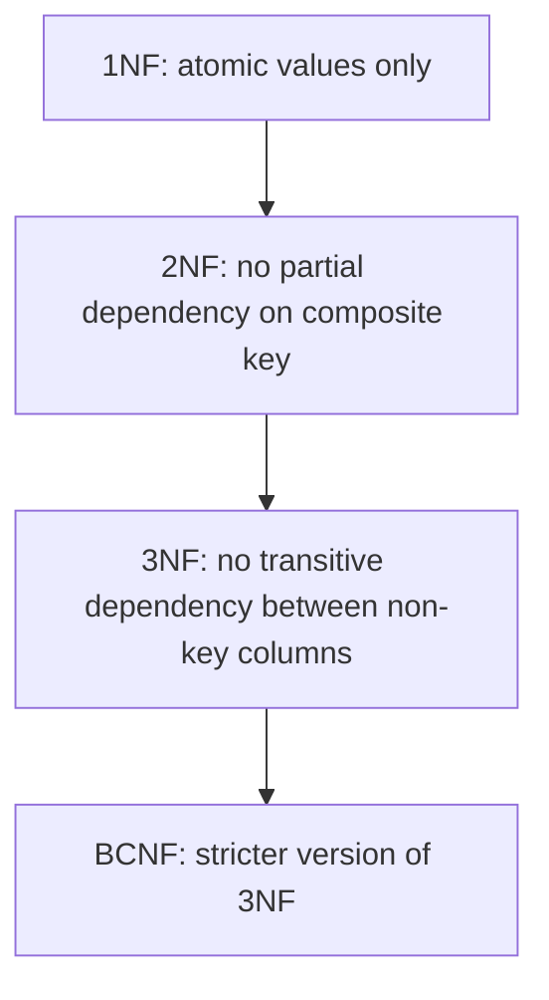

# Pillar 5 — Databases & Storage

## Section 3: Normalization

### Section Checklist

- [x] What normalization is and why it exists
- [x] The three anomalies (update, insert, delete)
- [x] First Normal Form (1NF) — atomic values
- [x] Second Normal Form (2NF) — partial dependency
- [x] Third Normal Form (3NF) — transitive dependency
- [x] Boyce-Codd Normal Form (BCNF) — brief overview
- [x] Normalization vs denormalization trade-off
- [x] Hands-on practice
- [x] DevOps connection noted

---

## 3.1 What is Normalization?

**Normalization** is the process of organizing tables to reduce redundancy and prevent data inconsistency. It's a series of formal rules ("normal forms") applied step by step, each fixing a specific class of problem.

## 3.2 The Problems Normalization Fixes: Anomalies

| Anomaly            | What happens                                                                                |
| ------------------ | ------------------------------------------------------------------------------------------- |
| **Update anomaly** | Same fact stored in multiple rows; updating one place but not others creates contradictions |
| **Insert anomaly** | Can't add a new fact without also having unrelated data available                           |
| **Delete anomaly** | Deleting one record accidentally destroys unrelated information                             |

## 3.3 First Normal Form (1NF)

**Rule:** Every column must hold a single, atomic (indivisible) value — no lists, no repeating groups.

**Violation example:**

| order_id | customer | products                |
| -------- | -------- | ----------------------- |
| 1        | Keith    | Laptop, Mouse, Keyboard |

The `products` column crams multiple values into one field, breaking querying (can't easily ask "which orders contain a Mouse?").

**Fixed (1NF-compliant):**

| order_id | customer | product  |
| -------- | -------- | -------- |
| 1        | Keith    | Laptop   |
| 1        | Keith    | Mouse    |
| 1        | Keith    | Keyboard |

Each row now holds one atomic value.

## 3.4 Second Normal Form (2NF)

**Rule:** Must already be in 1NF, AND every non-key column must depend on the **whole** primary key — not just part of it. This only matters with a **composite primary key** (a primary key made of more than one column).

**Violation example** — composite key `(order_id, product_id)`:

| order_id | product_id | product_name | quantity |
| -------- | ---------- | ------------ | -------- |
| 1        | 101        | Laptop       | 1        |
| 1        | 102        | Mouse        | 2        |

`product_name` depends only on `product_id`, not on the full composite key — a **partial dependency**, violating 2NF. If "Laptop" is renamed, every order row referencing product 101 must be updated.

**Fixed (2NF-compliant):**

```sql
CREATE TABLE products (
    product_id INTEGER PRIMARY KEY,
    product_name TEXT
);

CREATE TABLE order_items (
    order_id INTEGER,
    product_id INTEGER,
    quantity INTEGER,
    PRIMARY KEY (order_id, product_id),
    FOREIGN KEY (product_id) REFERENCES products(product_id)
);
```

`product_name` now lives in exactly one place.

## 3.5 Third Normal Form (3NF)

**Rule:** Must already be in 2NF, AND no non-key column may depend on another non-key column (only on the primary key) — eliminating **transitive dependencies**.

**Violation example:**

| customer_id | name  | zip_code | city    |
| ----------- | ----- | -------- | ------- |
| 1           | Keith | 00100    | Nairobi |

`city` depends on `zip_code`, not directly on `customer_id` — a transitive dependency (customer_id → zip_code → city). If zip code changes but city isn't updated, a contradiction results.

**Fixed (3NF-compliant):**

```sql
CREATE TABLE zip_codes (
    zip_code TEXT PRIMARY KEY,
    city TEXT
);

CREATE TABLE customers (
    customer_id INTEGER PRIMARY KEY,
    name TEXT,
    zip_code TEXT,
    FOREIGN KEY (zip_code) REFERENCES zip_codes(zip_code)
);
```



## 3.6 Boyce-Codd Normal Form (BCNF)

**Rule:** A stricter version of 3NF. For every functional dependency (A → B, "A determines B"), A must be a **candidate key** (a column or set of columns that could serve as a primary key).

3NF has a loophole BCNF closes: it's possible to satisfy 3NF while a non-candidate-key column still determines another column, if the determining column is part of an overlapping composite key. Rare in practice — most schema design stops at 3NF; BCNF is included for completeness and exam relevance.

> **⚠️ Callout — Normalization is a trade-off, not a law**
> Full normalization minimizes redundancy but increases joins needed per query. In high-read-volume systems, engineers sometimes deliberately **denormalize** (reintroduce redundancy) to improve read performance. Revisited in Section 7 (Caching).

## 3.7 Summary Table

| Normal Form | Fixes                  | Rule                                                        |
| ----------- | ---------------------- | ----------------------------------------------------------- |
| 1NF         | Multi-valued columns   | Atomic values only                                          |
| 2NF         | Partial dependency     | Non-key columns depend on the _whole_ composite key         |
| 3NF         | Transitive dependency  | Non-key columns depend _only_ on the key, not on each other |
| BCNF        | Rare edge cases in 3NF | Every determinant must be a candidate key                   |

## 3.8 Hands-On Practice

```bash
sqlite3 practice.db
```

Given this **unnormalized** table, normalize it yourself:

| student_id | student_name | course_id | course_name | instructor  | instructor_office |
| ---------- | ------------ | --------- | ----------- | ----------- | ----------------- |
| 1          | Zainab       | C1        | Databases   | Dr. Otieno  | Room 4B           |
| 1          | Zainab       | C2        | Networking  | Dr. Wanjiru | Room 2A           |

### Progressive Exercises

1. Identify the transitive dependency (hint: what does instructor_office depend on?).
2. Split this into 3NF-compliant tables (students, courses, instructors, enrollments).
3. Write the `CREATE TABLE` statements for your normalized design.
4. Write a query using `JOIN`s that reconstructs the original flat view.
5. Note one scenario where you'd deliberately denormalize this design.

<details>
<summary>Answers</summary>

```sql
-- 1
-- instructor_office depends on `instructor`, not on `student_id` or `course_id` directly — transitive dependency.

-- 2 & 3
CREATE TABLE instructors (
    instructor_name TEXT PRIMARY KEY,
    office TEXT
);

CREATE TABLE courses (
    course_id TEXT PRIMARY KEY,
    course_name TEXT,
    instructor_name TEXT,
    FOREIGN KEY (instructor_name) REFERENCES instructors(instructor_name)
);

CREATE TABLE students (
    student_id INTEGER PRIMARY KEY,
    student_name TEXT
);

CREATE TABLE enrollments (
    student_id INTEGER,
    course_id TEXT,
    PRIMARY KEY (student_id, course_id),
    FOREIGN KEY (student_id) REFERENCES students(student_id),
    FOREIGN KEY (course_id) REFERENCES courses(course_id)
);

-- 4
SELECT students.student_name, courses.course_name, instructors.instructor_name, instructors.office
FROM enrollments
JOIN students ON enrollments.student_id = students.student_id
JOIN courses ON enrollments.course_id = courses.course_id
JOIN instructors ON courses.instructor_name = instructors.instructor_name;

-- 5
-- If read millions of times per second on a dashboard and rarely changed, denormalizing
-- (storing instructor + office directly on the course row) avoids an extra join and speeds
-- up reads, at the cost of needing multi-row updates if an instructor changes office.
```

</details>

## 3.9 DevOps Connection

Poorly normalized production databases are a common source of data drift bugs — e.g., a config value stored in two places falling out of sync. This mirrors the IaC principle of a single source of truth: one Terraform state file, not scattered manual changes.

---

**Next section:** Section 4 — Indexing
