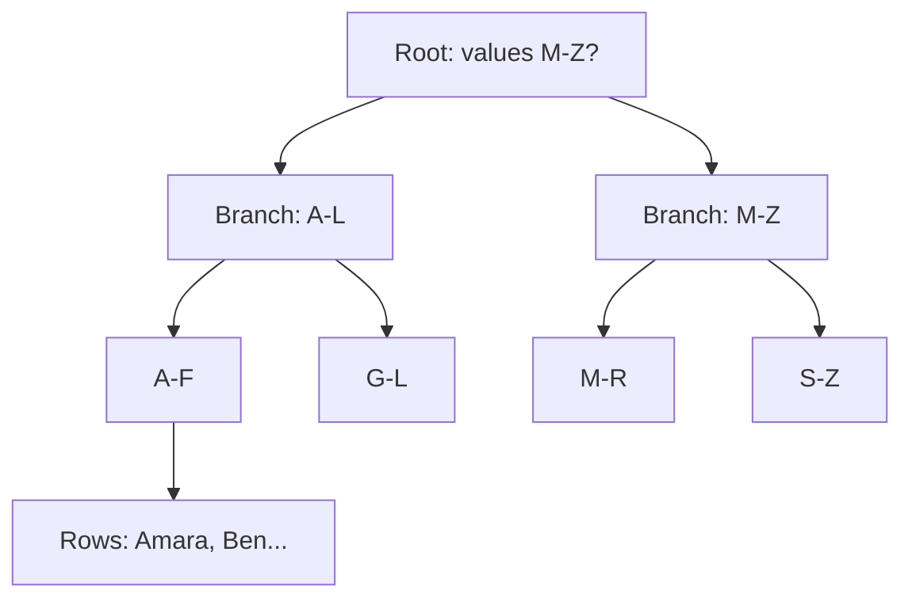
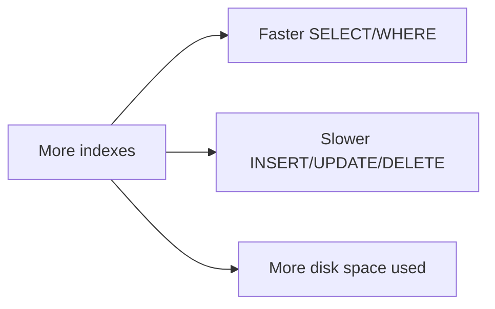

# Pillar 5 — Databases & Storage

## Section 4: Indexing

### Section Checklist

- [x] The full table scan problem
- [x] What an index is and how it's created
- [x] B-Tree structure and why it's fast (O(log n) vs O(n))
- [x] The read/write trade-off of indexes
- [x] Index types: B-Tree, Hash, Composite, Unique
- [x] Composite index column ordering
- [x] Reading query plans with EXPLAIN
- [x] Hands-on practice
- [x] DevOps connection noted

---

## 4.1 The Problem: Searching Without an Index

Running `SELECT * FROM customers WHERE email = 'keith@email.com';` requires the database to find matching rows. Without help, it performs a **full table scan** — checking every row one by one.

For 10 rows, that's instant. For 50 million rows, that's an enormous amount of work per query.

## 4.2 What is an Index?

An **index** is a separate data structure letting the database jump straight to needed rows instead of scanning everything — like a textbook's index: instead of reading every page to find "normalization," you look it up and jump straight to page 214.

```sql
CREATE INDEX idx_customers_email ON customers(email);
```

Now `WHERE email = '...'` queries can jump directly to matching rows.

> **⚠️ Callout — Primary keys are already indexed**
> Most database engines automatically index the primary key. That's why looking up a row by ID is fast by default — no manual indexing needed.

## 4.3 How Does an Index Actually Work? (B-Trees)

The most common index structure is a **B-Tree** (balanced tree) — a decision tree that narrows down where a value could be, level by level, instead of checking every row.



Instead of **O(n)** (linear time, growing proportionally with table size), a B-Tree lookup only traverses the tree's height — **O(log n)** (logarithmic time).

| Rows          | Full scan (worst case) | B-Tree index (approx) |
| ------------- | ---------------------- | --------------------- |
| 1,000         | 1,000                  | ~10                   |
| 1,000,000     | 1,000,000              | ~20                   |
| 1,000,000,000 | 1,000,000,000          | ~30                   |

This is why indexing matters enormously at scale, even though it's invisible at small scale.

## 4.4 The Trade-Off: Indexes Aren't Free

Indexes speed up reads (`SELECT`) but slow down writes (`INSERT`, `UPDATE`, `DELETE`) — every row change requires the index structure to be updated too. Indexes also consume extra disk space.



> **⚠️ Callout — Don't index everything**
> A common beginner mistake is indexing every column "just in case." In write-heavy systems (logging tables, high-frequency transaction tables), excessive indexing noticeably slows write throughput. Index columns frequently used in `WHERE`, `JOIN`, or `ORDER BY` clauses — not columns rarely queried.

## 4.5 Types of Indexes

| Index type       | Best for                                                      | Notes                                   |
| ---------------- | ------------------------------------------------------------- | --------------------------------------- |
| B-Tree (default) | Equality and range queries (`=`, `<`, `>`, `BETWEEN`)         | Most common, general-purpose            |
| Hash index       | Exact equality only (`=`)                                     | Faster for equality, useless for ranges |
| Composite index  | Queries filtering on multiple columns together                | Column order matters                    |
| Unique index     | Enforcing uniqueness (auto-created by `UNIQUE`/`PRIMARY KEY`) | Also speeds up lookups                  |

**Composite index example:**

```sql
CREATE INDEX idx_orders_customer_date ON orders(customer_id, order_date);
```

Helps queries filtering by `customer_id` alone, or `customer_id` AND `order_date` together — but **not** queries filtering by `order_date` alone. Column order matters: like a phone book sorted by last name then first name — great for "find Otieno," useless for "find everyone named Keith" regardless of last name.

## 4.6 Reading a Query Plan

Most databases support asking "how would you actually run this query?" via `EXPLAIN`:

```sql
EXPLAIN QUERY PLAN
SELECT * FROM customers WHERE email = 'keith@email.com';
```

Reveals whether the database used an index (`SEARCH ... USING INDEX`) or fell back to a full scan (`SCAN customers`) — the primary tool for diagnosing "why is this query slow?" in production systems.

## 4.7 Hands-On Practice

```bash
sqlite3 practice.db
```

```sql
-- Check current query plan (likely a full scan without an index)
EXPLAIN QUERY PLAN
SELECT * FROM customers WHERE email = 'keith@email.com';

-- Create an index
CREATE INDEX idx_customers_email ON customers(email);

-- Re-check the plan
EXPLAIN QUERY PLAN
SELECT * FROM customers WHERE email = 'keith@email.com';
```

### Progressive Exercises

1. Compare `EXPLAIN QUERY PLAN` output before and after creating the index — what changed?
2. Create an index on `orders.customer_id` and check if it changes the plan for a join query.
3. Create a composite index on `orders(customer_id, price)`.
4. Try `EXPLAIN QUERY PLAN` on a query filtering only by `price` — does the composite index get used? Why or why not?
5. Drop an index with `DROP INDEX idx_customers_email;` and confirm the plan reverts to a full scan.

<details>
<summary>Answers</summary>

```sql
-- 1
-- Before: "SCAN customers" (full table scan)
-- After: "SEARCH customers USING INDEX idx_customers_email (email=?)"

-- 2
CREATE INDEX idx_orders_customer ON orders(customer_id);
EXPLAIN QUERY PLAN
SELECT * FROM orders JOIN customers ON orders.customer_id = customers.customer_id;

-- 3
CREATE INDEX idx_orders_customer_price ON orders(customer_id, price);

-- 4
EXPLAIN QUERY PLAN
SELECT * FROM orders WHERE price > 50;
-- Likely still a full scan — the composite index is ordered by customer_id first,
-- so it can't efficiently filter on price alone (like a phone book: can't find
-- "everyone named Keith" from a last-name-first index).

-- 5
DROP INDEX idx_customers_email;
EXPLAIN QUERY PLAN
SELECT * FROM customers WHERE email = 'keith@email.com';
-- Reverts to "SCAN customers"
```

</details>

## 4.8 DevOps Connection

Slow database queries are among the most common root causes of production incidents and are typically the first thing investigated during performance troubleshooting. Understanding indexing is essential groundwork before working with database monitoring dashboards later — you need to know what "slow query" alerts are actually telling you.

---

**Next section:** Section 5 — ACID Transactions
