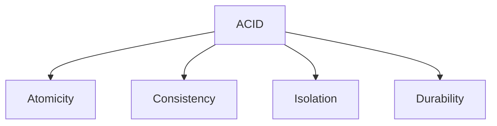
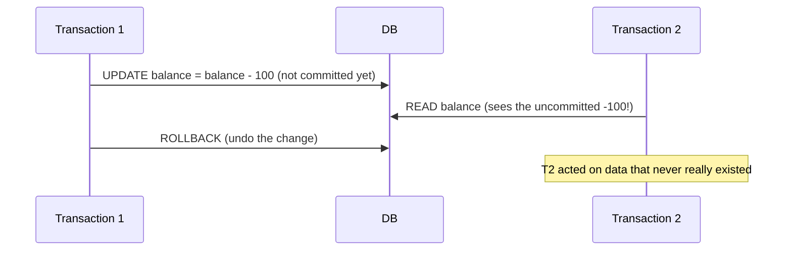

# Pillar 5 — Databases & Storage

## Section 5: ACID Transactions

### Section Checklist

- [x] What a transaction is
- [x] Atomicity
- [x] Consistency
- [x] Isolation (including dirty reads and isolation levels)
- [x] Durability (write-ahead logging)
- [x] SQL transaction syntax (BEGIN/COMMIT/ROLLBACK)
- [x] Hands-on practice
- [x] DevOps connection noted

---

## 5.1 What is a Transaction?

A **transaction** is a group of one or more database operations treated as a single, indivisible unit of work. Either **all** operations succeed, or **none** do — no in-between state.

**Classic example — bank transfer:**

```sql
BEGIN TRANSACTION;

UPDATE accounts SET balance = balance - 100 WHERE account_id = 1;  -- withdraw from Keith
UPDATE accounts SET balance = balance + 100 WHERE account_id = 2;  -- deposit to Amara

COMMIT;
```

If power fails after the first `UPDATE` but before the second, without transactions Keith loses $100 and Amara never receives it — money vanishes. A transaction guarantees this can't happen.

## 5.2 ACID — The Four Guarantees

**ACID** describes the four properties a reliable transaction system must guarantee.



### 5.2.1 Atomicity

**All operations in a transaction succeed together, or none do.** If any statement fails, the entire transaction rolls back (undoes) as if it never happened.

```sql
BEGIN TRANSACTION;
UPDATE accounts SET balance = balance - 100 WHERE account_id = 1;
-- something fails here, e.g. a constraint violation
ROLLBACK;  -- undoes the withdrawal above too
```

### 5.2.2 Consistency

**A transaction can only move the database from one valid state to another valid state** — it must not violate any defined rules (constraints, foreign keys, data types). A transaction that would break a rule is rejected entirely.

Example: with a `CHECK (balance >= 0)` constraint, a transaction pushing a balance negative is rejected — the database never enters an invalid state, even temporarily.

### 5.2.3 Isolation

**Concurrent transactions shouldn't interfere with each other**, even running simultaneously. Each transaction behaves as if it's the only one running.

**Problem this solves — the "dirty read":**



Without isolation, Transaction 2 could read a value Transaction 1 later rolls back — a **dirty read**.

**Isolation levels** (weakest/fastest to strongest/slowest):

| Level            | Prevents                          | Allows                                      |
| ---------------- | --------------------------------- | ------------------------------------------- |
| Read Uncommitted | Nothing                           | Dirty reads                                 |
| Read Committed   | Dirty reads                       | Non-repeatable reads                        |
| Repeatable Read  | Dirty reads, non-repeatable reads | Phantom reads                               |
| Serializable     | Everything                        | Transactions behave as if run one-at-a-time |

> **⚠️ Callout — Isolation is a trade-off**
> Stricter isolation (Serializable) is safest but slowest, requiring more aggressive locking. Weaker isolation (Read Committed) is faster but risks certain anomalies. Most production systems default to Read Committed as a practical middle ground.

### 5.2.4 Durability

**Once a transaction is committed, it survives even if the database crashes immediately after.** The change is written to permanent, non-volatile storage before the commit is confirmed.

Typically implemented via a **write-ahead log (WAL)** — every change is written to a durable log file _before_ being applied to main data files, so a crash mid-write can be recovered by replaying the log on restart.

## 5.3 Putting it Together — SQL Transaction Syntax

```sql
BEGIN TRANSACTION;

UPDATE accounts SET balance = balance - 100 WHERE account_id = 1;
UPDATE accounts SET balance = balance + 100 WHERE account_id = 2;

COMMIT;   -- makes changes permanent
-- or:
ROLLBACK; -- undoes everything since BEGIN TRANSACTION
```

| Command             | Effect                                        |
| ------------------- | --------------------------------------------- |
| `BEGIN TRANSACTION` | Start a new transaction                       |
| `COMMIT`            | Make all changes in the transaction permanent |
| `ROLLBACK`          | Undo all changes since the transaction began  |

## 5.4 Hands-On Practice

```bash
sqlite3 practice.db
```

```sql
CREATE TABLE accounts (
    account_id INTEGER PRIMARY KEY,
    owner TEXT,
    balance REAL CHECK (balance >= 0)
);

INSERT INTO accounts (account_id, owner, balance) VALUES (1, 'Keith', 500);
INSERT INTO accounts (account_id, owner, balance) VALUES (2, 'Amara', 200);
```

### Progressive Exercises

1. Run a transaction that transfers $100 from Keith to Amara, then `COMMIT` it. Verify both balances.
2. Start a transaction that would push Keith's balance negative (e.g., withdraw $10,000) — what happens, given the `CHECK` constraint?
3. Start a transaction, make a change, then `ROLLBACK` instead of `COMMIT` — verify the change did NOT persist.
4. Open two separate `sqlite3` sessions on `practice.db` at once. In session A, `BEGIN TRANSACTION` and update a balance without committing. In session B, try to read or update the same row — what happens?
5. Explain in your own words why `CHECK (balance >= 0)` is a **Consistency** guarantee, not an Atomicity one.

<details>
<summary>Answers</summary>

```sql
-- 1
BEGIN TRANSACTION;
UPDATE accounts SET balance = balance - 100 WHERE account_id = 1;
UPDATE accounts SET balance = balance + 100 WHERE account_id = 2;
COMMIT;
SELECT * FROM accounts;

-- 2
BEGIN TRANSACTION;
UPDATE accounts SET balance = balance - 10000 WHERE account_id = 1;
-- ERROR: CHECK constraint failed: balance >= 0
-- The entire transaction is rejected; balance remains unchanged.

-- 3
BEGIN TRANSACTION;
UPDATE accounts SET balance = balance + 50 WHERE account_id = 1;
ROLLBACK;
SELECT * FROM accounts;
-- balance is unchanged, as if the UPDATE never happened

-- 4
-- Session A: BEGIN TRANSACTION; UPDATE accounts SET balance = balance - 50 WHERE account_id = 1;
-- Session B: attempts to UPDATE the same row typically block/wait, or get a "database is locked"
-- error, until Session A commits or rolls back — SQLite's default locking enforcing isolation.

-- 5
-- CHECK (balance >= 0) is a Consistency guarantee because it defines a RULE about what counts
-- as a valid database state (no negative balances). Atomicity is about whether the whole
-- transaction succeeds or fails together — Consistency is about whether the resulting state
-- obeys the rules at all. The CHECK constraint causes the transaction to be rejected, and
-- Atomicity ensures that rejection undoes everything, not just part of it.
```

</details>

## 5.5 DevOps Connection

Understanding transactions and isolation levels is essential when diagnosing "why did this deploy corrupt data" or "why do two services see different values for the same record" incidents. Database locking behavior (exercise 4) is also a common cause of application timeouts under load — a frequent on-call troubleshooting scenario.

---

**Next section:** Section 6 — NoSQL Data Models & CAP Theorem
