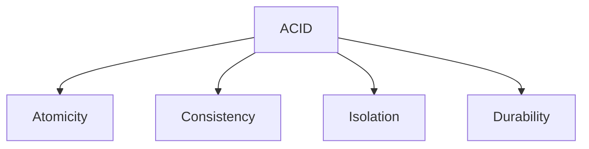
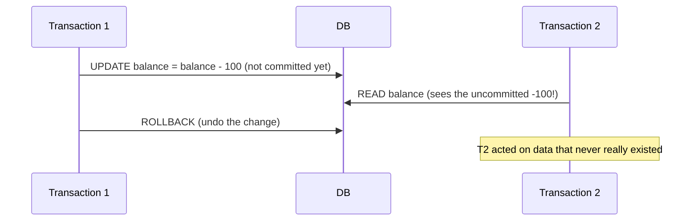

# Pillar 5 — Databases & Storage

## Section 5: ACID Transactions

### Section Checklist

- [x] What a transaction is
- [x] Atomicity
- [x] Consistency
- [x] Isolation (including dirty reads and isolation levels)
- [x] Durability (write-ahead logging)
- [x] SQL transaction syntax (BEGIN/COMMIT/ROLLBACK)
- [x] Hands-on practice
- [x] DevOps connection noted

---

## 5.1 What is a Transaction?

A **transaction** is a group of one or more database operations treated as a single, indivisible unit of work. Either **all** operations succeed, or **none** do — no in-between state.

**Classic example — bank transfer:**

```sql
BEGIN TRANSACTION;

UPDATE accounts SET balance = balance - 100 WHERE account_id = 1;  -- withdraw from Keith
UPDATE accounts SET balance = balance + 100 WHERE account_id = 2;  -- deposit to Amara

COMMIT;
```

If power fails after the first `UPDATE` but before the second, without transactions Keith loses $100 and Amara never receives it — money vanishes. A transaction guarantees this can't happen.

---

## 5.2 ACID — The Four Guarantees

**ACID** describes the four properties a reliable transaction system must guarantee.



### 5.2.1 Atomicity

**All operations in a transaction succeed together, or none do.** If any statement fails, the entire transaction rolls back (undoes) as if it never happened.

```sql
BEGIN TRANSACTION;
UPDATE accounts SET balance = balance - 100 WHERE account_id = 1;
-- something fails here, e.g. a constraint violation
ROLLBACK;  -- undoes the withdrawal above too
```

### 5.2.2 Consistency

**A transaction can only move the database from one valid state to another valid state** — it must not violate any defined rules (constraints, foreign keys, data types). A transaction that would break a rule is rejected entirely.

Example: with a `CHECK (balance >= 0)` constraint, a transaction pushing a balance negative is rejected — the database never enters an invalid state, even temporarily.

> **💡 Nuance:** In most databases, a constraint violation fails the _statement_, not the entire transaction. You can choose to `ROLLBACK` or continue with other operations after handling the error. However, the key point remains — the invalid state is never committed.

### 5.2.3 Isolation

**Concurrent transactions shouldn't interfere with each other**, even running simultaneously. Each transaction behaves as if it's the only one running.

**Problem this solves — the "dirty read":**



Without isolation, Transaction 2 could read a value Transaction 1 later rolls back — a **dirty read**.

**Isolation levels** (weakest/fastest to strongest/slowest):

| Level            | Prevents                          | Anomalies Still Possible                         |
| ---------------- | --------------------------------- | ------------------------------------------------ |
| Read Uncommitted | Nothing                           | Dirty reads, non-repeatable reads, phantom reads |
| Read Committed   | Dirty reads                       | Non-repeatable reads, phantom reads              |
| Repeatable Read  | Dirty reads, non-repeatable reads | Phantom reads                                    |
| Serializable     | Everything                        | None (true serializability)                      |

> **⚠️ Callout — Isolation is a trade-off**
> Stricter isolation (Serializable) is safest but slowest, requiring more aggressive locking. Weaker isolation (Read Committed) is faster but risks certain anomalies. Most production systems default to Read Committed as a practical middle ground.

> **📘 Deep Dive — MVCC (Multi-Version Concurrency Control)**
> Many modern databases (PostgreSQL, MySQL/InnoDB, Oracle) implement isolation using MVCC rather than simple locking. Instead of blocking readers for writers, MVCC maintains multiple versions of each row. Readers see a consistent snapshot of the database at the moment their transaction began, without waiting for writers to release locks. This provides excellent performance for read-heavy workloads while still preventing dirty reads.

> **⚠️ Advanced Note — Serializable Nuance**
> Some databases advertise "Serializable" isolation but implement **Serializable Snapshot Isolation (SSI)** , which isn't true serializability in all edge cases (e.g., write skew). PostgreSQL's SSI catches most anomalies but isn't perfect. True serializability typically requires significant performance overhead — another reason many production systems stick with Read Committed or Repeatable Read.

### 5.2.4 Durability

**Once a transaction is committed, it survives even if the database crashes immediately after.** The change is written to permanent, non-volatile storage before the commit is confirmed.

**How it works — Write-Ahead Logging (WAL):**

Every change is first written to a sequential, append-only log file on durable storage _before_ being applied to the main data files. Here's why this matters:

1. **Crash recovery:** If the database crashes mid-write, it replays the WAL on restart to reconstruct any changes that were committed but not yet flushed to data files.
2. **Performance:** Writes to the log are sequential (fast) rather than random I/O to data files (slow).
3. **Atomicity support:** The WAL also stores undo information, enabling rollback of uncommitted transactions.

```
Operation flow:
1. Transaction begins
2. Change is written to WAL (durable)
3. Change is applied to in-memory buffer
4. On COMMIT, WAL is flushed to disk (fsync)
5. Acknowledgment sent to client
6. Later, dirty pages are written to data files (checkpoint)
```

If a crash occurs between steps 4 and 6, the WAL ensures the committed change is recovered. If a crash occurs before step 4, the transaction is simply replayed from the last checkpoint — no partial changes.

---

## 5.3 Putting it Together — SQL Transaction Syntax

```sql
BEGIN TRANSACTION;   -- or just BEGIN in some databases

UPDATE accounts SET balance = balance - 100 WHERE account_id = 1;
UPDATE accounts SET balance = balance + 100 WHERE account_id = 2;

COMMIT;   -- makes changes permanent
-- or:
ROLLBACK; -- undoes everything since BEGIN TRANSACTION
```

| Command             | Effect                                        |
| ------------------- | --------------------------------------------- |
| `BEGIN TRANSACTION` | Start a new transaction                       |
| `COMMIT`            | Make all changes in the transaction permanent |
| `ROLLBACK`          | Undo all changes since the transaction began  |

> **ℹ️ Note:** SQLite accepts `BEGIN TRANSACTION` or simply `BEGIN`. PostgreSQL accepts both. MySQL requires `START TRANSACTION` or `BEGIN` (but not `BEGIN TRANSACTION` in all contexts). Always check your database's syntax.

---

## 5.4 Hands-On Practice

```bash
sqlite3 practice.db
```

```sql
CREATE TABLE accounts (
    account_id INTEGER PRIMARY KEY,
    owner TEXT,
    balance REAL CHECK (balance >= 0)
);

INSERT INTO accounts (account_id, owner, balance) VALUES (1, 'Keith', 500);
INSERT INTO accounts (account_id, owner, balance) VALUES (2, 'Amara', 200);
```

### Progressive Exercises

1. Run a transaction that transfers $100 from Keith to Amara, then `COMMIT` it. Verify both balances.

2. Start a transaction that would push Keith's balance negative (e.g., withdraw $10,000) — what happens, given the `CHECK` constraint?

3. Start a transaction, make a change, then `ROLLBACK` instead of `COMMIT` — verify the change did NOT persist.

4. Open two separate `sqlite3` sessions on `practice.db` at once. In session A, `BEGIN TRANSACTION` and update a balance without committing. In session B, try to read or update the same row — what happens?

   > **📘 Context:** SQLite uses **database-level locking** for write operations — Session B will get `database is locked` immediately. Other databases behave differently:
   >
   > - **PostgreSQL** uses row-level locking with MVCC — Session B can _read_ the old version but will _block_ on writes until Session A commits or rolls back.
   > - **MySQL/InnoDB** uses row-level locking — similar to PostgreSQL, reads see the old version, writes block.
   >   This behavior is why understanding your database's locking model matters for production performance tuning.

5. Explain in your own words why `CHECK (balance >= 0)` is a **Consistency** guarantee, not an Atomicity one.

<details>
<summary>Answers</summary>

```sql
-- 1
BEGIN TRANSACTION;
UPDATE accounts SET balance = balance - 100 WHERE account_id = 1;
UPDATE accounts SET balance = balance + 100 WHERE account_id = 2;
COMMIT;
SELECT * FROM accounts;

-- 2
BEGIN TRANSACTION;
UPDATE accounts SET balance = balance - 10000 WHERE account_id = 1;
-- ERROR: CHECK constraint failed: balance >= 0
-- The statement fails; you can ROLLBACK or continue with other operations.
-- If you COMMIT after handling the error, no change was made to Keith's balance.
-- The invalid state is never committed.

-- 3
BEGIN TRANSACTION;
UPDATE accounts SET balance = balance + 50 WHERE account_id = 1;
ROLLBACK;
SELECT * FROM accounts;
-- balance is unchanged, as if the UPDATE never happened

-- 4
-- Session A: BEGIN TRANSACTION; UPDATE accounts SET balance = balance - 50 WHERE account_id = 1;
-- Session B: attempts to UPDATE the same row typically gets "database is locked" in SQLite.
-- In PostgreSQL/MySQL, the write would block until Session A commits or rolls back.
-- Reads in PostgreSQL/MySQL would see the old value (MVCC snapshot).

-- 5
-- CHECK (balance >= 0) is a Consistency guarantee because it defines a RULE about what counts
-- as a valid database state (no negative balances). Atomicity is about whether the whole
-- transaction succeeds or fails together — Consistency is about whether the resulting state
-- obeys the rules at all. The CHECK constraint causes the statement (and typically the
-- transaction) to be rejected, and Atomicity ensures that if you ROLLBACK, everything is undone.
```

</details>

---

## 5.5 DevOps Connection

Understanding transactions and isolation levels is essential when diagnosing **"why did this deploy corrupt data"** or **"why do two services see different values for the same record"** incidents.

**Common real-world scenarios:**

| Problem                         | Root Cause                                                                                                          | Solution                                                                                              |
| ------------------------------- | ------------------------------------------------------------------------------------------------------------------- | ----------------------------------------------------------------------------------------------------- |
| Application timeouts under load | Long-running transactions holding locks; queries blocked by uncommitted writes                                      | Shorten transactions; use appropriate isolation level; index for faster queries                       |
| "Lost update" bugs              | Two transactions read the same value, modify it, and write back — second overwrites first without seeing the change | Use `SELECT ... FOR UPDATE`; increase isolation to Repeatable Read; use optimistic locking            |
| Stale reads in microservices    | Service A reads a value, Service B updates it, Service A reads again and sees old value (non-repeatable read)       | Use Read Committed or higher; consider eventual consistency trade-offs                                |
| Data corruption after restore   | Backup taken during an open transaction                                                                             | Use `pg_dump` with `--no-sync` flags or ensure transaction isolation; always use consistent snapshots |

**On-call troubleshooting checklist:**

1. Check for long-running transactions (`SELECT * FROM pg_stat_activity` in PostgreSQL)
2. Identify blocking locks (`pg_locks` in PostgreSQL; `SHOW ENGINE INNODB STATUS` in MySQL)
3. Consider lowering isolation level if strict consistency isn't required
4. Add retry logic with exponential backoff for transaction conflicts
5. Monitor WAL disk usage — a full WAL can halt all writes

---

**Next section:** Section 6 — NoSQL Data Models & CAP Theorem
