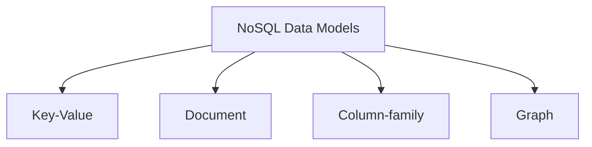
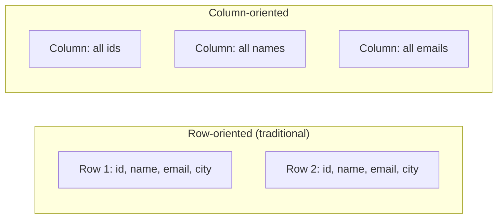
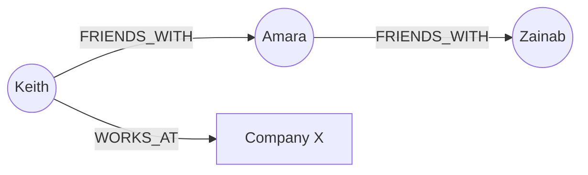
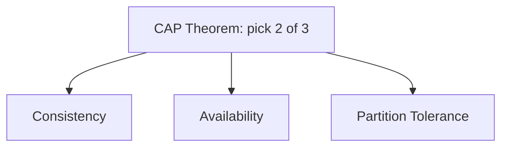
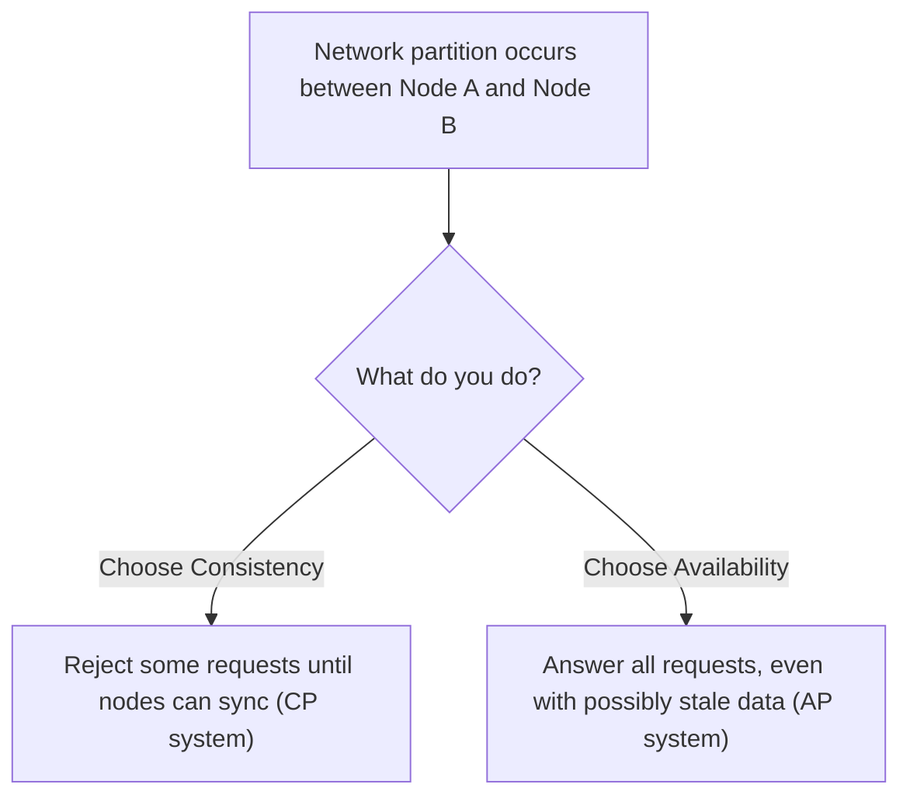

# Pillar 5 — Databases & Storage

## Section 6: NoSQL Data Models & CAP Theorem

### Section Checklist

- [x] Why NoSQL exists and what it relaxes
- [x] Key-Value stores
- [x] Document stores
- [x] Column-family stores
- [x] Graph databases
- [x] Model comparison table
- [x] CAP Theorem (Consistency, Availability, Partition Tolerance)
- [x] CP vs AP trade-off during partitions
- [x] Eventual consistency
- [x] Conceptual practice exercises
- [x] DevOps connection noted

---

## 6.1 Why Does NoSQL Exist?

Everything so far assumes a **relational** model: fixed schemas, tables, joins, ACID guarantees. This works extremely well for structured data with clear relationships, but has limits:

- Rigid schemas make storing wildly variable data (e.g., user profiles with different optional fields) painful.
- Joins across many tables get slow at massive scale, across many machines.
- Some workloads don't need strict consistency — they need to handle massive, distributed write volume instead.

**NoSQL** ("Not Only SQL") is an umbrella term for database models that intentionally relax some relational rules to gain flexibility or scale. It's several different data models, each suited to different problems.

## 6.2 The Four Common NoSQL Data Models



### 6.2.1 Key-Value Stores

The simplest model: every piece of data is a **key** paired with an opaque **value**. The database doesn't know or care what's inside the value.

```
key: "session:abc123"
value: "{user_id: 42, expires: 1720000000}"
```

Like a giant dictionary/hashmap. Extremely fast for simple lookups, but can't query _inside_ the value without extra tooling.

**Real-world examples:** Redis, Amazon DynamoDB (simplest usage), Memcached.

### 6.2.2 Document Stores

Stores data as **documents** — typically JSON-like structures — where each document can have a different shape, unlike a rigid SQL table.

```json
{
  "customer_id": 1,
  "name": "Keith",
  "interests": ["devops", "hiking"],
  "address": {
    "city": "Nairobi",
    "zip": "00100"
  }
}
```

This nests structure directly (array, nested object) — something a 1NF-compliant relational table isn't supposed to do. Different documents in the same collection can have entirely different fields.

**Real-world examples:** MongoDB, Couchbase, Amazon DocumentDB.

### 6.2.3 Column-Family Stores

Optimized for storing and reading **huge volumes of data organized by column rather than by row** — the opposite orientation from a normal relational table. Great for analytics workloads needing "just this one column across billions of rows."



**Real-world examples:** Apache Cassandra, HBase, Google Bigtable.

### 6.2.4 Graph Databases

Optimized for data fundamentally about **relationships/connections** — social networks, recommendation engines, fraud detection. Stores data as **nodes** (things) and **edges** (relationships), built for fast traversal rather than tabular queries.



Relational databases can model this via junction tables, but traversing many "hops" (friends of friends of friends) gets slow with repeated joins. Graph databases make deep traversal fast.

**Real-world examples:** Neo4j, Amazon Neptune.

## 6.3 Summary — Choosing a Model

| Model         | Good for                                                         | Real-world example                |
| ------------- | ---------------------------------------------------------------- | --------------------------------- |
| Relational    | Structured data, complex relationships, strong consistency needs | Banking, inventory systems        |
| Key-Value     | Simple, extremely fast lookups                                   | Session storage, caching          |
| Document      | Flexible/nested data, rapid schema evolution                     | User profiles, content management |
| Column-family | Massive scale, analytics on specific columns                     | Time-series data, IoT sensor data |
| Graph         | Deeply connected/relationship-heavy data                         | Social networks, fraud detection  |

> **⚠️ Callout — NoSQL usually trades consistency for scale**
> Most NoSQL systems relax ACID guarantees (especially strict consistency) in exchange for easier distribution across many machines and handling huge write volumes. A deliberate design trade-off, formalized by the CAP theorem below.

## 6.4 The CAP Theorem

When a database is **distributed** — spread across multiple machines/nodes, often in different physical locations — it's mathematically impossible to simultaneously guarantee all three:



| Property                | Meaning                                                                                                |
| ----------------------- | ------------------------------------------------------------------------------------------------------ |
| **C**onsistency         | Every read receives the most recent write (or an error) — all nodes see the same data at the same time |
| **A**vailability        | Every request receives a response (success or failure), even if some nodes are down                    |
| **P**artition Tolerance | The system keeps working even if network communication between nodes breaks down (a "partition")       |

**Key insight:** network partitions **will** happen (cables get cut, data centers lose connectivity, packets drop) — partition tolerance isn't really optional. In practice, the real choice is between **Consistency** and **Availability** _when a partition occurs_.



- **CP (Consistency + Partition Tolerance):** During a partition, the system refuses to respond rather than risk stale data. Example: many traditional relational databases configured for strong consistency, some MongoDB configurations.
- **AP (Availability + Partition Tolerance):** During a partition, the system keeps responding to every request, even if nodes temporarily disagree. Example: Cassandra, DynamoDB (by default).

> **⚠️ Callout — "Choose 2 of 3" is a simplification**
> C and A aren't perfectly binary during normal operation (no partition) — most systems provide both when healthy. CAP describes what you sacrifice _specifically during a network partition_. Useful mental model, but the nuance matters for real design discussions.

### 6.4.1 Eventual Consistency

A common middle ground for AP systems: **eventual consistency** — writes propagate to all nodes given enough time (no partition), so if writes stop, all replicas will _eventually_ converge. A relaxed guarantee compared to strict consistency's "every read sees the latest write, immediately."

## 6.5 Hands-On / Conceptual Practice

No local install needed — these exercises are conceptual/design-based, since experiencing multi-node partition behavior needs a real distributed cluster (touched later in Kubernetes/Docker Compose, Phase 2).

### Progressive Exercises

1. You're designing a shopping cart session store needing blazing-fast reads/writes with no complex queries. Which NoSQL model fits best, and why?
2. You're building a "recommended friends" feature for a social app. Which model fits best, and why?
3. A banking system absolutely cannot show a stale account balance. Would you lean CP or AP? Why?
4. A social media "like count" can be slightly out of date without real harm. Would you lean CP or AP? Why?
5. Explain in your own words why partition tolerance isn't really a "choice" in real distributed systems.

<details>
<summary>Answers</summary>

1. **Key-Value store.** Session data is a simple lookup by session ID, no need to query inside the value, and speed matters most.

2. **Graph database.** "Recommended friends" requires traversing relationships (friends-of-friends), which graph databases are purpose-built for.

3. **CP.** Showing a stale balance could mean someone spends money they don't have, or a transaction processes against outdated data — correctness matters more than always getting an instant response.

4. **AP.** A slightly stale like count is a harmless cosmetic issue; keeping the app responsive for every user matters more than perfect real-time accuracy.

5. Networks are physical and fallible — cables get cut, hardware fails, data centers lose connectivity. A truly distributed system cannot guarantee this never happens, so "not tolerating partitions" effectively means the system fails outright whenever a partition occurs — not a realistic design choice. The real design decision is what to do _when_ (not if) a partition happens.
</details>

## 6.6 DevOps Connection

Choosing between SQL and NoSQL, and understanding CAP trade-offs, directly informs decisions about database services in cloud infrastructure and how applications are architected for resilience during network issues — foundational before touching distributed systems tooling like Kubernetes in Phase 2.

---

**Next section:** Section 7 — Caching & Database Security Basics
