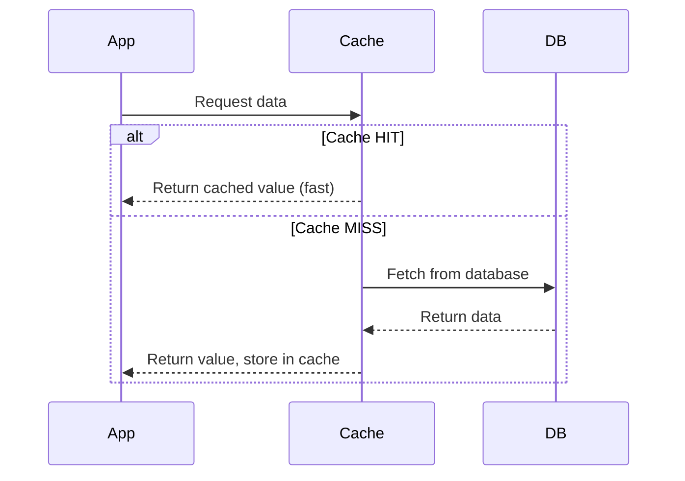
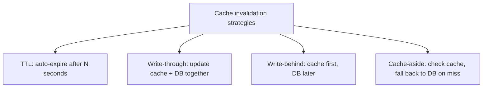
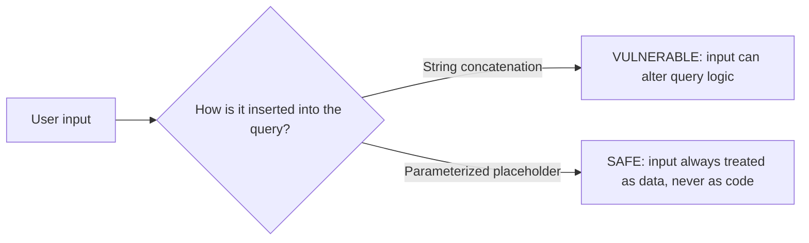

# Pillar 5 — Databases & Storage

## Section 7: Caching & Database Security Basics

### Section Checklist

- [x] Why caching exists (cache hit vs miss)
- [x] Where caching lives (app, dedicated server, query cache, CDN)
- [x] Cache invalidation strategies (TTL, write-through, write-behind, cache-aside)
- [x] Caching as deliberate denormalization
- [x] Least privilege for database accounts
- [x] SQL injection — mechanism and fix (parameterized queries)
- [x] Encryption at rest vs in transit
- [x] Hands-on practice
- [x] DevOps connection noted

---

## 7.1 Why Caching Exists

Even with good indexing, hitting the database for every read is expensive at scale — disk I/O, network round-trips, and query execution all add latency. **Caching** means storing a copy of frequently-accessed data somewhere faster to retrieve from, so repeated requests don't go all the way back to the database.



A **cache hit** means data was found in the cache (fast). A **cache miss** means it wasn't, so the system falls back to the database (slow), then usually stores the result in the cache for next time.

## 7.2 Where Caching Lives

| Layer                          | Example                             | Typical use                                         |
| ------------------------------ | ----------------------------------- | --------------------------------------------------- |
| In-memory application cache    | A Python dictionary, local variable | Very short-lived, single-process data               |
| Dedicated cache server         | Redis, Memcached                    | Shared cache across multiple application servers    |
| Database query cache           | Built into some database engines    | Caches results of repeated identical queries        |
| CDN (Content Delivery Network) | Cloudflare, Fastly                  | Caches static content close to users geographically |

Redis (from Section 6, as a key-value store) is a common dedicated caching layer precisely because key-value lookups are extremely fast — the same property that makes it useful as a session store makes it useful as a cache.

## 7.3 Cache Invalidation — The Hard Part

Famous saying: _"There are only two hard things in computer science: cache invalidation and naming things."_

**Cache invalidation** is knowing _when_ cached data is stale and needs refreshing or removal. If a customer's balance changes in the database but the cache still holds the old value, anyone reading from the cache gets wrong data.

Common strategies:

| Strategy                       | How it works                                                            | Trade-off                                                                        |
| ------------------------------ | ----------------------------------------------------------------------- | -------------------------------------------------------------------------------- |
| **TTL (Time To Live)**         | Cached data automatically expires after N seconds                       | Simple, but data can be stale for up to the TTL window                           |
| **Write-through**              | Every write updates both cache and database at the same time            | Cache always fresh, but writes are slower (two writes instead of one)            |
| **Write-behind**               | Write goes to cache first, database updated asynchronously later        | Fast writes, but risk of data loss if cache fails before syncing                 |
| **Cache-aside (lazy loading)** | Application checks cache first; on a miss, reads DB and populates cache | Most common pattern; simple, but first request after invalidation is always slow |



> **⚠️ Callout — Caching reintroduces the redundancy problem from Section 3**
> Caching is deliberate denormalization/duplication for speed — the exact trade-off flagged in Section 3.6. You intentionally accept the risk of two copies of the truth (cache and database) becoming inconsistent, in exchange for speed. This is why cache invalidation strategy matters so much — it's how that risk is managed.

## 7.4 Database Security Basics

A shift from performance to protection. Three foundational principles:

### 7.4.1 Least Privilege

Every application, service, or user connecting to a database should have **only the permissions it actually needs** — nothing more.

```sql
-- Bad: application uses a superuser account for everything
-- Good: a scoped user that can only do what the app actually needs

CREATE USER app_readonly WITH PASSWORD 'securepassword';
GRANT SELECT ON customers TO app_readonly;
-- app_readonly can read customer data, but cannot INSERT, UPDATE, DELETE, or DROP tables
```

If that account's credentials leak, the damage is limited to what it's allowed to do — a read-only reporting service should never hold `DROP TABLE` permission.

### 7.4.2 SQL Injection

**SQL injection** is an attack where untrusted input is inserted directly into a SQL query string, letting an attacker manipulate the query's logic.

**Vulnerable code (conceptual):**

```
query = "SELECT * FROM customers WHERE email = '" + user_input + "'"
```

If `user_input` is `' OR '1'='1`, the resulting query becomes:

```sql
SELECT * FROM customers WHERE email = '' OR '1'='1'
```

Since `'1'='1'` is always true, this returns **every row in the table** — bypassing the intended filter entirely. Worse payloads can delete data or extract unauthorized information.

**The fix — parameterized queries (prepared statements):** input is passed separately as a parameter, and the database driver handles it safely without ever treating it as executable SQL syntax.

```python
# Vulnerable
cursor.execute(f"SELECT * FROM customers WHERE email = '{user_input}'")

# Safe - parameterized query
cursor.execute("SELECT * FROM customers WHERE email = ?", (user_input,))
```



> **⚠️ Callout — Not just a "web security" topic**
> SQL injection is one of the most persistent vulnerabilities in software history and appears in the OWASP Top 10. It matters here because it's fundamentally a _database interaction_ problem — it happens at the exact point where application code builds SQL.

### 7.4.3 Encryption

Two distinct concepts:

| Type                      | Protects against                                              | Example                                                    |
| ------------------------- | ------------------------------------------------------------- | ---------------------------------------------------------- |
| **Encryption at rest**    | Someone stealing the physical disk/backup files               | Database files encrypted on disk                           |
| **Encryption in transit** | Someone intercepting network traffic between app and database | TLS/SSL connection between application and database server |

Both matter — encrypting the disk does nothing to protect data traveling over the network, and vice versa.

## 7.5 Hands-On Practice

```bash
sqlite3 practice.db
```

SQLite doesn't have user-level permissions like a client-server database, so the least-privilege exercise is conceptual. The SQL injection exercise is fully hands-on with Python.

### Progressive Exercises

1. Write out what permissions a read-only analytics dashboard should have on the `orders` table, versus the application backend that processes new orders.
2. In Python, write a vulnerable query using an f-string against `practice.db`, and demonstrate an injection payload that returns all rows regardless of the WHERE clause.
3. Fix the query from #2 using a parameterized query with `?` placeholders.
4. Design a cache-aside strategy (pseudocode) for a `GET /customer/{id}` API endpoint — describe cache hit and cache miss behavior.
5. Explain why TTL-based caching might be a bad fit for account balance data, but a good fit for a "trending products" list.

<details>
<summary>Answers</summary>

```
-- 1
-- Analytics dashboard: SELECT only on orders (read-only, reporting).
-- Order-processing backend: SELECT, INSERT, UPDATE on orders (needs to create and modify
-- orders), but should NOT have DROP or ALTER — it doesn't need to change table structure.
```

```python
# 2 — vulnerable
import sqlite3
conn = sqlite3.connect("practice.db")
cursor = conn.cursor()

user_input = "' OR '1'='1"
query = f"SELECT * FROM customers WHERE email = '{user_input}'"
cursor.execute(query)
print(cursor.fetchall())  # returns ALL customers, not just one matching email

# 3 — fixed
user_input = "keith@email.com"
cursor.execute("SELECT * FROM customers WHERE email = ?", (user_input,))
print(cursor.fetchall())
```

```
-- 4
-- GET /customer/{id}:
-- 1. Check cache for key "customer:{id}"
-- 2. If HIT: return cached value immediately
-- 3. If MISS: query database for customer {id}, store result in cache with a TTL,
--    then return the value to the caller

-- 5
-- Account balances must always be accurate — a stale balance could mislead someone into
-- overspending or cause a support incident. TTL-based caching accepts staleness for a
-- window of time, dangerous for financial correctness. A "trending products" list doesn't
-- need to be perfectly real-time — being a few minutes stale causes no real harm, so TTL
-- caching is a great fit (and much cheaper than recalculating "trending" constantly).
```

</details>

## 7.6 DevOps Connection

Caching strategy directly affects infrastructure decisions (provisioning a Redis cluster, memory sizing) and is a frequent topic in cost/performance trade-off discussions. Database security basics — least privilege, parameterized queries, encryption — are exactly what's audited during security reviews and compliance checks, connecting directly back to Pillar 3 (Security) principles already covered.

---

**Pillar 5 — Databases & Storage: COMPLETE**
