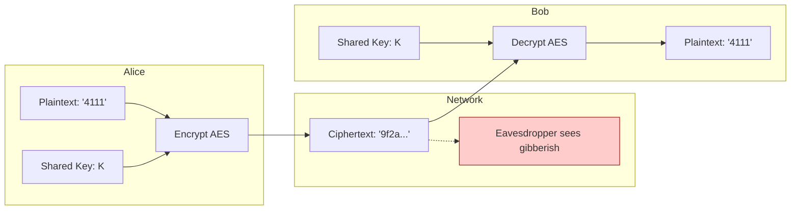
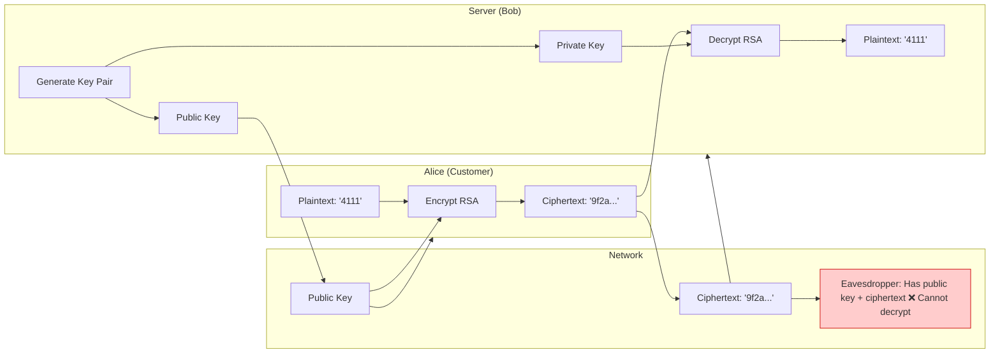
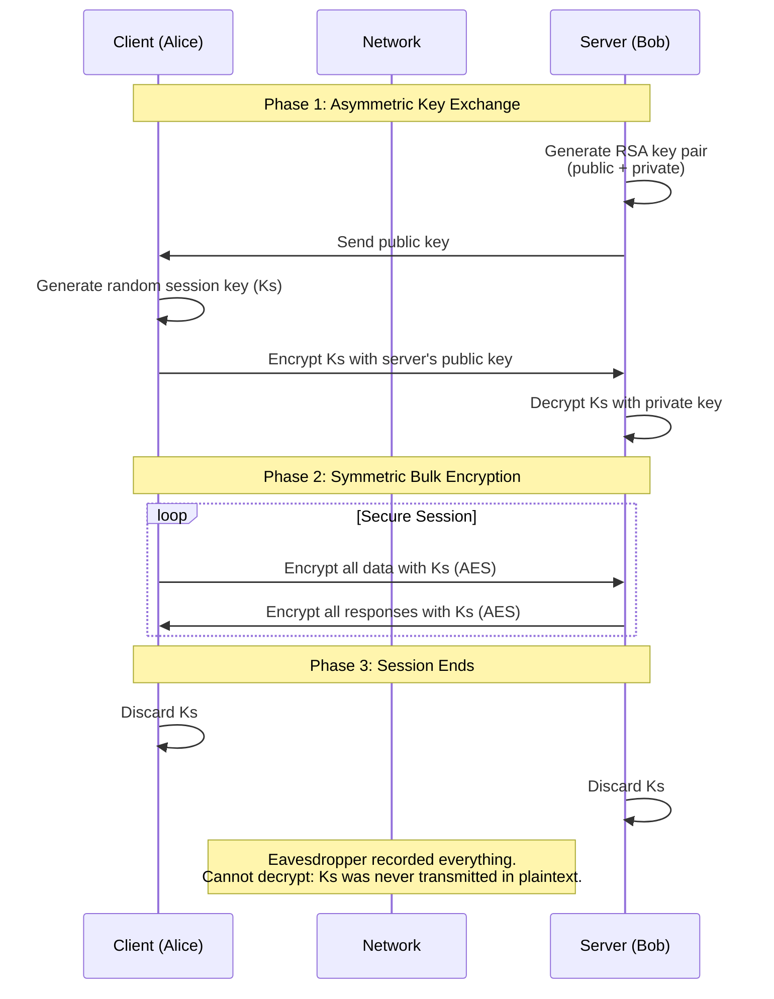
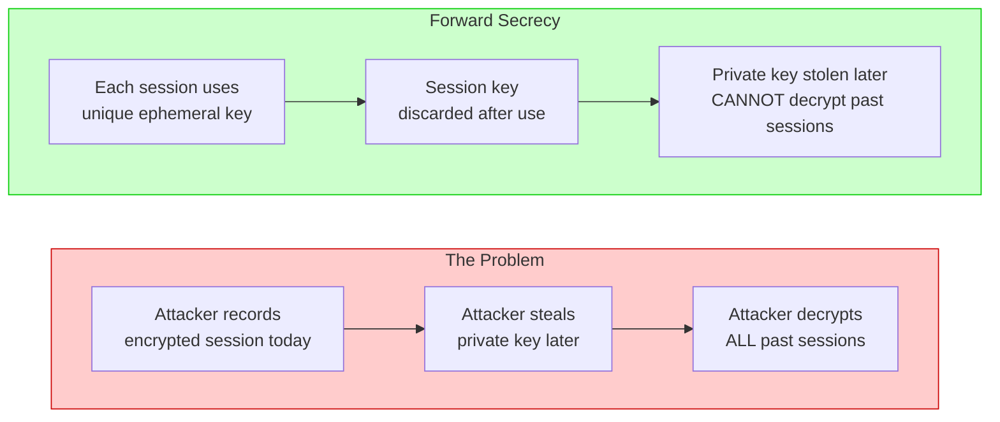
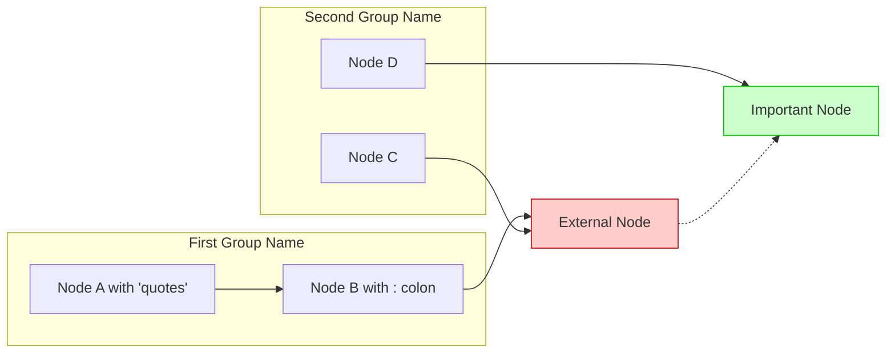

# Placing Complex Diagrams in GitHub Markdown Files

A practical guide to creating Mermaid diagrams that render correctly on GitHub.

---

## Table of Contents

1. [The Core Problem](#the-core-problem)
2. [The Golden Rules](#the-golden-rules)
3. [Diagram Templates](#diagram-templates)
   - [Symmetric Encryption Flow](#symmetric-encryption-flow)
   - [Asymmetric Encryption Flow](#asymmetric-encryption-flow)
   - [Hybrid Cryptosystem Flow](#hybrid-cryptosystem-flow)
   - [Forward Secrecy Comparison](#forward-secrecy-comparison)
4. [Common Error Messages & Solutions](#common-error-messages--solutions)
5. [Testing Your Diagrams](#testing-your-diagrams)
6. [GitHub Mermaid Version Check](#github-mermaid-version-check)
7. [Template for New Diagrams](#template-for-new-diagrams)

---

## The Core Problem

GitHub uses Mermaid to render diagrams from Markdown code blocks. However, Mermaid's parser is **strict** about syntax. The most common errors come from:

| Issue                    | Example                        | Why It Fails                                |
| ------------------------ | ------------------------------ | ------------------------------------------- |
| **Unquoted labels**      | `Server[Server (Bob)]`         | Parentheses confuse the parser              |
| **Nested quotes**        | `A[Plaintext: "4111"]`         | The `"` inside the label breaks the parser  |
| **Colons in labels**     | `A[Plaintext: "4111"]`         | Colons are interpreted as link syntax       |
| **Inline styling**       | `style EV fill:#ffcccc`        | `style` is fragile; `classDef` is preferred |
| **Missing arrow syntax** | `A -> B` (should be `A --> B`) | Incorrect arrow type                        |

---

## The Golden Rules

To make Mermaid diagrams work reliably on GitHub:

### Rule 1: Quote Everything with Special Characters

```mermaid
✅ subgraph Server["Server (Bob)"]
✅ A["Plaintext: '4111'"]
✅ Eaves["Eavesdropper: ❌ Cannot decrypt"]
```

### Rule 2: Use `classDef` Instead of `style`

```mermaid
✅ classDef warning fill:#ffcccc,stroke:#cc0000
✅ class Eaves warning

❌ style Eaves fill:#ffcccc,stroke:#cc0000
```

### Rule 3: Use Single Quotes Inside Double-Quoted Labels

```mermaid
✅ A["Plaintext: '4111'"]
✅ Message["Alice said: 'Hello'"]
```

### Rule 4: Keep Subgraph Names Explicit

```mermaid
✅ subgraph Alice["Alice (Customer)"]
✅ subgraph Network["Network"]

❌ subgraph Alice[Alice (Customer)]
```

### Rule 5: Use Proper Arrow Syntax

| Arrow  | Meaning      | Use Case                        |
| ------ | ------------ | ------------------------------- |
| `-->`  | Solid arrow  | Data flow, direct connection    |
| `-.->` | Dashed arrow | Indirect or optional connection |
| `==>`  | Thick arrow  | Emphasis or critical path       |

---

## Diagram Templates

### Symmetric Encryption Flow



---

### Asymmetric Encryption Flow



---

### Hybrid Cryptosystem Flow (Sequence Diagram)



---

### Forward Secrecy Comparison



---

## Common Error Messages & Solutions

| Error Message                                      | Likely Cause                      | Solution                                                   |
| -------------------------------------------------- | --------------------------------- | ---------------------------------------------------------- |
| `Expecting 'SGE', 'DOUBLECIRCLEEND', ... got 'PS'` | Parentheses in subgraph name      | Quote the subgraph: `subgraph Name["Name (with parens)"]`  |
| `Parse error on line X`                            | Unquoted label with special chars | Quote the node: `Node["Label with 'quotes' and : colons"]` |
| `Unknown diagram type`                             | Wrong flowchart type              | Use `flowchart LR` or `sequenceDiagram` at the top         |
| `style EV` not applied                             | Inline style syntax error         | Use `classDef` + `class` instead                           |
| `Empty diagram`                                    | Missing or broken syntax          | Check for missing arrows or incorrect syntax               |

---

## Testing Your Diagrams

### Method 1: GitHub Preview

1. Create a test file in your repository (e.g., `test-diagram.md`)
2. Paste your Mermaid code block
3. View it rendered on GitHub (not in the editor)

### Method 2: Use `info` Diagram

Check the Mermaid version and basic rendering:

````markdown
```mermaid
  info
```
````

### Method 3: Isolate the Problem

If a complex diagram fails:

1. Simplify: remove styling, subgraphs, and formatting
2. Test the minimal version
3. Add complexity back gradually

---

## GitHub Mermaid Version Check

To see the Mermaid version GitHub is using:

````markdown
```mermaid
  info
```
````

This renders as a small info card with the version number. If you're using a feature from a newer version than GitHub supports, it won't render.

---

## Template for New Diagrams

Copy this template when creating a new diagram:

````markdown

````

---

## Quick Reference Card

| Element              | Syntax                                  | Example                                        |
| -------------------- | --------------------------------------- | ---------------------------------------------- |
| Subgraph             | `subgraph Name["Label"]`                | `subgraph Server["Server (Bob)"]`              |
| Node                 | `ID["Label with 'quotes'"]`             | `A["Plaintext: '4111'"]`                       |
| Solid arrow          | `A --> B`                               | `PubKey --> Encrypt`                           |
| Dashed arrow         | `A -.-> B`                              | `C -.-> EV`                                    |
| Styling class        | `classDef name fill:color,stroke:color` | `classDef warning fill:#ffcccc,stroke:#cc0000` |
| Apply class          | `class ID className`                    | `class EV eavesdrop`                           |
| Sequence participant | `participant Name as Alias`             | `participant Client as Client (Alice)`         |
| Sequence note        | `Note over A,B: Text`                   | `Note over Client,Server: Phase 1`             |

---

**Last Updated:** 2026
