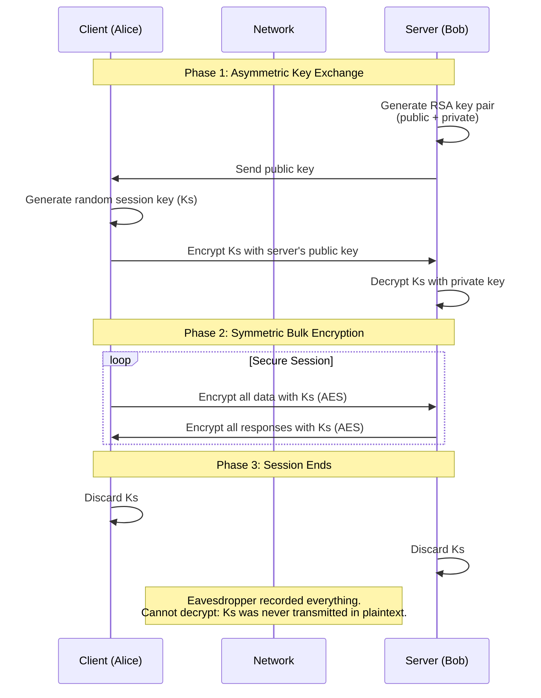
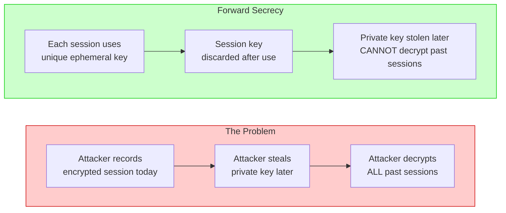

# Security — Section 1: Cryptography Fundamentals

## ✅ Checklist

- [x] Understand the key exchange problem, with a concrete scenario
- [x] Symmetric encryption — mechanism, worked example, pros/cons, AES
- [x] Asymmetric encryption — mechanism, worked example, pros/cons, RSA/ECC
- [x] Understand why asymmetric alone isn't a full replacement for symmetric
- [x] Hybrid cryptosystems — why every real system uses both
- [x] Key length & security levels — what the numbers actually mean
- [x] Common pitfalls — what mistakes engineers make (and how to avoid them)
- [x] Forward secrecy — why it matters and how it works (teaser for Section 3)
- [x] Hands-on: generate a real RSA key pair in the Codespace
- [x] Hands-on: encrypt and decrypt a file with AES-256

---

## 1.1 The Problem, With a Concrete Scenario

Imagine you run an online store. A customer, Alice, wants to enter her card number on your checkout page. Between her laptop and your server sits an untrusted path — her home router, her ISP, backbone routers, possibly a public Wi-Fi hotspot. Any one of these hops could, in principle, be run or compromised by someone hostile. Security engineers work under the default assumption: **treat the network as hostile** — design as if someone is always listening.

The moment Alice tries to send her card number securely, two distinct problems appear:

1. **Confidentiality** — scramble the data so a listener sees gibberish.
2. **Key exchange** — the scrambling needs a "key," but how do Alice's browser and your server agree on that key _without_ the listener also learning it?

Problem 2 is the hard one. If the key itself is sent over the same network, the eavesdropper grabs it too — the entire scheme collapses. This is the **key exchange problem**, and modern cryptography largely exists to solve it.

### The Locked Box Analogy

Think of cryptography as sending a package through a hostile postal system:

| Method         | Analogy                                                                                                                                                                                                                                            |
| -------------- | -------------------------------------------------------------------------------------------------------------------------------------------------------------------------------------------------------------------------------------------------- |
| **Symmetric**  | A lock with one key. You must physically hand the key to the recipient _before_ sending anything. If the postal system is compromised, delivering the key is the weak point.                                                                       |
| **Asymmetric** | A padlock that anyone can lock but only you can unlock. You publish copies of the open padlock to the world. Anyone can put a message in a box and snap the padlock shut. Only you have the key to open it — and the key never leaves your pocket. |

This is the conceptual leap that makes modern cryptography work: **instead of sharing a secret key, you share a public padlock.**

---

## 1.2 Symmetric Encryption

One key does both jobs — it encrypts and decrypts. Think of a physical padlock: whoever holds the key can lock the box or unlock it. There's no distinction between a "locking key" and an "unlocking key" — it's the same object.

### Visual: Symmetric Encryption Flow

```mermaid
flowchart LR
    subgraph Alice[Alice]
        A[Plaintext: "4111"]
        K1[Shared Key: K]
        E[Encrypt AES]
    end

    subgraph Network[Network]
        C[Ciphertext: "9f2a..."]
        EV[Eavesdropper sees gibberish]
    end

    subgraph Bob[Bob]
        D[Decrypt AES]
        B[Plaintext: "4111"]
        K2[Shared Key: K]
    end

    A --> E
    K1 --> E
    E --> C
    C --> D
    K2 --> D
    D --> B
    C -.-> EV

    classDef eavesdrop fill:#ffcccc,stroke:#cc0000
    class EV eavesdrop
```

**Worked example:**
Alice and Bob agree in advance (in person, before any network is involved) on a shared secret key, `K`. Alice runs her message through AES using `K`, producing ciphertext, and sends it over the internet. Bob receives the ciphertext and runs AES in reverse using the _same_ key `K`, recovering the plaintext.

**Pros:**

- Extremely fast — can encrypt gigabytes of data per second
- Used for encrypting large volumes of data: video streams, database backups, entire disk volumes

**Cons:**

- The key exchange problem is completely unsolved here. Alice and Bob had to agree on `K` beforehand, somehow. Over the open internet, with a stranger, at first contact (like an online store and a first-time customer) — there's no "beforehand" to rely on.

**Algorithm to know:**
AES (Advanced Encryption Standard) — the current industry standard, running under the hood in HTTPS, VPNs, and disk encryption tools like BitLocker and LUKS.

---

## 1.3 Asymmetric Encryption (Public-Key Cryptography)

This is the breakthrough (Diffie–Hellman, RSA — 1970s) that solves the key exchange problem. Instead of a single shared key, each party generates a **mathematically linked pair**: a public key and a private key. Data encrypted with one half of the pair can _only_ be decrypted with the other half — not a copy of the same key, but its mathematical counterpart.

### Visual: Asymmetric Encryption Flow

```mermaid
flowchart LR
    subgraph Server[Server (Bob)]
        Gen[Generate Key Pair]
        PubKey[Public Key]
        PrivKey[Private Key]
        Decrypt[Decrypt RSA]
        Plain1[Plaintext: "4111"]
    end

    subgraph Alice[Alice (Customer)]
        Encrypt[Encrypt RSA]
        Plain2[Plaintext: "4111"]
        Cipher[Ciphertext: "9f2a..."]
    end

    subgraph Network[Network]
        PubKeySent[Public Key]
        CipherSent[Ciphertext: "9f2a..."]
        Eaves[Eavesdropper: Has public key + ciphertext ❌ Cannot decrypt]
    end

    Gen --> PubKey
    Gen --> PrivKey
    PubKey --> PubKeySent
    PubKeySent --> Alice
    Plain2 --> Encrypt
    PubKeySent --> Encrypt
    Encrypt --> Cipher
    Cipher --> CipherSent
    CipherSent --> Server
    CipherSent --> Eaves
    Cipher --> Decrypt
    PrivKey --> Decrypt
    Decrypt --> Plain1

    style Eaves fill:#ffcccc,stroke:#cc0000
```

**Worked scenario — Alice and the online store:**

1. Your server generated a key pair long before Alice ever connected. The public key is embedded in your server's TLS certificate and handed to anyone who connects.
2. Alice's browser connects and receives your server's public key.
3. Alice's browser encrypts her card number using your server's _public_ key.
4. The ciphertext travels across the hostile network. An eavesdropper captures it and already has the public key too (it's public) — neither piece of information helps them.
5. Your server decrypts using its _private_ key — which never left the server and was never transmitted anywhere.

The elegant part: Alice never needed to have met you before, and no shared secret needed to exist in advance. The public key can be published to the entire planet, and it changes nothing — only the mathematically paired private key can reverse the encryption.

**Pros:**

- Solves key exchange cleanly for two strangers meeting for the first time online — the default situation for the entire web
- Enables digital signatures (authenticity) and non-repudiation

**Cons:**

- Computationally expensive. RSA-2048 is roughly 100–1000x slower than AES for equivalent security. Encrypting a 4GB backup file with RSA directly would be painfully slow.

**Algorithms:**

| Algorithm            | Year | Key size       | Use case                                                    |
| -------------------- | ---- | -------------- | ----------------------------------------------------------- |
| RSA                  | 1977 | 2048–4096 bits | Widely supported, legacy systems                            |
| ECC (Elliptic Curve) | 1985 | 256–521 bits   | Smaller keys, faster — increasingly preferred in modern TLS |

### A Common Misconception

It's tempting to assume asymmetric encryption is "strictly better" since it solves key exchange. It isn't a replacement for symmetric encryption — it _can't_ be, due to the speed gap. If a server used pure RSA to encrypt an entire video stream, page loads would crawl. Early SSL implementations that overused asymmetric operations ran into exactly this bottleneck in practice.

---

## 1.4 Why Asymmetric Alone Isn't Enough

The speed gap is not academic — it's a hard engineering constraint.

| Operation            | Time (approx)    |
| -------------------- | ---------------- |
| Encrypt 1KB with AES | Microseconds     |
| Encrypt 1KB with RSA | Milliseconds     |
| Encrypt 1GB with AES | Seconds          |
| Encrypt 1GB with RSA | Minutes to hours |

If a server uses RSA to encrypt every byte of a 4GB video file, the operation could take 100–1000x longer than using AES. That's the difference between a responsive API and a timeout.

**The key insight:** Asymmetric encryption is used for _exchanging a small secret_ — not for encrypting the bulk data itself.

---

## 1.5 Hybrid Cryptosystems

No real system picks one approach exclusively. TLS, SSH, Signal, WhatsApp all do the same thing:

1. **Asymmetric** encryption exchanges a short-lived, randomly generated **symmetric session key** — a small amount of data, so the slower asymmetric operation is cheap here.
2. **Symmetric** encryption (AES) then handles all the actual bulk data — full page content, images, video, files — because it's fast.

### Visual: Hybrid Cryptosystem Flow (Sequence Diagram)



**Concrete numbers to anchor this:**

- Exchanging a 256-bit session key asymmetrically: ~milliseconds
- Encrypting a 4GB file symmetrically with that key: ~seconds
- Doing the same 4GB file with pure asymmetric encryption: an order of magnitude longer

This performance gap is _why_ the hybrid model exists — it's a hard engineering requirement, not academic elegance.

This exact handshake-then-bulk-transfer pattern is precisely what the TLS handshake implements step by step (Section 3) — no new concept, just this same idea as an actual protocol.

---

## 1.6 Key Length & Security Levels

Not all keys are equal. Here's what the numbers actually mean:

| Algorithm       | Key length | Equivalent security | Used for           | Notes                                  |
| --------------- | ---------- | ------------------- | ------------------ | -------------------------------------- |
| **AES**         | 128 bits   | 128 bits            | Bulk encryption    | Minimum for new systems                |
| **AES**         | 256 bits   | 256 bits            | Bulk encryption    | ✅ Recommended; future-proof           |
| **RSA**         | 1024 bits  | ~80 bits            | Legacy systems     | ❌ Broken — don't use                  |
| **RSA**         | 2048 bits  | ~112 bits           | General use        | ✅ Minimum for new systems             |
| **RSA**         | 3072 bits  | ~128 bits           | Higher security    | ✅ Recommended for sensitive data      |
| **RSA**         | 4096 bits  | ~140 bits           | Very high security | Slower; use ECC instead                |
| **ECC (P-256)** | 256 bits   | 128 bits            | Modern TLS         | ✅ Equivalent to RSA 3072, much faster |
| **ECC (P-384)** | 384 bits   | 192 bits            | Higher security    | ✅ Recommended for long-term security  |
| **ECC (P-521)** | 521 bits   | 256 bits            | Future-proof       | Very high security; overkill for most  |

### What "Equivalent Security" Actually Means

When we say "AES-128 has 128 bits of security," we mean:

- An attacker would need to try approximately 2^128 possible keys to break it.
- That's roughly 3.4 × 10^38 attempts.
- With all the world's computing power, that's effectively impossible.

When we say "RSA-2048 has ~112 bits of security," we mean:

- The best attack on RSA-2048 is faster than brute-forcing 2^112 operations.
- This is why AES with a 128-bit key is considered stronger than RSA-2048, even though RSA-2048 looks like a much larger number.

**Key takeaway:** For equivalent security, **ECC uses much smaller keys than RSA**, making it faster and more efficient. This is why modern TLS prefers ECC.

---

## 1.7 Common Pitfalls

Even with the right algorithms, implementation mistakes are common — and often catastrophic.

| Pitfall                             | Why it happens                                   | How to avoid                                             |
| ----------------------------------- | ------------------------------------------------ | -------------------------------------------------------- |
| **Using AES-ECB mode**              | Default in some libraries; lazy coding           | Always use GCM, CBC, or CTR with a random IV             |
| **Hardcoding keys in source code**  | Convenient for testing; forgotten in production  | Use environment variables, secrets managers, or KMS      |
| **Reusing a nonce/IV**              | Saves time; not understanding the risk           | Generate a fresh random IV for each encryption           |
| **Rolling your own crypto**         | Overconfidence; "I can write a better algorithm" | Use well-audited libraries (OpenSSL, libsodium, AWS KMS) |
| **Using MD5 or SHA-1 for security** | Legacy systems; not keeping up                   | Use SHA-256 or SHA-3 for hashing                         |
| **Using RSA-1024**                  | Old systems; not upgrading                       | Minimum RSA-2048, or preferably ECC                      |
| **Storing keys in plaintext**       | Misunderstanding threat models                   | Encrypt keys at rest; use HSMs or KMS                    |

### Real-World Examples

- **ECB mode**: The famous "Linux Penguin" image encrypted with ECB still shows the penguin silhouette — because identical blocks produce identical ciphertext.
- **Hardcoded keys**: Uber's 2016 breach was linked to hardcoded AWS keys in source code pushed to GitHub.
- **IV reuse**: WEP wireless encryption was broken largely because it reused IVs.

---

## 1.8 Forward Secrecy — Teaser for Section 3

There's one more twist to the key exchange problem.

Even if you solve the key exchange today, an attacker could _record_ your encrypted traffic today and _store_ it. If they later steal your server's private key (via a breach, vulnerability, or insider threat), they can decrypt _all past sessions_ they recorded.



**Forward secrecy** solves this by ensuring that each session uses a _fresh, ephemeral_ key that is:

1. Exchanged using asymmetric cryptography during the handshake
2. Used only for that one session
3. Discarded immediately after the session ends

Even if an attacker steals your server's private key tomorrow, they cannot decrypt past sessions because each session's key was unique and never stored.

This is implemented using **Diffie-Hellman ephemeral (DHE/ECDHE)** — the "E" stands for "ephemeral" (short-lived). Modern TLS requires it.

**We'll cover this in detail in Section 3 (TLS/SSL & the Handshake).**

---

## 1.9 DevOps Connection

This same pattern appears repeatedly in the DevOps world:

| DevOps context              | Where crypto appears                                                                                              |
| --------------------------- | ----------------------------------------------------------------------------------------------------------------- |
| **SSH key-based login**     | Asymmetric key pair authenticates the connection; session traffic encrypted symmetrically                         |
| **CI/CD secrets**           | GitHub Secrets, GitLab CI variables — encrypted at rest, decrypted in memory during pipeline runs                 |
| **Container image signing** | Cosign/Sigstore uses asymmetric signatures to verify image provenance                                             |
| **KMS / Secrets Manager**   | Encryption at rest; key rotation policies; "envelope encryption" (KMS encrypts data keys, data keys encrypt data) |
| **TLS termination**         | Load balancers, ingress controllers, API gateways terminate TLS and forward plaintext (or re-encrypt) internally  |
| **mTLS (mutual TLS)**       | Service-to-service authentication in microservices — both sides present certificates                              |
| **Helm secrets**            | Encrypted values files using sops or Helm Secrets                                                                 |
| **Vault**                   | Dynamic secrets, encryption as a service, transit engine                                                          |

**The pattern is consistent:** use asymmetric cryptography to establish trust and exchange a small secret, then use symmetric cryptography for all bulk work.

---

## Hands-On Practice (Codespace)

### 1. Generate an RSA Key Pair (Asymmetric)

```bash
# Generate a private key
openssl genrsa -out private.pem 2048

# Extract the public key
openssl rsa -in private.pem -pubout -out public.pem

# View the public key (this is what a server sends to a client)
cat public.pem
```

Run `cat public.pem` — that block of text is exactly the kind of public key a browser receives from a server during a real TLS handshake. Worth seeing once so "public key" stops being an abstract idea.

### 2. Encrypt and Decrypt a File with AES (Symmetric)

```bash
# Create a test file
echo "This is a secret message for my server" > plaintext.txt

# Encrypt with AES-256-CBC
openssl enc -aes-256-cbc -salt -in plaintext.txt -out encrypted.bin -pass pass:mysecretpassword

# View the ciphertext (it's binary — use cat or hexdump)
hexdump -C encrypted.bin | head

# Decrypt it
openssl enc -d -aes-256-cbc -in encrypted.bin -out decrypted.txt -pass pass:mysecretpassword

# Verify
cat decrypted.txt
```

### 3. Sign and Verify with RSA (Asymmetric — Preview)

```bash
# Create a message
echo "Deploy version v1.2.3" > message.txt

# Sign it with your private key
openssl dgst -sha256 -sign private.pem -out signature.bin message.txt

# Verify with the public key
openssl dgst -sha256 -verify public.pem -signature signature.bin message.txt
```

This is how container image signing works — the publisher signs the image digest with their private key, and consumers verify with the public key.

---

## Key Takeaways

1. **Symmetric encryption** is fast but has a key exchange problem.
2. **Asymmetric encryption** solves key exchange but is slow.
3. **Hybrid cryptosystems** use asymmetric to exchange a session key, then symmetric for bulk data — this is how TLS, SSH, and VPNs work.
4. **Key length matters** — 2048-bit RSA ≈ 112 bits of security; 256-bit ECC ≈ 128 bits; AES-256 is 256 bits.
5. **Implementation mistakes are common** — avoid ECB mode, hardcoded keys, and IV reuse.
6. **Forward secrecy** ensures past sessions stay secure even if the private key is stolen later.
7. **The pattern repeats in DevOps** — SSH, KMS, container signing, mTLS, and secrets management all use these same primitives.
