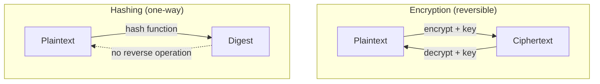
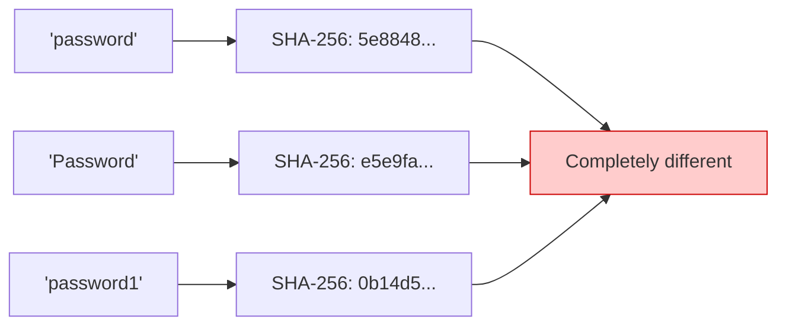
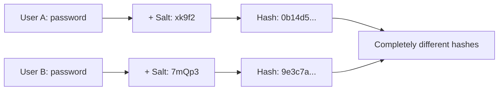
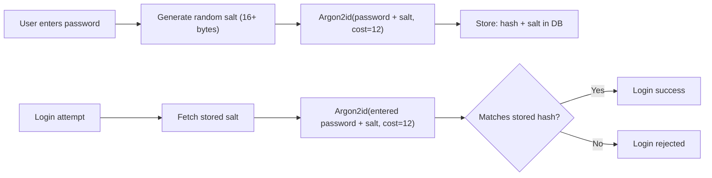

# Security — Section 2: Hashing & Password Security

## ✅ Checklist

- [ ] Understand what a hash function is and how it differs from encryption
- [ ] Know the required properties of a good hash function
- [ ] Understand where hashing is used beyond passwords
- [ ] Understand rainbow tables and why salting defeats them
- [ ] Understand why fast hashes are dangerous for passwords, and which algorithms fix this
- [ ] Understand the difference between salt and pepper (and when to use each)
- [ ] Common pitfalls — real-world breach examples
- [ ] Hands-on: hash strings and files in the Codespace, observe salting/avalanche effect

---

## 2.1 What a Hash Function Is, With a Concrete Scenario

Say your company gets breached and the database dump leaks online (this happens constantly — LinkedIn 2012, Adobe 2013, RockYou 2009 are famous cases). If you stored passwords as plaintext, every user's login credential is now public. Hashing exists specifically to make this breach survivable.

A **hash function** takes input of any size and produces a fixed-size output (a "digest"). Same input always produces the same output. Critically, it is **one-way** — there is no mathematical operation that reverses a hash back into its original input. This is fundamentally different from encryption, which is _designed_ to be reversed by whoever holds the key.

|             | Encryption            | Hashing                                                                                                   |
| ----------- | --------------------- | --------------------------------------------------------------------------------------------------------- |
| Reversible? | Yes, with the key     | No — never, by design                                                                                     |
| Purpose     | Confidentiality       | Integrity / verification                                                                                  |
| Output size | Roughly matches input | Always fixed length (e.g. SHA-256 always outputs 256 bits, whether hashing one character or one gigabyte) |

### Visual: Hashing vs Encryption



## 2.2 Properties a Good Hash Function Needs

- **Deterministic** — same input, same output, always
- **Fast to compute** (for general use) — this becomes a _problem_ for password hashing specifically, covered in 2.4
- **Collision-resistant** — practically impossible to find two different inputs producing the same output
- **Avalanche effect** — a tiny change in input produces a wildly different output. Example: `hash("password")` and `hash("Password")` look nothing alike, despite differing by one character.

### Visual: The Avalanche Effect



Notice how one character change (lowercase p → uppercase P, or adding a single digit) produces a hash that bears **no resemblance** to the original — this is the avalanche effect in action.

---

## 2.3 Where Hashing Is Used

- **Integrity checks** — verifying a downloaded file wasn't corrupted or tampered with. You compare `sha256sum` of your download against the hash published on the project's site.
- **Password storage** — servers store `hash(password)`, never the password itself.
- **Blockchain** — blocks are chained together by including the previous block's hash.
- **Git** — every commit is identified by a hash of its contents; changing one line in an old commit changes every commit hash after it.

---

## 2.4 Password Hashing — Where This Actually Bites in the Real World

**Naive approach:** store `hash(password)` directly. This fails for two independent reasons.

### Problem 1: Rainbow Tables

A **rainbow table** is a precomputed lookup table: millions of common passwords mapped to their hash values. If two users both pick `"password123"`, they get the _identical_ hash. An attacker with a rainbow table cracks both instantly — no brute-forcing needed, it's a lookup.

### Visual: How Rainbow Tables Work

```mermaid
flowchart TB
    subgraph Attack["Rainbow Table Attack (Un-Salted)"]
        A["Leaked hash: 5e8848..."] --> B["Look up in precomputed table"]
        B --> C["Found! Password: 'password'"]
        C --> D["✅ Attacker now has the password"]
    end

    subgraph Defense["With Salt (Defeats Rainbow Tables)"]
        E["Leaked hash: 0b14d5..."] --> F["Look up in precomputed table"]
        F --> G["❌ Not found — table doesn't include salt"]
        G --> H["❌ Attacker must brute-force each user individually"]
    end

    style Attack fill:#ffcccc,stroke:#cc0000
    style Defense fill:#ccffcc,stroke:#00cc00
```



**Fix — salting:** generate a random string (the "salt") per user, and hash `password + salt` instead of just `password`. The salt is stored alongside the hash in the database — it doesn't need to be secret, it just needs to be unique per user. Identical passwords now produce completely different hashes, and precomputed rainbow tables become useless.

> **Salt length:** Use at least **16 bytes (128 bits)** of random data per salt. Modern systems use 32 bytes (256 bits).

### Visual: Salt in Practice



Identical password → different salt → completely different hash. Rainbow tables are useless.

### Problem 2: General-Purpose Hashes Are Fast

SHA-256 is designed to hash gigabytes per second — great for file integrity, terrible for passwords. A fast hash means an attacker with leaked hashes can brute-force **billions of guesses per second** on commodity GPU hardware.

**Fix — slow, purpose-built password hashing algorithms:**

| Algorithm    | Year | Key feature                                                                                | Recommended cost                          |
| ------------ | ---- | ------------------------------------------------------------------------------------------ | ----------------------------------------- |
| **bcrypt**   | 1999 | Tunable work factor (`cost`)                                                               | `cost=12` (modern default)                |
| **scrypt**   | 2009 | Memory‑hard (resists GPU/ASIC)                                                             | Varies — tune for your hardware           |
| **Argon2id** | 2015 | **Recommended** — hybrid of Argon2i (side‑channel resistance) and Argon2d (GPU resistance) | `m=19MB, t=2, p=1` (OWASP recommendation) |

These are deliberately, tunably slow — you can dial up the "cost factor" as hardware gets faster over the years, keeping brute-force attempts expensive even as computers speed up. Argon2id additionally makes attacks memory-intensive, which specifically defeats GPU/ASIC-based cracking rigs.

### Visual: Password Storage Pipeline



The plaintext password is never stored, ever — not even transiently in a log file, ideally.

### 2.4.1 Pepper (Optional Extra Layer)

A **pepper** is a global secret key, stored separately from the database (e.g., in a secrets manager or environment variable), that is added to the password _before_ hashing, alongside the per-user salt.

| Layer      | Scope    | Where stored                                          | Purpose                                                                         |
| ---------- | -------- | ----------------------------------------------------- | ------------------------------------------------------------------------------- |
| **Salt**   | Per‑user | In the database (with the hash)                       | Defeats rainbow tables                                                          |
| **Pepper** | Global   | Separate from the database (secrets manager, env var) | If the database is breached, attackers still need the pepper to crack passwords |

> **⚠️ Important:** Peppers add a layer of defence, but they are not a replacement for salts. Never skip salting.

---

## 2.5 Common Pitfalls

| Pitfall                                           | Why it happens                                         | How to avoid                                                        |
| ------------------------------------------------- | ------------------------------------------------------ | ------------------------------------------------------------------- |
| **Storing plaintext passwords**                   | Laziness, or "we'll add hashing later"                 | Never store plaintext, from day one                                 |
| **Hashing without a salt**                        | Assuming SHA-256 alone is "secure"                     | Always generate and store a unique per-user salt (16+ bytes)        |
| **Using a fast hash (MD5/SHA-256) for passwords** | Confusing "used for hashing" with "safe for passwords" | Use bcrypt, scrypt, or Argon2id specifically                        |
| **Using MD5 for anything security-related**       | Legacy code, old tutorials                             | MD5 is broken for collision resistance — avoid entirely             |
| **Reusing the same salt across all users**        | Misunderstanding what the salt is for                  | Salt must be unique _per user_, generated fresh each time           |
| **Logging plaintext passwords accidentally**      | Debug logging left in production                       | Scrub sensitive fields before logging, ever                         |
| **Not using a pepper**                            | Unaware of the extra defence layer                     | Store a global secret outside the database for added security       |
| **Using Argon2i when you should use Argon2id**    | Confusion between variants                             | Use **Argon2id** (hybrid of i + d) — it's the modern recommendation |

### Real-World Examples

- **LinkedIn (2012 breach, disclosed 2016):** ~117 million passwords were hashed with unsalted SHA-1. With no salt, attackers cracked the vast majority within days using precomputed tables.
- **Adobe (2013):** Passwords were encrypted (reversibly!) rather than hashed, using a single shared key — a fundamental confusion of encryption with hashing. Password hints were also stored in plaintext alongside the encrypted passwords, letting attackers guess many passwords directly from the hints.
- **RockYou (2009):** 32 million passwords stored in **plaintext**, no hashing at all. This breach became the source of the infamous "rockyou.txt" wordlist still used in password-cracking tools like **hashcat** and **John the Ripper** today.

---

> **💡 Why fast hashes are dangerous:** A modern GPU can compute **billions of SHA-256 hashes per second**. If your database leaks and you used SHA-256 (unsalted), an attacker with a few hundred dollars of GPU hardware can crack most common passwords within hours. With bcrypt/Argon2id, the same attack drops to a few hundred guesses per second — making it effectively infeasible.

---

## 2.6 Hands-On Practice (Codespace)

### 1. Hash a string with SHA-256 (fast hash — fine for integrity, NOT for passwords)

```bash
# Hash a string
echo -n "password123" | sha256sum

# Notice: hashing the exact same string always gives the exact same output
echo -n "password123" | sha256sum

# Now hash it with a "salt" appended manually, to see the avalanche effect
echo -n "password123xk9f2" | sha256sum
```

### 2. Observe the Avalanche Effect

```bash
# Create three files with slight differences
echo "Deploy script v1" > deploy1.sh
echo "Deploy script v1 " > deploy2.sh   # trailing space
echo "Deploy script v1." > deploy3.sh   # period instead of space

# Hash all three — compare the outputs
sha256sum deploy1.sh
sha256sum deploy2.sh
sha256sum deploy3.sh
# Each hash is completely different despite tiny input changes
```

### 3. Hash a file (integrity check)

```bash
# Create a file and hash it
echo "This is my configuration file" > config.txt
sha256sum config.txt

# Modify the file slightly
echo "This is my configuration file v2" > config.txt
sha256sum config.txt
# The hash changes completely — detecting tampering
```

### 4. Proper password hashing with bcrypt (recommended)

```bash
# Install bcrypt (Python)
pip install bcrypt --break-system-packages

# Generate a hash with automatic salt
python3 -c "import bcrypt; h = bcrypt.hashpw(b'mypassword', bcrypt.gensalt()); print(h)"

# Run it twice — the output differs each time because bcrypt generates a new random salt
python3 -c "import bcrypt; h = bcrypt.hashpw(b'mypassword', bcrypt.gensalt()); print(h)"
```

### 5. Observe bcrypt's cost factor

```bash
# With cost factor 12 (default, recommended)
python3 -c "import bcrypt, time; start=time.time(); h=bcrypt.hashpw(b'test', bcrypt.gensalt(12)); print(f'{time.time()-start:.3f}s')"

# With cost factor 4 (weak, fast)
python3 -c "import bcrypt, time; start=time.time(); h=bcrypt.hashpw(b'test', bcrypt.gensalt(4)); print(f'{time.time()-start:.3f}s')"

# The cost factor directly controls how expensive each hash is
# Higher cost = slower hash = harder to crack
```

### 6. (Optional) Argon2id — modern recommended algorithm

```bash
# Install argon2-cffi
pip install argon2-cffi --break-system-packages

# Hash with Argon2id
python3 -c "from argon2 import PasswordHasher; ph=PasswordHasher(); h=ph.hash('mypassword'); print(h)"
# OWASP recommended: memory=19MB, time=2, parallelism=1
```

---

## 2.7 DevOps Connection

| DevOps context                     | Where hashing appears                                                                                                                    |
| ---------------------------------- | ---------------------------------------------------------------------------------------------------------------------------------------- |
| **Git commit hashes**              | Every commit is a hash of its contents, tree, and parent — changing anything changes the hash                                            |
| **Docker image digests**           | Images are referenced by content hash (`sha256:...`) to guarantee immutability — pulling by digest always retrieves the exact same bytes |
| **Checksums in package managers**  | `pip`, `npm`, `apt` verify package integrity via published hashes before installing                                                      |
| **Terraform state locking**        | State file changes can be hash-verified to detect drift or tampering                                                                     |
| **CI/CD artifact verification**    | Build pipelines hash artifacts to confirm the deployed binary matches what was tested                                                    |
| **Software supply chain security** | SLSA (Supply Chain Levels for Software Artifacts) uses hashing to verify build provenance                                                |

---

## Key Takeaways

1. Hashing is **one-way** — fundamentally different from encryption, which is reversible.
2. Never store plaintext passwords — hash them, always.
3. Always **salt** passwords (16+ bytes per user) — identical passwords must produce different hashes.
4. Use **slow, purpose-built** password hashing algorithms (bcrypt/scrypt/Argon2id) — never a fast general-purpose hash like SHA-256 or MD5 for passwords.
5. **bcrypt cost=12** is the modern default; increase the cost as hardware gets faster.
6. **Argon2id** is the modern recommendation (use memory=19MB, time=2, parallelism=1 as a baseline).
7. Real breaches (LinkedIn, Adobe, RockYou) each failed at a _different_ step — no salt, encryption instead of hashing, or no hashing at all.
8. **Peppers** add an extra layer of defence — store a global secret outside the database.
9. Hashing underpins integrity verification everywhere in DevOps tooling: Git, Docker, package managers, CI/CD.

---

**Next:** [Section 3 — TLS/SSL & the Handshake](Section 3 — TLS-SSL & the Handshake.md)
