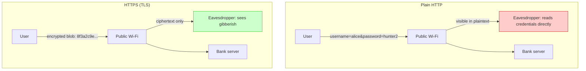
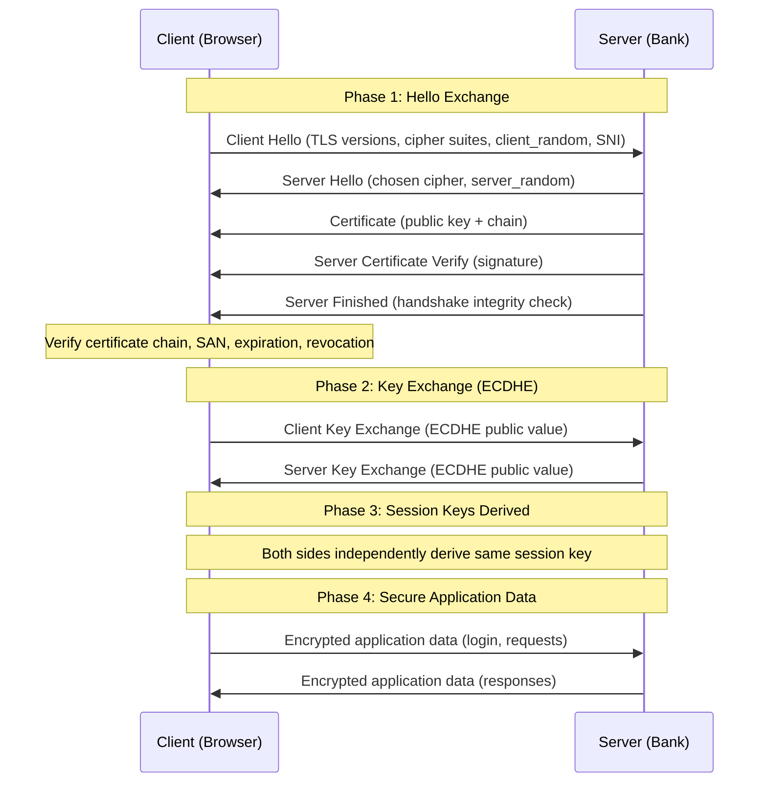
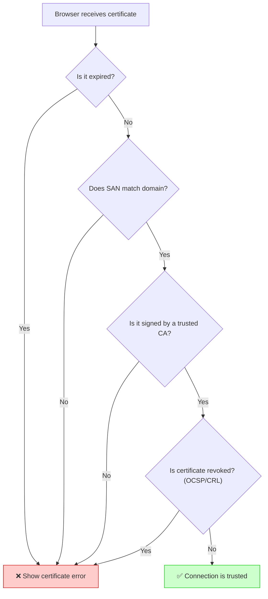
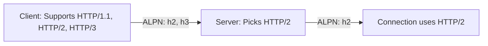
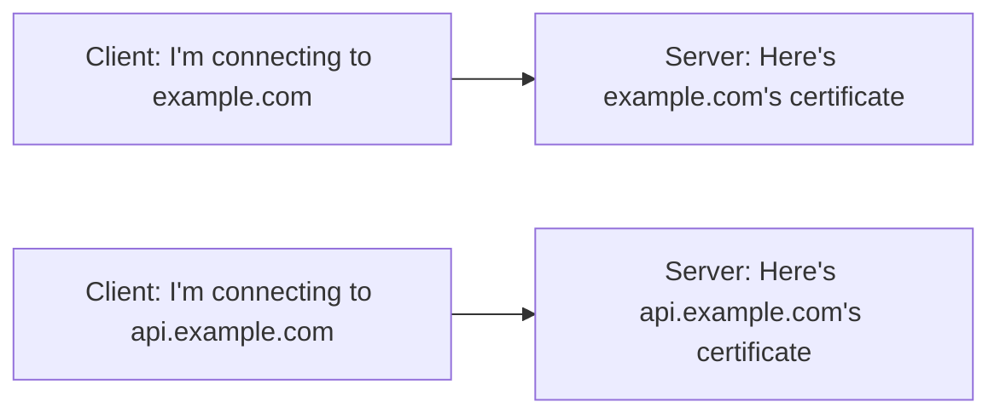
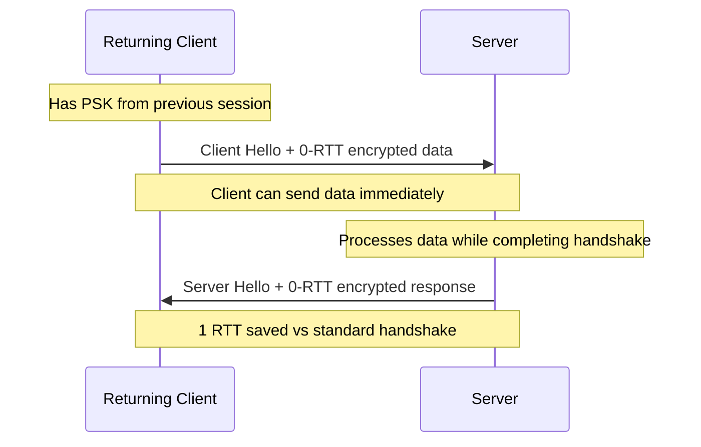

# Security — Section 3: TLS/SSL & the Handshake

## ✅ Checklist

- [ ] Understand why TLS exists and what three problems it solves
- [ ] Walk through the TLS 1.3 handshake step by step
- [ ] Understand certificate validation (chain, SAN, expiration, revocation)
- [ ] Understand forward secrecy and why ephemeral keys matter
- [ ] Know what changed between TLS 1.2 and TLS 1.3
- [ ] Understand ALPN, SNI, and session resumption
- [ ] Common pitfalls — real-world breach examples (Heartbleed, POODLE, Superfish)
- [ ] Hands-on: inspect a real TLS handshake and certificate chain in the Codespace

---

## 3.1 Why TLS Exists, With a Concrete Scenario

Say you're on public airport Wi-Fi, logging into your bank's website. Plain HTTP sends everything — your username, password, account balance — as readable plaintext across that Wi-Fi network. Anyone running a packet sniffer on the same network (a trivially available tool, e.g. Wireshark) sees your credentials scroll past in the clear. This isn't hypothetical — "Firesheep," a 2010 browser extension, made exactly this attack a one-click affair on shared Wi-Fi, hijacking Facebook/Twitter sessions en masse until sites moved to HTTPS-by-default.

TLS (Transport Layer Security — SSL is its deprecated predecessor; the terms get used interchangeably in casual speech, but SSL itself is broken and unused today) wraps HTTP in a secure channel and solves three problems simultaneously:

1. **Confidentiality** — nobody on the network path can read the data
2. **Integrity** — nobody can tamper with the data in transit without detection
3. **Authentication** — you can verify you're actually talking to your bank's real server, not an impostor

### Visual: HTTP vs HTTPS on Hostile Wi-Fi



---

## 3.2 The Handshake, Step by Step

This is the hybrid cryptosystem from Section 1, implemented as an actual protocol. Here's the modern TLS 1.3 flow (simplified from TLS 1.2's extra round-trip — 1.3 is faster specifically because it cut a round-trip out of this process):

1. **Client Hello** — browser sends supported TLS versions, cipher suites, and a random number (`client_random`)
2. **Server Hello** — server picks a cipher suite, sends its own random number (`server_random`), and sends its **digital certificate** (contains the server's public key, signed by a Certificate Authority — full trust mechanics in Section 4)
3. **Certificate verification** — browser checks the certificate is valid, unexpired, matches the domain name (via Subject Alternative Name), and is signed by a CA the browser already trusts
4. **Key exchange** — using Diffie-Hellman (specifically **ECDHE** in modern TLS — the "E" means "ephemeral," covered in 3.3), both sides derive a shared secret without ever transmitting it directly across the network
5. **Session keys derived** — both sides independently compute the same symmetric session key from the shared secret and the earlier random numbers
6. **Switch to symmetric encryption** — all actual application data (login form, bank balance, everything) is now encrypted with the fast symmetric key, not the slow asymmetric operations

### Visual: TLS 1.3 Handshake (Detailed)



### 3.2.1 Certificate Validation — How the Browser Actually Trusts the Certificate

When the browser receives the server's certificate, it performs a series of checks:



The certificate chain matters here:

| Certificate type              | Purpose                                                                                                                    |
| ----------------------------- | -------------------------------------------------------------------------------------------------------------------------- |
| **Root CA**                   | The ultimate trust anchor — browsers ship with a pre-installed list of trusted root CAs (Mozilla's CA Certificate Program) |
| **Intermediate CA**           | Signed by the root CA — used to issue leaf certificates; if compromised, can be revoked without revoking the root          |
| **Leaf (Server) Certificate** | Issued to your specific domain — contains the server's public key, domain name, expiration date                            |

The browser validates the full chain: Leaf → Intermediate → Root (trusted). If any link in the chain is broken (expired, revoked, signed by an unknown CA), the connection fails.

> **💡 SAN (Subject Alternative Name):** Modern certificates use SAN to specify domain names. The deprecated Common Name (CN) field is no longer sufficient. A single certificate can cover multiple domains (e.g., `example.com`, `www.example.com`, `api.example.com`) via SAN.

---

## 3.3 Forward Secrecy — Why Ephemeral Keys Matter

Consider this scenario: an attacker records _all_ encrypted traffic to your bank today, without being able to decrypt any of it yet. Years later, they breach the bank and steal its private key. If the original key exchange used the server's long-term private key directly, **every recorded session, going back years, becomes decryptable retroactively.**

This happened at scale — the 2013 Snowden disclosures revealed mass surveillance programs understood to rely partly on exactly this pattern: harvest encrypted traffic now, decrypt later if a key is ever obtained.

**Forward secrecy** fixes this. Modern TLS uses **ECDHE** (Elliptic Curve Diffie-Hellman Ephemeral) — a _fresh_, temporary key pair generated for that single session only, then discarded immediately after. The server's long-term private key is used only to _sign_ the exchange (proving authenticity), never to encrypt it directly. Even if the server's long-term private key is stolen tomorrow, none of yesterday's recorded sessions can be decrypted — each used its own disposable key that no longer exists anywhere.

### Visual: Without vs With Forward Secrecy

```mermaid
flowchart TB
    subgraph NoFS["Without Forward Secrecy"]
        A1["Attacker records 1000s of sessions over years"] --> B1["Server's long-term private key stolen"]
        B1 --> C1["ALL recorded sessions decrypted retroactively"]
    end
    subgraph FS["With Forward Secrecy (ECDHE)"]
        A2["Attacker records 1000s of sessions over years"] --> B2["Each session used a unique, ephemeral key"]
        B2 --> C2["Ephemeral keys discarded after each session"]
        C2 --> D2["Server's long-term key stolen later"]
        D2 --> E2["Past sessions still CANNOT be decrypted"]
    end
    style NoFS fill:#ffcccc,stroke:#cc0000
    style FS fill:#ccffcc,stroke:#00cc00
```



> **Important:** TLS 1.3 made forward secrecy **mandatory** — it was optional and cipher-suite dependent in TLS 1.2, which is precisely why incidents like the above were possible against older configurations.

---

## 3.4 TLS 1.2 vs TLS 1.3 — What Actually Changed

|                                                  | TLS 1.2                          | TLS 1.3                                                                   |
| ------------------------------------------------ | -------------------------------- | ------------------------------------------------------------------------- |
| Round trips before data sent                     | 2                                | 1 (faster page loads)                                                     |
| Forward secrecy                                  | Optional, cipher-suite dependent | Mandatory                                                                 |
| Weak ciphers (RC4, MD5, static RSA key exchange) | Permitted                        | Removed entirely                                                          |
| "0-RTT" resumption                               | Not supported                    | Supported (reconnecting to a known server can skip most of the handshake) |
| Cipher suite count                               | ~37+                             | ~5 (simplified, safer)                                                    |
| Certificate exchange                             | RSA or ECDSA                     | ECDSA-only for key exchange (RSA still allowed for signing)               |
| Session resumption                               | Session IDs and tickets          | More secure PSK (Pre-Shared Key) resumption                               |

### 3.4.1 Key Technical Improvements in TLS 1.3

| Improvement                          | Why It Matters                                                                                    |
| ------------------------------------ | ------------------------------------------------------------------------------------------------- |
| **Removed static RSA key exchange**  | RSA key exchange doesn't provide forward secrecy; removed to make FS mandatory                    |
| **Removed RC4, 3DES, MD5, SHA-1**    | All known weak or broken algorithms; removed to prevent downgrade attacks                         |
| **Encrypted ServerHello extensions** | Prevents certain traffic analysis attacks (e.g., SNI still exposed, but less metadata)            |
| **0-RTT resumption**                 | Returning clients can send data immediately; reduces latency significantly                        |
| **TLS False Start**                  | (1.2 feature, but refined) — reduces perceived latency by sending data before handshake completes |

### 3.4.2 ALPN — How TLS Negotiates HTTP/2 or HTTP/3

**ALPN** (Application-Layer Protocol Negotiation) is a TLS extension that lets the client advertise which application protocols it supports (HTTP/1.1, HTTP/2, HTTP/3) during the handshake. The server picks one.



This avoids a separate, insecure round-trip to negotiate the protocol after TLS is already established.

### 3.4.3 SNI — Hosting Multiple Domains on One IP

**SNI** (Server Name Indication) is a TLS extension that lets the client tell the server which domain name it's trying to reach _during_ the handshake. Without SNI, one IP address could only serve one TLS certificate. With SNI, a single load balancer or IP can host hundreds of domains with different certificates.



> **⚠️ Privacy note:** SNI is sent unencrypted in plaintext during the handshake. This means anyone monitoring the network can see which domain you're visiting, even though the actual content is encrypted. TLS 1.3 Encrypted Client Hello (ECH) addresses this, but adoption is still limited.

---

## 3.5 Session Resumption and 0-RTT

### 3.5.1 Session Resumption (TLS 1.2)

In TLS 1.2, returning clients can resume a session using a **session ticket** (issued by the server during the initial handshake). The client presents the ticket on reconnection, skipping the full handshake — reducing one full round-trip.

### 3.5.2 0-RTT (TLS 1.3)

TLS 1.3 introduces **0-RTT** ("zero round-trip time") resumption: a returning client can send application data (e.g., the first HTTP request) on the very first packet, without waiting for the handshake to complete. This dramatically reduces latency for repeat visitors.



> **⚠️ 0-RTT security note:** 0-RTT data is not forward-secret (it's encrypted with the PSK, which is derived from the previous session's key). This means 0-RTT data can be replayed by an attacker. It's safe for idempotent or low-sensitivity data, but not for critical operations (e.g., password changes, financial transactions).

---

## 3.6 Common Pitfalls

| Pitfall                                                                     | Why it happens                                    | How to avoid                                                                       |
| --------------------------------------------------------------------------- | ------------------------------------------------- | ---------------------------------------------------------------------------------- |
| **Still supporting TLS 1.0/1.1**                                            | Legacy client compatibility fears                 | Disable both — deprecated, vulnerable to known attacks (BEAST, POODLE)             |
| **Allowing weak cipher suites**                                             | Default server config not hardened                | Explicitly configure strong cipher suites only; disable RC4/3DES/static RSA        |
| **Self-signed certs in production**                                         | Convenience during dev, forgotten before shipping | Use a real CA (Let's Encrypt is free) for anything public-facing                   |
| **Ignoring certificate expiry**                                             | No automated renewal                              | Automate renewal (certbot, ACM, cert-manager) — expired certs break trust entirely |
| **Mixed content (HTTP resources on an HTTPS page)**                         | Legacy assets not migrated                        | Serve every resource over HTTPS; browsers block or warn on mixed content           |
| **Terminating TLS at the load balancer, then sending plaintext internally** | Assuming "the internal network is safe"           | Use mTLS or re-encrypt internally too — internal networks get breached constantly  |
| **Not using HSTS**                                                          | Unaware of HSTS                                   | Set `Strict-Transport-Security` header to force browsers to always use HTTPS       |
| **Certificate with mismatched domain name**                                 | Wrong CN/SAN, or missing SAN                      | Always use SAN; test with `openssl s_client -connect` before deploying             |

### Weak Cipher Suites to Avoid

| Cipher                    | Reason to Avoid                                                         |
| ------------------------- | ----------------------------------------------------------------------- |
| RC4                       | Broken; biases in output allow plaintext recovery                       |
| 3DES                      | Slow and weak (112-bit effective security)                              |
| NULL ciphers              | No encryption at all                                                    |
| EXPORT ciphers            | Intentionally weak (40-bit keys) mandated by US export law in the 1990s |
| Static RSA key exchange   | No forward secrecy                                                      |
| CBC mode with TLS 1.0/1.1 | Vulnerable to padding oracle attacks (POODLE, Lucky13)                  |

### Real-World Examples

- **Heartbleed (2014):** a buffer over-read bug in OpenSSL let attackers read server memory directly — including private keys, session tokens, and passwords — from any server running a vulnerable OpenSSL version, without leaving a trace in logs. It affected roughly half a million of the internet's certificates at the time.
- **POODLE (2014):** exploited weaknesses in SSL 3.0's padding scheme, forcing the deprecation of SSL 3.0 industry-wide.
- **Superfish (2015):** Lenovo pre-installed adware that hijacked TLS connections using a single, shared root certificate installed on every affected laptop — meaning anyone who extracted that one certificate (trivial, and quickly done) could impersonate _any_ HTTPS site to _any_ Superfish-affected laptop.

---

## 3.7 Hands-On Practice (Codespace)

### 1. Watch a real TLS handshake happen against a live server

```bash
# Connect to Google's HTTPS server and observe the full handshake
openssl s_client -connect google.com:443 -tls1_3
```

### 2. Inspect the certificate chain returned

```bash
# Show the full certificate chain with details
openssl s_client -connect google.com:443 -showcerts </dev/null 2>/dev/null | openssl x509 -noout -text | head -60
```

### 3. Check which TLS version and cipher suite were negotiated

```bash
# Show protocol and cipher information
openssl s_client -connect google.com:443 2>/dev/null | grep -E "Protocol|Cipher"
```

### 4. Try connecting while forcing an old, deprecated protocol (should fail on a hardened server)

```bash
# Attempt TLS 1.0 — likely to fail
openssl s_client -connect google.com:443 -tls1 2>&1 | head -10
```

### 5. Check certificate expiry dates

```bash
# Extract validity dates
echo | openssl s_client -connect google.com:443 2>/dev/null | openssl x509 -noout -dates
```

### 6. Check if a server supports forward secrecy

```bash
# Look for ECDHE or DHE in the cipher suite
openssl s_client -connect google.com:443 2>/dev/null | grep -E "Cipher|ECDHE"
```

### 7. Verify the certificate matches the domain name

```bash
# Check SAN (Subject Alternative Name)
echo | openssl s_client -connect google.com:443 2>/dev/null | openssl x509 -noout -text | grep -A1 "Subject Alternative Name"
```

### 8. Test your own server (once you have one)

```bash
# Install testssl.sh
git clone --depth 1 https://github.com/drwetter/testssl.sh.git
cd testssl.sh
./testssl.sh --quick your-server.com
```

Optional — once you have your own public HTTPS endpoint deployed, run a full external audit against it at **ssllabs.com/ssltest** — it grades your actual TLS configuration (cipher suites, protocol versions, cert chain) the way a real security review would.

---

## 3.8 DevOps Connection

| DevOps context                           | Where TLS appears                                                                                                                                              |
| ---------------------------------------- | -------------------------------------------------------------------------------------------------------------------------------------------------------------- |
| **Load balancers / ingress controllers** | TLS termination — decrypting incoming HTTPS before forwarding to backend services                                                                              |
| **cert-manager (Kubernetes)**            | Automates issuing and renewing TLS certificates for cluster ingress, often via Let's Encrypt                                                                   |
| **mTLS in service meshes**               | Istio/Linkerd enforce mutual TLS between every service-to-service call automatically — both client and server present certificates (covered more in Section 5) |
| **CI/CD pipelines**                      | Every `git push`, package download, and API call in a pipeline runs over TLS by default                                                                        |
| **ACM (AWS Certificate Manager)**        | Managed certificate issuance/renewal for load balancers — automates exactly what cert-manager does for Kubernetes                                              |
| **SSL Labs / testssl.sh**                | Standard tools DevOps engineers use to audit a server's actual TLS configuration before going live                                                             |
| **API Gateways**                         | TLS termination and certificate management for external APIs                                                                                                   |
| **Service-to-service (mTLS)**            | Microservices often use mutual TLS to authenticate between internal services, preventing lateral movement if one service is breached                           |

---

## Key Takeaways

1. TLS provides **confidentiality, integrity, and authentication** — not just encryption alone.
2. The handshake is the **hybrid cryptosystem** from Section 1, implemented as a real protocol: asymmetric to exchange a key, symmetric for the actual data.
3. **Forward secrecy (ECDHE)** ensures a stolen long-term private key can't retroactively decrypt past recorded sessions — mandatory in TLS 1.3.
4. TLS 1.3 removed weak legacy ciphers and cut a full round-trip compared to TLS 1.2.
5. Certificate validation includes: expiration, SAN (domain name match), chain verification, and revocation checking (OCSP/CRL).
6. **ALPN** negotiates HTTP/2 or HTTP/3 during the handshake; **SNI** allows multiple domains on one IP.
7. **0-RTT** reduces latency for returning clients but is not forward-secret; use only for idempotent/low-sensitivity operations.
8. Real-world failures (Heartbleed, POODLE, Superfish) show implementation and deployment mistakes are often the actual weak point, not the underlying cryptographic math.
9. Certificate validity, expiry, and trust chains (Section 4 goes deep on this) are just as operationally critical as the cryptography itself.

**Next:** [Section 4 — PKI & Certificate Authorities](Section 4 — PKI & Certificate Authorities.md)
