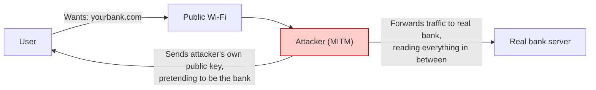
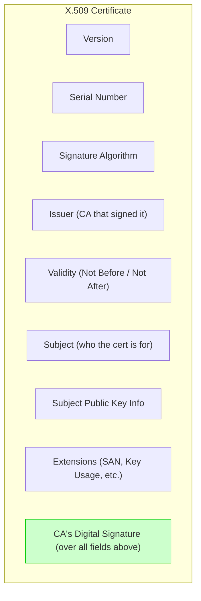
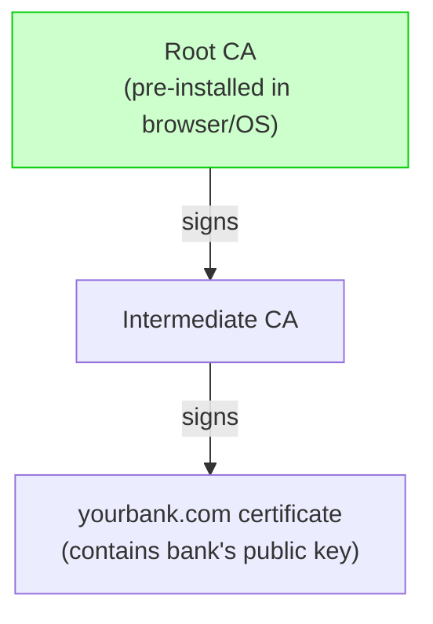
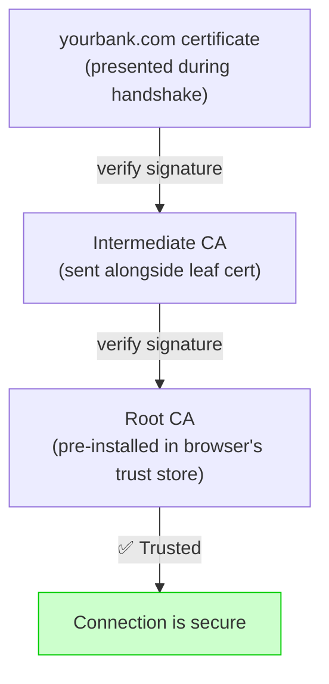
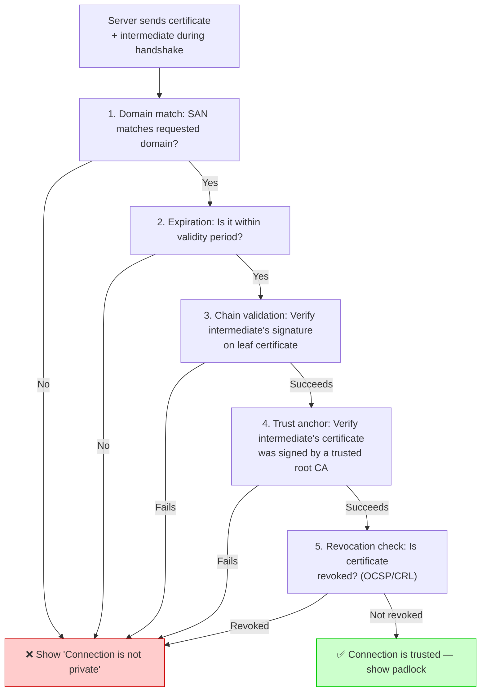
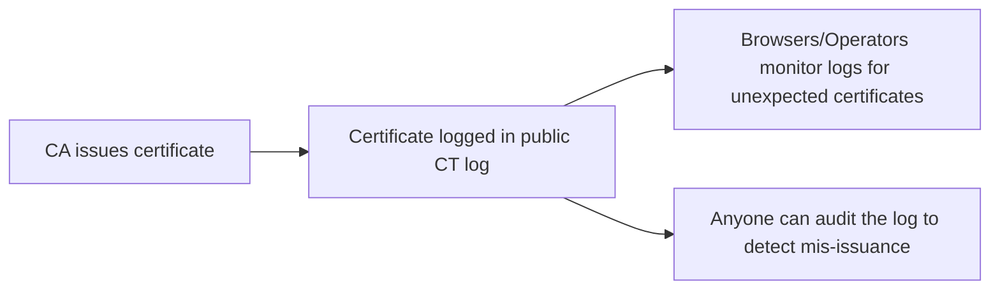

# Security — Section 4: PKI & Certificate Authorities

## ✅ Checklist

- [ ] Understand the trust problem TLS alone doesn't solve
- [ ] Understand what a digital certificate actually contains and proves
- [ ] Understand the chain of trust — root CA, intermediate CA, leaf certificate
- [ ] Walk through how a browser verifies a certificate chain step by step
- [ ] Understand certificate formats (PEM, DER, PKCS#12)
- [ ] Know the difference between DV, OV, and EV certificates
- [ ] Understand private key protection (HSMs, TPMs, KMS)
- [ ] Common pitfalls — real-world CA failure examples (DigiNotar, Superfish)
- [ ] Hands-on: inspect a real certificate chain and generate a self-signed cert in the Codespace

---

## 4.1 The Trust Problem, With a Concrete Scenario

Section 3 glossed over one detail: in the TLS handshake, the server sends its public key. But here's the gap — **how does your browser know that public key actually belongs to your bank, and not to an attacker running a fake "bank" server?**

Concrete attack: you connect to public Wi-Fi at a coffee shop. An attacker runs a **man-in-the-middle (MITM)** device that intercepts your connection attempt to `yourbank.com` and instead hands you _its own_ public key, pretending to be the bank. Without a way to verify identity, your browser would happily encrypt your login credentials — to the attacker's key. This is what tools like **sslstrip** are built to perform.

This is the **trust problem**: encryption alone proves nothing about _identity_. Anyone can generate a key pair — a key pair proves you hold the matching private key, not that you're who you claim to be. **PKI (Public Key Infrastructure)** solves this by creating a chain of trust.

### Visual: MITM Attack Without PKI



---

## 4.2 What a Certificate Actually Is — The Structure

A **digital certificate** binds a public key to an identity (a domain name, an organization) and is digitally signed by a **Certificate Authority (CA)** — a trusted third party whose entire business is vouching for identities.

### Visual: Certificate Structure



The **signature** is the crucial part — it's created using asymmetric cryptography (Section 1) again: the CA signs the certificate with _its own_ private key. Anyone can verify that signature using the CA's _public_ key, which is bundled directly into every browser and OS.

A certificate contains, among other fields:

- The domain name(s) it's valid for (Subject Alternative Name)
- The public key it certifies
- The issuing CA's identity
- A validity period (issued date, expiry date)
- A **digital signature** from the CA, over all of the above

---

## 4.3 The Chain of Trust

Browsers don't trust every CA in existence blindly — they ship with a curated list of **root CAs** (root certificates), pre-installed by the browser/OS vendor. Root CAs almost never sign website certificates directly — instead, they sign **intermediate CAs**, which then sign the actual website's certificate. This creates a chain:

```
Root CA (trusted, built into browser)
   -> signs -> Intermediate CA
        -> signs -> yourbank.com's certificate
```

**Why the extra layer?** If an intermediate CA's key is ever compromised, it can be revoked without invalidating the root CA itself — the root stays offline and protected essentially all the time, minimizing its exposure.

### Visual: Chain of Trust (Issuance Direction)



### Visual: Chain of Trust (Validation Direction)



| Certificate type     | Role in the chain                                                                                                                     |
| -------------------- | ------------------------------------------------------------------------------------------------------------------------------------- |
| **Root CA**          | The ultimate trust anchor — browsers ship with a pre-installed list of trusted root CAs (managed by Mozilla's CA Certificate Program) |
| **Intermediate CA**  | Signed by the root CA — used to issue leaf certificates; if compromised, can be revoked without revoking the root                     |
| **Leaf Certificate** | Issued to your specific domain — contains the server's public key, domain name, expiration date                                       |

---

## 4.4 How Browser Verification Actually Works, Step by Step

### Visual: Browser Certificate Validation



**Step-by-step explanation:**

1. Server sends its certificate _and_ the intermediate CA's certificate during the TLS handshake
2. Browser checks: is this certificate's domain name a match for the site I'm trying to reach? (SAN)
3. Browser checks: is the certificate within its validity period (not expired, not "not yet valid")?
4. Browser verifies the intermediate CA's signature on the site's certificate, using the intermediate CA's public key
5. Browser then verifies the intermediate CA's _own_ certificate was signed by a root CA it already trusts (built into its trust store)
6. Browser optionally checks revocation status (OCSP or CRL)
7. If every link in the chain checks out, the browser shows the padlock. If any link fails, you get the "Your connection is not private" warning

---

## 4.5 Certificate Formats

When working with certificates, you'll encounter different file formats. Here's what they mean:

| Format      | Extension(s)           | Description                                                                | Common use                                                                 |
| ----------- | ---------------------- | -------------------------------------------------------------------------- | -------------------------------------------------------------------------- |
| **PEM**     | `.pem`, `.crt`, `.cer` | Base64-encoded, human-readable (starts with `-----BEGIN CERTIFICATE-----`) | Most common; used in web servers, Kubernetes secrets, and most Linux tools |
| **DER**     | `.der`, `.cer`         | Binary format (not human-readable)                                         | Windows systems, some Java keystores                                       |
| **PKCS#12** | `.p12`, `.pfx`         | Binary bundle containing certificate + private key (password-protected)    | Windows IIS, mutual TLS client certificates                                |

### Converting Between Formats (Handy Reference)

```bash
# PEM → DER
openssl x509 -in cert.pem -outform DER -out cert.der

# DER → PEM
openssl x509 -in cert.der -inform DER -out cert.pem

# PEM → PKCS#12 (cert + key bundle)
openssl pkcs12 -export -in cert.pem -inkey key.pem -out bundle.p12

# PKCS#12 → PEM (extract cert and key separately)
openssl pkcs12 -in bundle.p12 -nokeys -out cert.pem
openssl pkcs12 -in bundle.p12 -nocerts -out key.pem
```

---

## 4.6 Private Key Protection

The private key is the most sensitive part of the PKI system. If it's stolen, the certificate becomes useless — anyone with the private key can impersonate the server.

### Private Key Storage Options

| Method                             | Security Level | Use case                                                                                                  |
| ---------------------------------- | -------------- | --------------------------------------------------------------------------------------------------------- |
| **Filesystem (plaintext)**         | Low            | Development only — never production                                                                       |
| **Encrypted filesystem**           | Medium         | Small deployments, protected by OS-level encryption                                                       |
| **HSM (Hardware Security Module)** | Very High      | Banking, government, high-security environments — keys never leave the hardware                           |
| **TPM (Trusted Platform Module)**  | High           | Server hardware with built-in cryptographic coprocessor                                                   |
| **KMS (Key Management Service)**   | High           | Cloud environments — AWS KMS, GCP Cloud KMS, Azure Key Vault — keys stored in managed HSM-backed services |
| **Secrets Manager**                | Medium-High    | Storing TLS private keys as encrypted secrets with rotation                                               |

> **Best practice:** In production, never store private keys in plaintext on disk. Use a KMS, HSM, or at minimum, encrypt the key with a strong passphrase.

---

## 4.7 Certificate Types

| Type                            | What's verified                                                 | Example use case                                                                                                          |
| ------------------------------- | --------------------------------------------------------------- | ------------------------------------------------------------------------------------------------------------------------- |
| **DV (Domain Validated)**       | Only that you control the domain (e.g. via DNS record or email) | Free certs (Let's Encrypt), personal sites, most of the modern web                                                        |
| **OV (Organization Validated)** | Domain control + verified business registration                 | Corporate sites wanting extra legitimacy                                                                                  |
| **EV (Extended Validation)**    | Domain + rigorous legal/business identity verification          | Historically banks; largely deprecated in browser UI today since browsers stopped showing the special green-bar indicator |

---

## 4.8 Certificate Transparency — A Modern PKI Safeguard

**Certificate Transparency (CT)** is a system that requires CAs to publicly log every certificate they issue. These logs are public, auditable, and append-only.



**Why CT matters:**

- If a CA is breached (like DigiNotar), the fraudulent certificates will appear in the public logs
- Domain owners can monitor CT logs for certificates issued for their domain without their knowledge
- Browsers now require CT for all public TLS certificates

**ACME Protocol** (Automatic Certificate Management Environment) is how Let's Encrypt and other modern CAs automate issuance. It handles the domain validation and certificate issuance over HTTPS, without manual intervention.

---

## 4.9 Common Pitfalls

| Pitfall                                                    | Why it happens                                                               | How to avoid                                                                                                           |
| ---------------------------------------------------------- | ---------------------------------------------------------------------------- | ---------------------------------------------------------------------------------------------------------------------- |
| **Self-signed certificates in production**                 | No signature from a trusted CA at all — browsers reject or warn loudly       | Use a real CA (Let's Encrypt is free and automatable)                                                                  |
| **Expired certificates**                                   | No automated renewal process                                                 | Automate renewal (certbot, cert-manager, ACM)                                                                          |
| **Incomplete certificate chain (missing intermediate)**    | Server only sends its own cert, not the intermediate                         | Configure the server to send the full chain, not just the leaf cert                                                    |
| **Wildcard certificate misuse**                            | Using one `*.example.com` cert across too many unrelated subdomains/services | Scope certificates tightly; a leak on one service shouldn't compromise all subdomains                                  |
| **Not pinning certificates for high-security mobile apps** | Assuming the OS trust store is always sufficient                             | Certificate pinning defends specifically against a compromised or coerced CA issuing a fraudulent cert for your domain |
| **Trusting any CA blindly**                                | Assuming "it has a padlock" means "it's safe"                                | A padlock only proves _encryption + identity of the domain_, not that the site itself is trustworthy or non-malicious  |
| **Storing private keys in plaintext**                      | Convenience; lack of understanding of the risk                               | Use KMS, HSM, or at minimum encrypt the key with a passphrase                                                          |
| **Using weak key algorithms**                              | Legacy systems                                                               | Use RSA-2048+ or ECC (P-256 or higher) for modern security                                                             |

### Real-World Examples

- **DigiNotar (2011):** a Dutch CA was breached, and the attacker issued fraudulent certificates for domains including `*.google.com`. These fake certificates were used in real MITM attacks against Iranian internet users. The fallout was severe enough that DigiNotar was removed from every major browser's trust store, effectively ending the company.

- **Superfish (2015, revisited from Section 3):** a PKI failure specifically — Lenovo's adware installed its _own_ root CA certificate into the OS trust store on every affected laptop, meaning the adware could silently forge valid-looking certificates for any HTTPS site. This also demonstrates why trust stores should only contain legitimate, audited CAs.

- **Let's Encrypt (2015–present):** founded specifically to fix a PKI accessibility problem — before it existed, certificates commonly cost money and required manual, tedious renewal, which pushed many site operators toward the self-signed and expired-cert pitfalls above. Free, automatable, short-lived (90-day) certificates changed the entire industry's default behavior. The **CA/Browser Forum** (the governing body that sets the rules for CAs) now mandates maximum certificate lifetimes of 398 days (≈13 months), pushing the industry toward shorter, more frequently renewed certificates.

---

## 4.10 Hands-On Practice (Codespace)

### 1. Inspect the full certificate chain for a real site

```bash
openssl s_client -connect github.com:443 -showcerts </dev/null 2>/dev/null | grep -E "s:|i:"
# "s:" = subject (who the cert is for), "i:" = issuer (who signed it)
# Trace the chain: leaf cert's issuer should match the next cert's subject, and so on up to the root
```

### 2. Generate your own self-signed certificate (to see what browsers reject and why)

```bash
openssl req -x509 -newkey rsa:2048 -keyout selfsigned-key.pem -out selfsigned-cert.pem -days 365 -nodes -subj "/CN=localhost"
```

### 3. Inspect your self-signed cert's fields

```bash
openssl x509 -in selfsigned-cert.pem -noout -text | head -20
# Notice: issuer and subject are IDENTICAL — this is exactly what marks it as self-signed,
# and exactly what a browser flags as untrusted (no external CA vouching for it)
```

### 4. Check a real certificate's validity dates and issuing CA

```bash
echo | openssl s_client -connect github.com:443 2>/dev/null | openssl x509 -noout -issuer -dates
```

### 5. Convert a certificate between formats (if you have one)

```bash
# Create a self-signed cert if you don't have one
openssl req -x509 -newkey rsa:2048 -keyout key.pem -out cert.pem -days 365 -nodes

# Convert PEM to DER
openssl x509 -in cert.pem -outform DER -out cert.der

# Convert DER to PEM
openssl x509 -in cert.der -inform DER -out cert.pem

# Create a PKCS#12 bundle
openssl pkcs12 -export -in cert.pem -inkey key.pem -out bundle.p12 -password pass:test123
```

---

## 4.11 DevOps Connection

| DevOps context                                        | Where PKI appears                                                                                                    |
| ----------------------------------------------------- | -------------------------------------------------------------------------------------------------------------------- |
| **cert-manager (Kubernetes)**                         | Automates the entire chain-of-trust lifecycle — requesting, issuing, and renewing certs from a CA like Let's Encrypt |
| **Internal CAs (HashiCorp Vault PKI secrets engine)** | Organizations run their own private CA to issue short-lived certs for internal service-to-service mTLS               |
| **AWS ACM**                                           | Managed CA-issued certificates for load balancers, auto-renewed, no manual PEM file handling                         |
| **Container image signing (Cosign/Sigstore)**         | Uses a similar trust-chain concept — verifying a signature traces back to a trusted identity                         |
| **Corporate device management (MDM)**                 | Company-issued devices often have an internal root CA installed to inspect/proxy corporate traffic                   |
| **mTLS in service meshes**                            | Istio/Linkerd use PKI internally to issue certificates for each service for mutual TLS authentication                |
| **Code signing**                                      | CI/CD pipelines sign build artifacts with code-signing certificates to verify authenticity                           |

---

## Key Takeaways

1. Encryption alone proves nothing about **identity** — PKI exists specifically to solve the trust problem.
2. A certificate binds a public key to an identity, signed by a CA using the same asymmetric cryptography from Section 1.
3. Browsers trust a small set of pre-installed **root CAs**; everything else chains back to one of those roots.
4. The **intermediate CA layer** exists so a compromised intermediate can be revoked without invalidating the root.
5. DV/OV/EV certificate types differ in _how much_ identity verification occurred — none of them guarantee the site itself is trustworthy, only that the domain/identity claim checks out.
6. **Certificate Transparency** logs all issued certificates publicly, making it possible to detect fraudulent certs.
7. **Private keys must be protected** — use HSMs, KMS, or encrypted storage in production.
8. Real-world CA failures (DigiNotar, Superfish) show that the trust model's weakest point is often the CA itself, not the cryptographic math.
9. Let's Encrypt fundamentally changed the industry by making trusted certificates free and automatable, eliminating the excuses behind expired/self-signed cert pitfalls.
10. The **CA/Browser Forum** governs CA practices; certificate lifetimes are now capped at 398 days, pushing toward more frequent renewal cycles.

**Next:** [Section 5 — Authentication vs Authorization](Section 5 — Authentication vs Authorization.md)
