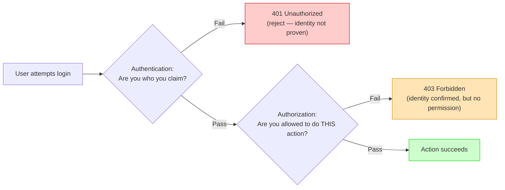
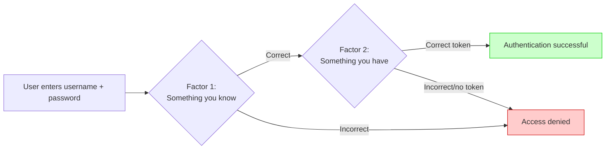
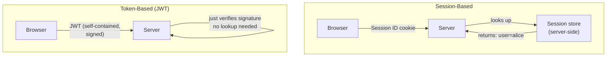
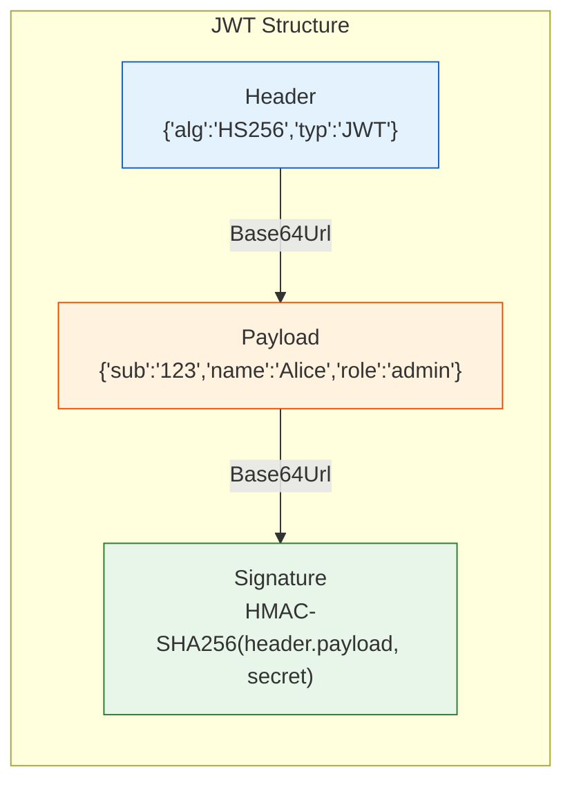
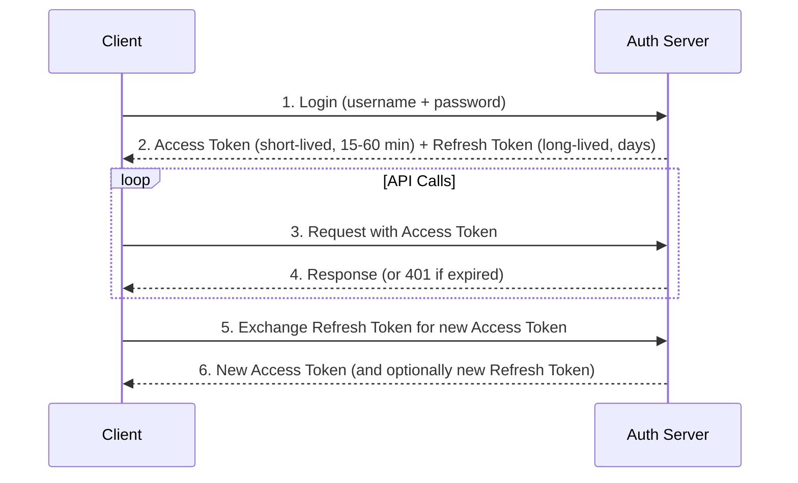
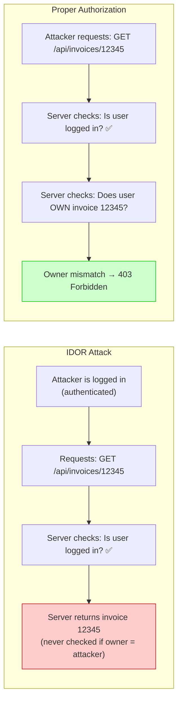

# Security — Section 5: Authentication vs Authorization

## ✅ Checklist

- [ ] Understand the distinction between authentication and authorization
- [ ] Know the three authentication factor categories and what real MFA requires
- [ ] Understand session-based vs token-based (JWT) authentication tradeoffs
- [ ] Understand what JWTs actually are — signed, not encrypted
- [ ] Understand IDOR/BOLA and why it's a top real-world vulnerability class
- [ ] Understand the refresh token pattern
- [ ] Common pitfalls — real-world examples (Twitter 2020, IDOR patterns)
- [ ] Hands-on: decode a JWT and simulate signature verification in the Codespace

---

## 5.1 The Distinction, With a Concrete Scenario

Picture an office building. **Authentication** is showing your ID badge at the front door so the guard confirms _you are who you claim to be_. **Authorization** is separate — once inside, your badge only opens certain doors: your floor, maybe the server room if you're IT staff, but not the CEO's office or the finance vault. You were authenticated once at the entrance, but authorization is checked _again, separately_, at every single door.

This distinction gets conflated constantly in casual conversation ("I logged in" vs "I have access"), but they answer fundamentally different questions:

- **Authentication (AuthN):** "Who are you?" — verifying identity
- **Authorization (AuthZ):** "What are you allowed to do?" — verifying permissions

A system can authenticate you perfectly (you proved you're really Alice) and still deny you access to something (Alice isn't authorized to view payroll data). These are two separate checks, and conflating them in code or design is a very common, very real security bug.

### Visual: AuthN vs AuthZ as Two Separate Gates



Notice the distinct HTTP status codes — `401` means "I don't know who you are," `403` means "I know exactly who you are, and the answer is still no." Mixing these up in an API's error handling is itself a common real-world bug that leaks information.

### HTTP Status Codes — Quick Reference

| Status Code        | Meaning                                                                           | AuthN/AuthZ                             |
| ------------------ | --------------------------------------------------------------------------------- | --------------------------------------- |
| `200 OK`           | Success                                                                           | AuthZ passed                            |
| `401 Unauthorized` | Authentication failed or missing                                                  | AuthN failure                           |
| `403 Forbidden`    | Authentication succeeded, but AuthZ failed                                        | AuthZ failure                           |
| `404 Not Found`    | Resource doesn't exist (sometimes used to hide existence from unauthorised users) | Often AuthZ failure masquerading as 404 |

---

## 5.2 Authentication Factors

Authentication proves identity using one or more "factors":

| Factor type            | Example                                                     | Weakness                                                            |
| ---------------------- | ----------------------------------------------------------- | ------------------------------------------------------------------- |
| **Something you know** | Password, PIN                                               | Can be guessed, phished, leaked in a breach                         |
| **Something you have** | Phone (SMS code), hardware key (YubiKey), authenticator app | Can be lost or stolen; SMS specifically vulnerable to SIM-swapping  |
| **Something you are**  | Fingerprint, face ID                                        | Can't be "changed" if compromised — no password reset for your face |

**Multi-Factor Authentication (MFA)** combines two or more of these categories. Crucially, _two passwords_ is not MFA — that's still one factor type (something you know), just twice. Real MFA requires factors from _different_ categories.

### Visual: MFA Flow



---

## 5.3 Session-Based vs Token-Based Authentication

Once you're authenticated, the system needs to remember you across requests — HTTP itself is stateless, so "remembering" has to be built on top.

**Session-based (traditional):** server creates a session record (stored server-side, often in memory or a database) and gives the browser a **session ID** in a cookie. Every request, the browser sends the cookie, and the server looks up the session record to know who you are.

- **Pro:** server can instantly revoke a session (just delete the record)
- **Con:** doesn't scale easily across multiple servers without a shared session store (like Redis)

**Token-based (JWT — JSON Web Token):** instead of a server-side record, the server issues a signed token containing the user's identity and claims directly inside it. The server doesn't need to "look anything up" — it just verifies the token's signature.

- **Pro:** stateless, scales trivially across many servers (no shared session store needed)
- **Con:** harder to revoke early — a JWT is valid until it expires, no matter what, unless you build extra infrastructure (a blocklist) specifically to handle revocation, which partially defeats the "stateless" benefit

### Visual: Session Cookies vs JWT



### Visual: JWT Structure



---

## 5.4 Refresh Tokens — The Complete Picture

JWTs have a natural tension: short expiry is secure (less window for abuse) but annoying for users; long expiry is convenient but risky. **Refresh tokens** solve this:



| Token type        | Lifetime              | Purpose                                | Storage                                                |
| ----------------- | --------------------- | -------------------------------------- | ------------------------------------------------------ |
| **Access Token**  | Short (15-60 min)     | Authorise API requests                 | Client (memory or httpOnly cookie)                     |
| **Refresh Token** | Long (days to months) | Get new Access Tokens without re-login | Secure, often stored server-side or in httpOnly cookie |

> **Best practice:** Store Access Tokens in memory (not localStorage) and Refresh Tokens in httpOnly cookies to prevent XSS theft.

---

## 5.5 Authorization Concepts

Authorization decides what an authenticated identity can _do_.

**Role-Based Access Control (RBAC):** users are assigned roles (`admin`, `editor`, `viewer`), and permissions attach to the role, not the individual user. Adding a new admin is just "assign the admin role" — no need to individually configure dozens of permissions per person. (Full access control models, including RBAC in depth, are covered in Section 6.)

**Common real-world confusion:** many systems check _authentication_ ("is this a logged-in user?") when they actually needed to check _authorization_ ("is this logged-in user allowed to edit THIS specific resource?"). This exact gap is the root cause of a huge class of real vulnerabilities, covered concretely below.

---

## 5.6 OAuth 2.0 and OpenID Connect — Teaser

You've probably used "Login with Google" or "Login with GitHub" — that's **OAuth 2.0** and **OpenID Connect (OIDC)** in action.

| Protocol           | Purpose        | What it gives you                                             |
| ------------------ | -------------- | ------------------------------------------------------------- |
| **OAuth 2.0**      | Authorization  | Delegated access — "This app can read my Google Drive files"  |
| **OpenID Connect** | Authentication | Identity verification — "This user is really alice@gmail.com" |
| **JWT**            | Token format   | A specific way to encode and sign claims                      |

> **Note:** JWT is a token format, OAuth is a protocol. They're not the same thing — OAuth can use JWTs (and often does), but JWTs can be used independently of OAuth. We'll cover OAuth and OIDC in detail in later sections.

---

## 5.7 Common Pitfalls

| Pitfall                                                             | Why it happens                                                                   | How to avoid                                                                              |
| ------------------------------------------------------------------- | -------------------------------------------------------------------------------- | ----------------------------------------------------------------------------------------- |
| **Broken Object Level Authorization (BOLA/IDOR)**                   | Checking "is user logged in" but not "does this user own THIS specific resource" | Explicitly verify resource ownership on every request, not just login status              |
| **Storing JWTs in localStorage**                                    | Convenient for frontend developers                                               | Vulnerable to XSS-based token theft; prefer httpOnly cookies where possible               |
| **Never expiring sessions/tokens**                                  | Convenience, avoiding "annoying" re-logins                                       | Set reasonable expiry; use refresh tokens for longer-lived sessions                       |
| **Treating "authenticated" as "authorized for everything"**         | Conflating the two concepts in code                                              | Always check authorization separately and explicitly, per action/resource                 |
| **SMS-based MFA treated as equally strong as an authenticator app** | Assuming all MFA is equivalent                                                   | SIM-swapping defeats SMS MFA; prefer app-based or hardware-key MFA for sensitive accounts |
| **Putting secrets in JWT payloads**                                 | Assuming JWT is encrypted                                                        | JWT is signed, NOT encrypted — anyone can read the payload                                |
| **Not validating JWT signature**                                    | Assuming any token is valid                                                      | Always verify signature using the server's secret or public key                           |

### Visual: IDOR Attack Pattern



### Real-World Examples

- **IDOR / BOLA vulnerabilities** are so common they've topped the OWASP API Security Top 10 for years (full OWASP coverage in Sections 7–8). Classic pattern: an API endpoint like `GET /api/invoices/12345` checks that you're _logged in_, but never checks that invoice `12345` actually _belongs to you_. Simply changing the number in the URL — no hacking tools required, just editing a number — lets any logged-in user view or edit anyone else's data. This exact bug has been found in production at major companies repeatedly; it's less "exotic exploit" and more "someone forgot one `if` statement."

- **Twitter's 2020 breach:** attackers used social engineering to gain access to an internal admin tool. Once _authenticated_ as an employee (via a phished credential), the tool's _authorization_ model apparently didn't sufficiently limit which accounts that access could touch, allowing high-profile account takeovers used to tweet a crypto scam.

---

## 5.8 Hands-On Practice (Codespace)

### 1. Decode a JWT's structure (JWTs are base64, NOT encrypted!)

```bash
# A JWT looks like: header.payload.signature

# Decode the header
echo '{"alg":"HS256","typ":"JWT"}' | base64

# Decode the payload
echo '{"sub":"1234567890","name":"Alice","role":"admin"}' | base64

# Notice: this is BASE64, not encryption — anyone can decode and READ a JWT's contents.
# Only the SIGNATURE prevents tampering; the payload itself is fully readable by anyone.
```

### 2. Generate a signature to see what "signing" a token means

```bash
# Sign a payload with HMAC-SHA256
echo -n '{"sub":"1234567890","role":"admin"}' | openssl dgst -sha256 -hmac "supersecretkey"
# This HMAC is conceptually what a JWT signature is — proof the payload wasn't altered,
# without encrypting the payload itself
```

### 3. Verify a signature (simulate server-side validation)

```bash
# Step 1: Original payload
PAYLOAD='{"sub":"1234567890","role":"admin"}'
SECRET="supersecretkey"

# Step 2: Compute signature
SIGNATURE=$(echo -n "$PAYLOAD" | openssl dgst -sha256 -hmac "$SECRET" | awk '{print $2}')
echo "Original signature: $SIGNATURE"

# Step 3: Attacker tampers with payload
TAMPERED='{"sub":"1234567890","role":"superadmin"}'
NEW_SIG=$(echo -n "$TAMPERED" | openssl dgst -sha256 -hmac "$SECRET" | awk '{print $2}')
echo "Tampered signature: $NEW_SIG"

# The signatures don't match! The server would detect tampering immediately.
```

### 4. Notice the avalanche effect

```bash
# Change one character in the payload
PAYLOAD1='{"role":"admin"}'
PAYLOAD2='{"role":"Admin"}'  # Capital A

echo -n "$PAYLOAD1" | openssl dgst -sha256 -hmac "secret"
echo -n "$PAYLOAD2" | openssl dgst -sha256 -hmac "secret"
# The HMAC outputs are completely different — one character change = totally different signature
```

**Important realization from exercise 1:** a JWT is _not_ encrypted, just base64-encoded and signed. This is a very common misconception — never put secrets inside a JWT payload assuming they're hidden. They're plainly readable by anyone who intercepts the token; only tampering is prevented, not reading.

---

## 5.9 DevOps Connection

| DevOps context                          | Where AuthN/AuthZ appears                                                                                                                        |
| --------------------------------------- | ------------------------------------------------------------------------------------------------------------------------------------------------ |
| **Kubernetes RBAC**                     | Every `kubectl` action is checked against Role/ClusterRole bindings — pure authorization, layered on top of authentication (via certs or tokens) |
| **CI/CD pipeline secrets**              | Pipeline runners authenticate to cloud providers via service accounts/tokens, then are authorized only for specific scoped actions               |
| **API Gateways**                        | Commonly centralize authentication (verify the JWT) while delegating fine-grained authorization to each backend service                          |
| **SSO (Single Sign-On) in enterprises** | One authentication event (e.g. via SAML/OIDC) grants access across many separate tools, each still enforcing its own authorization rules         |
| **GitHub/GitLab repo permissions**      | Classic RBAC in action — Owner/Maintainer/Developer/Reporter roles each authorized for different actions on the same authenticated account       |
| **Service accounts in cloud**           | AWS IAM roles, GCP service accounts — authentication via credentials, authorization via policies (covered in Section 6)                          |

---

## Key Takeaways

1. **Authentication answers "who are you," authorization answers "what can you do."** They are separate checks, and conflating them is a recurring, serious class of bug.
2. `401` = authentication failed (identity unknown); `403` = authentication succeeded, authorization failed.
3. Real MFA requires factors from _different_ categories (know/have/are) — two passwords is not MFA.
4. Session-based auth is stateful and easily revocable; token-based (JWT) auth is stateless and scales better but is harder to revoke early.
5. A JWT is signed, **not encrypted** — its payload is fully readable by anyone; only tampering is prevented.
6. **Refresh tokens** enable long-lived sessions without storing credentials client-side: access token (short) + refresh token (long).
7. IDOR/BOLA (checking login but not resource ownership) is one of the most common real-world authorization vulnerabilities, and tops OWASP's API security list for a reason.
8. Real incidents (Twitter 2020) show that authentication compromise plus weak authorization scope multiplies the blast radius of a single stolen credential.
9. OAuth 2.0 (authorization) and OpenID Connect (authentication) are the real-world protocols you'll encounter in the wild — JWT is a token format they often use.

**Next:** [Section 6 — Least Privilege & Access Control Models](Section 6 — Least Privilege & Access Control Models.md)
