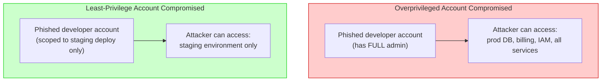
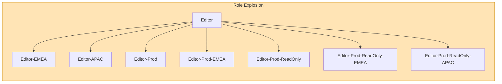
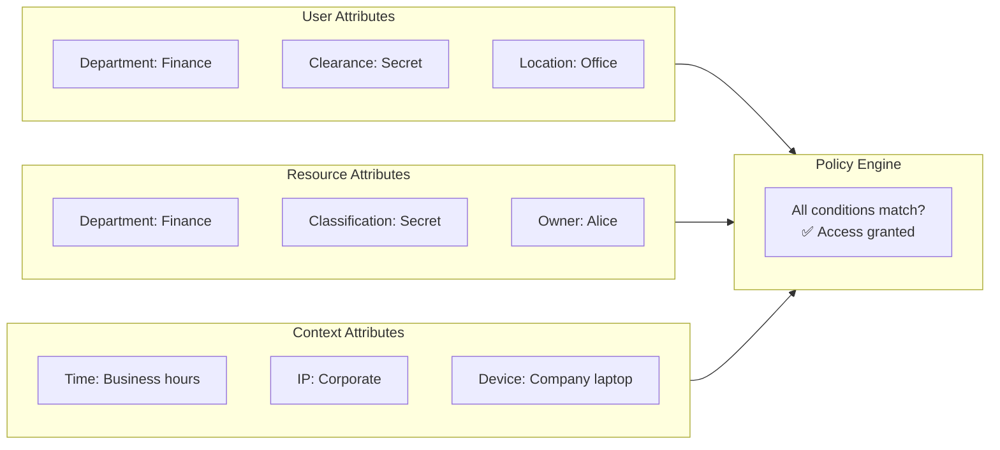
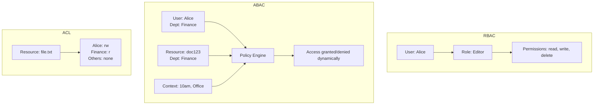
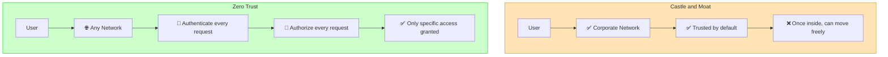

# Security — Section 6: Least Privilege & Access Control Models

## ✅ Checklist

- [ ] Understand the Principle of Least Privilege and why it limits blast radius, not breaches themselves
- [ ] Understand RBAC, ABAC, and ACL — how each works and their tradeoffs
- [ ] Understand Zero Trust as the broader philosophy underpinning least privilege
- [ ] Understand separation of duties and why it matters
- [ ] Common pitfalls — real-world breach examples (Equifax, Capital One, Target)
- [ ] Hands-on: Linux file permissions, groups, sudo auditing, and ACLs in the Codespace

---

## 6.1 The Principle, With a Concrete Scenario

Say a junior developer needs to deploy code to a staging server. The lazy approach: give them full admin access to the entire production AWS account, because "it's easier than figuring out exactly what they need." Six months later, that developer's laptop gets phished. Because their account had full admin rights, the attacker now has full admin rights too — over production databases, billing, IAM, everything — not because the attacker was sophisticated, but because nobody scoped the original access down.

**Principle of Least Privilege (PoLP):** every user, process, or system should have the _minimum_ access necessary to do its job — nothing more. Not "access I might need someday." Not "access that's convenient." The minimum, full stop.

This sounds obvious stated plainly, but it's violated constantly in practice because scoping access down takes deliberate effort, while granting broad access is the path of least resistance in the moment. The 2017 Equifax breach and countless smaller incidents trace back to exactly this: a service or account had far more access than its actual job required, and that excess access is precisely what an attacker exploited once they got in anywhere.

### Visual: Blast Radius With and Without Least Privilege



The account gets compromised either way — the difference is entirely in the **blast radius** once it happens. Least privilege doesn't prevent every breach; it limits the damage a single breach can cause.

> **💡 Key insight:** Least privilege is about **limiting blast radius**, not about preventing breaches entirely. Assume breach somewhere; design so it can't go everywhere.

---

## 6.2 Access Control Models

There are several standard models for actually implementing "who can do what." Each solves the same underlying problem differently.

### RBAC — Role-Based Access Control

Permissions are attached to **roles**, and users are assigned roles. You don't configure permissions per-person; you configure them per-role, then assign people to roles.

**Worked example:** at a company, the roles might be `viewer`, `editor`, `admin`. `editor` can create and modify documents but not delete users. `admin` can do both. When Alice joins as a new editor, she's simply assigned the `editor` role — she instantly inherits exactly the right permission set, no manual configuration per person.

- **Pro:** scales cleanly as organizations grow — managing 10 roles is far simpler than managing custom permissions for 10,000 individual employees
- **Con:** can become rigid — "role explosion" happens when edge cases pile up and you end up creating dozens of hyper-specific roles to handle exceptions

### Visual: Role Explosion



### ABAC — Attribute-Based Access Control

Permissions are decided dynamically based on **attributes** of the user, resource, and context — not a fixed role.

**Worked example:** "Allow access to this document IF the user's department attribute matches the document's department tag, AND the request is coming from a corporate IP address, AND it's during business hours." None of that is a fixed "role" — it's a real-time policy evaluation across multiple attributes.

### Visual: ABAC Attributes



- **Pro:** far more granular and context-aware than RBAC
- **Con:** significantly more complex to design, audit, and reason about — harder to answer "who can access X" at a glance, since the answer depends on live context

### ACL — Access Control Lists

Permissions attached directly to individual resources, listing exactly which users/groups can perform which actions on that specific resource.

**Worked example:** a specific file on a Linux server has an ACL saying "user alice: read+write, group finance: read-only, everyone else: no access." This is per-resource, not per-role.

- **Pro:** very precise, fine-grained control over individual resources
- **Con:** doesn't scale — managing thousands of files each with their own custom ACL becomes unmanageable at scale, unlike RBAC's "assign a role once" model

### Visual: Three Models Side by Side



---

## 6.3 Separation of Duties

A related concept: **Separation of Duties (SoD)** ensures that no single person has enough access to perform a critical action alone. This prevents fraud, errors, and insider threats.

**Example:** In financial systems, one person shouldn't be able to both request and approve a payment. In DevOps, the same person shouldn't be able to both write code and deploy it to production without a review.

| Principle   | Least Privilege                   | Separation of Duties                                   |
| ----------- | --------------------------------- | ------------------------------------------------------ |
| **Focus**   | Limit access scope                | Distribute critical access across multiple people      |
| **Goal**    | Reduce blast radius               | Prevent unilateral action                              |
| **Example** | Developer only has staging access | Require two-person approval for production deployments |

---

## 6.4 Zero Trust — A Related, Broader Philosophy

Least privilege is one piece of a broader philosophy called **Zero Trust**: "never trust, always verify." Traditional network security assumed anything _inside_ the corporate firewall was trustworthy — the "castle and moat" model. Zero Trust rejects this assumption entirely: every request, from anywhere, internal or external, is authenticated and authorized _every time_, as if the network itself is hostile.

### Visual: Zero Trust vs Castle and Moat



This matters practically because internal networks get breached constantly — once an attacker is "inside" the moat in a castle-and-moat model, they often have free rein. Zero Trust assumes breach is inevitable somewhere, and designs so that a breach in one place doesn't cascade everywhere.

---

## 6.5 Service Account Rotation

Service accounts (used by CI/CD pipelines, automated jobs, and system daemons) are a special case of least privilege — they're even more dangerous because they often have no human review process.

| Best practice               | Why it matters                                                  |
| --------------------------- | --------------------------------------------------------------- |
| **Short-lived credentials** | Reduce the window of opportunity if credentials are compromised |
| **Automated rotation**      | Eliminates the human failure point of "I forgot to rotate"      |
| **Scoped permissions**      | Exactly the actions the pipeline needs, nothing more            |
| **Audit trail**             | Know when and how service accounts are used                     |
| **Human review**            | Don't let service accounts run forever without review           |

> **Cloud example:** AWS recommends using IAM roles (not long-term access keys) for EC2 instances and services. The role credentials are automatically rotated by the service.

---

## 6.6 Privilege Escalation — What Least Privilege Defends Against

**Privilege escalation** is an attack where an attacker gains access to a low-privilege account and then exploits a vulnerability to gain higher privileges (e.g., admin).

Least privilege defends against this in two ways:

1. **Vertical privilege escalation:** A low-privilege user can't become admin if there are no admin capabilities to exploit — the "admin" role shouldn't be accessible from a normal user's session
2. **Horizontal privilege escalation:** A user in one department shouldn't be able to access another department's data even if they're both "regular users" — because resource ownership checks are part of authorization

---

## 6.7 Common Pitfalls

| Pitfall                                                                           | Why it happens                                  | How to avoid                                                                                                  |
| --------------------------------------------------------------------------------- | ----------------------------------------------- | ------------------------------------------------------------------------------------------------------------- |
| **Granting broad access "to be safe" / "just in case"**                           | Convenience, avoiding future access requests    | Grant exactly what's needed now; expand only when a real, specific need arises                                |
| **Never auditing/rotating old permissions**                                       | "Set and forget" mentality                      | Periodic access reviews — remove permissions from roles/people who no longer need them                        |
| **Shared admin accounts across a team**                                           | Convenience, avoiding individual account setup  | Individual accounts per person, even if they share the same role — enables accountability and easy revocation |
| **Over-scoped service accounts (e.g. a CI/CD pipeline with full account access)** | Easier than scoping exact permissions needed    | Scope service accounts to the minimum actions that specific pipeline actually performs                        |
| **Role explosion in RBAC**                                                        | Handling every edge case with a new custom role | Consider ABAC for genuinely dynamic/contextual access needs instead of endless new roles                      |
| **Confusing "authenticated" with "should have broad access"**                     | Conflating AuthN and AuthZ (Section 5) again    | Authorization must be scoped deliberately, regardless of how strong authentication was                        |
| **Long-lived service account keys**                                               | Easier than implementing rotation               | Use short-lived credentials (IAM roles, workload identity, OIDC) where possible                               |
| **Not separating duties**                                                         | One person does everything                      | Enforce approval workflows for critical actions (e.g., deployment approvals)                                  |

### Real-World Examples

- **Equifax (2017):** attackers exploited an unpatched web application vulnerability, but the breach became catastrophic (147 million people's data) partly because the compromised system had far more access to sensitive internal databases than its actual function required — a textbook least-privilege failure compounding a separate vulnerability.

- **Capital One (2019):** a former AWS employee exploited a misconfigured web application firewall to assume an overly-permissive IAM role, which then had access to far more S3 storage than that specific application actually needed — the initial entry point was one flaw, but the _scale_ of the breach (100+ million records) was a direct consequence of that role's excessive scope.

- **Target (2013):** attackers initially breached the network through a third-party HVAC (heating/cooling) vendor's credentials. Those vendor credentials should never have had a path into payment systems at all — a clear least-privilege and network segmentation failure, letting a small, unrelated vendor access balloon into a massive breach of 40 million credit cards.

---

## 6.8 Hands-On Practice (Codespace)

### 1. Inspect Linux file permissions

```bash
touch secret-config.txt
ls -l secret-config.txt
# Notice the rwx permission bits for owner/group/others
```

### 2. Restrict a file to owner-only access

```bash
chmod 600 secret-config.txt
ls -l secret-config.txt
# Now only the file owner can read/write it — group and others have zero access
```

### 3. View and set Linux ACLs (finer-grained permissions)

```bash
# View current ACLs
getfacl secret-config.txt

# Add a specific user with read permission
setfacl -m u:alice:r secret-config.txt

# Verify the ACL was applied
getfacl secret-config.txt
# Now Alice has read access even if she's not the owner or in the group
```

### 4. Simulate role-based grouping using Linux groups

```bash
# Create a group
sudo groupadd deployers

# Add yourself to the group
sudo usermod -aG deployers $(whoami)

# Check your groups
groups
# In real systems, group membership is exactly the RBAC pattern —
# permissions attach to the group ("role"), users are added to it
```

### 5. Check what sudo privileges your current user actually has

```bash
sudo -l
# This shows exactly which commands your account is authorized to run as another user —
# a live, practical example of scoped authorization
```

### 6. Create a file with group-based permissions (RBAC simulation)

```bash
# Create a file
touch shared-file.txt

# Set group ownership to the deployers group
sudo chown :deployers shared-file.txt

# Set permissions: owner rw, group rw, others none
chmod 660 shared-file.txt

# Verify
ls -l shared-file.txt
# -rw-rw---- 1 user deployers 0 date shared-file.txt
```

---

## 6.9 DevOps Connection

| DevOps context                                         | Where least privilege / access control models appear                                                                 |
| ------------------------------------------------------ | -------------------------------------------------------------------------------------------------------------------- |
| **AWS IAM policies**                                   | The canonical example — scoping a role to exactly the S3 buckets/EC2 actions it needs, nothing more                  |
| **Kubernetes RBAC**                                    | Roles and RoleBindings scope exactly which pods/namespaces a service account can touch                               |
| **Terraform Cloud/Enterprise workspace permissions**   | Different teams get scoped access to apply changes only to their own infrastructure workspaces                       |
| **CI/CD pipeline service accounts**                    | A deploy pipeline should hold credentials scoped only to the deployment target, never broader account-wide access    |
| **HashiCorp Vault policies**                           | ABAC-like dynamic secret access — policies grant access to specific secret paths based on identity and context       |
| **Zero Trust network architectures (e.g. BeyondCorp)** | Google's internal model — no "trusted internal network," every request authenticated/authorized regardless of origin |
| **AWS IAM Roles for Service Accounts (IRSA)**          | In Kubernetes, assign IAM roles to pods — each pod gets exactly the permissions it needs, not full account access    |
| **GitHub branch protection rules**                     | Require approvals for merges, restrict who can push to main — a practical separation of duties                       |

---

## Key Takeaways

1. **Least privilege** means the minimum access necessary — not "access that might be convenient someday."
2. Least privilege doesn't prevent a breach — it limits the **blast radius** once one happens.
3. **RBAC** scales well via roles but risks "role explosion" for edge cases; **ABAC** is more granular and context-aware but harder to audit; **ACL** is precise per-resource but doesn't scale to large numbers of resources.
4. **Separation of Duties** ensures no single person can perform critical actions alone — a key control for fraud and error prevention.
5. **Zero Trust** is the broader philosophy underpinning least privilege: never trust by default, verify every request regardless of network location.
6. Real breaches (Equifax, Capital One, Target) show a consistent pattern: an initial, often unrelated entry point becomes catastrophic specifically because _something_ along the chain had far more access than it needed.
7. Auditing and rotating permissions regularly matters as much as the initial scoping — access tends to accumulate and go stale over time if nobody actively reviews it.
8. **Service accounts** deserve special attention — they're often left with broad, permanent access. Use short-lived credentials and automated rotation.

**Next:** [Section 7 — OWASP Top 10 Part 1](Section 7 — OWASP Top 10 Part 1.md)
