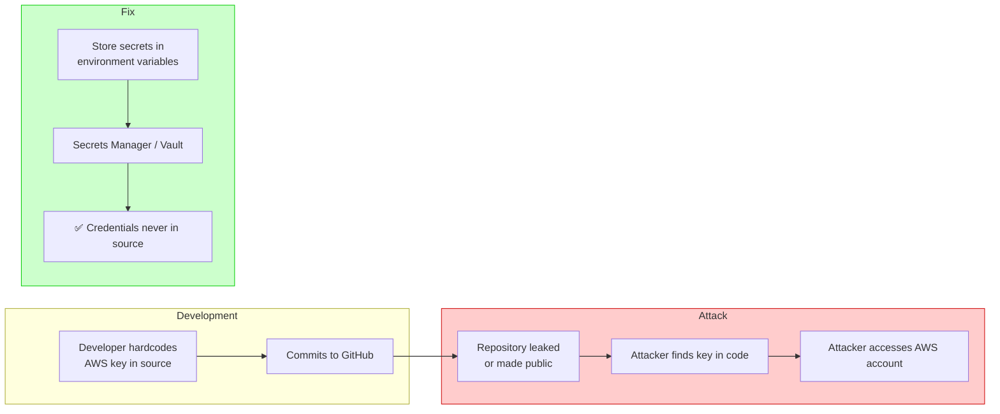
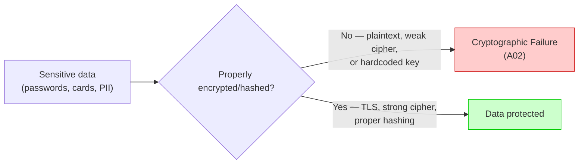
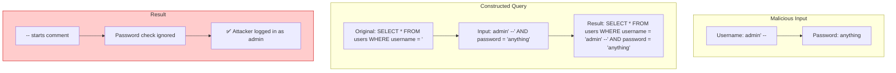
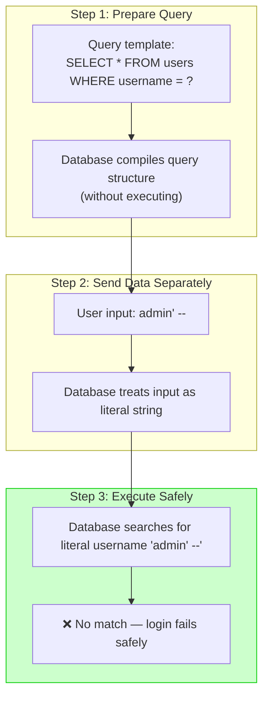

# Security — Section 7: OWASP Top 10 — Part 1

## ✅ Checklist

- [ ] Understand what OWASP is and why the Top 10 is grounded in real-world data
- [ ] Understand the current OWASP Top 10 overview
- [ ] Understand A01: Broken Access Control, with a concrete example beyond IDOR
- [ ] Understand A02: Cryptographic Failures and how it connects to Sections 1–3
- [ ] Understand A03: Injection, especially SQL injection and parameterized queries
- [ ] Understand command injection as another injection variant
- [ ] Common pitfalls — real-world breach examples (Uber, Sony)
- [ ] Hands-on: demonstrate a real SQL injection and its parameterized-query fix in the Codespace

---

## 7.1 What OWASP Is, and Why This List Matters

OWASP (Open Web Application Security Project) is a nonprofit that maintains, among other things, the **OWASP Top 10** — a periodically updated ranking of the most critical web application security risks, based on real-world data contributed by security firms and bug bounty programs across the industry. It's not theoretical — it's a distillation of what actually keeps getting exploited in production, over and over, across thousands of real applications.

This section and Section 8 cover the current (2021) Top 10 in two halves. The goal isn't memorizing a list — it's understanding the _mechanism_ behind each category well enough to recognize it in real code, not just recite the name.

### OWASP Top 10 (2021) — Overview

| Rank    | Category                                   | Description                                              |
| ------- | ------------------------------------------ | -------------------------------------------------------- |
| **A01** | Broken Access Control                      | Authentication without proper authorization checks       |
| **A02** | Cryptographic Failures                     | Weak crypto, missing TLS, hardcoded keys, bad hashing    |
| **A03** | Injection                                  | SQL, command, LDAP injection (covered in this section)   |
| **A04** | Insecure Design                            | Architectural flaws that can't be patched easily         |
| **A05** | Security Misconfiguration                  | Default credentials, open ports, exposed error messages  |
| **A06** | Vulnerable and Outdated Components         | Known CVEs in dependencies (Section 8)                   |
| **A07** | Identification and Authentication Failures | Weak session management, credential stuffing (Section 8) |
| **A08** | Software and Data Integrity Failures       | Supply chain attacks, unsigned updates (Section 8)       |
| **A09** | Security Logging and Monitoring Failures   | Insufficient detection and response (Section 8)          |
| **A10** | Server-Side Request Forgery                | SSRF attacks (Section 8)                                 |

> **Note:** A04–A10 are covered in Section 8.

---

## 7.2 A01: Broken Access Control

This is currently the #1 risk on the list — and it's the exact IDOR/BOLA pattern already covered in Section 5.5, now framed at the OWASP category level. Broken access control means the system fails to properly enforce what an authenticated user is allowed to do or access.

**Concrete example beyond the invoice-ID case from Section 5:** an e-commerce site's admin panel is reachable at `/admin/dashboard`. The developer assumed "nobody will guess this URL," so the page itself never checks whether the logged-in user actually has the admin role — it just renders if you're logged in _at all_. Any regular customer who happens to type that URL gets full admin access. This is called **security through obscurity** — hiding something rather than actually protecting it — and it's a well-known anti-pattern precisely because URLs, API endpoints, and file paths get discovered constantly, whether through crawling, leaked documentation, or simple guessing.

### Visual: Access Control Bypass Pattern

```mermaid
flowchart TB
    subgraph Attack["The Attack"]
        A1["Attacker logs in as regular user"] --> A2["Requests: /admin/dashboard"]
        A2 --> A3["Server checks: Is user logged in? ✅"]
        A3 --> A4["Server returns admin dashboard"]
        A4 --> A5["❌ Attacker has admin access without admin role"]
    end
    subgraph Fix["Proper Authorization"]
        B1["Attacker logs in as regular user"] --> B2["Requests: /admin/dashboard"]
        B2 --> B3["Server checks: Is user logged in? ✅"]
        B3 --> B4["Server checks: Does user have admin role? ❌"]
        B4 --> B5["✅ 403 Forbidden — no access"]
    end
    style Attack fill:#ffcccc,stroke:#cc0000
    style Fix fill:#ccffcc,stroke:#00cc00
```



---

## 7.3 A02: Cryptographic Failures

This category covers cryptography done wrong — not "no cryptography," but cryptography implemented in a way that fails to actually protect data. It directly connects everything from Sections 1, 2, and 3.

**Concrete examples:**

- Transmitting sensitive data (passwords, card numbers) over plain HTTP instead of HTTPS — no TLS at all (Section 3)
- Using a weak or outdated cipher (e.g. still supporting SSL 3.0, or using MD5 for anything security-related) — covered in Sections 2 and 3's pitfalls
- Storing passwords with a fast, unsalted hash instead of bcrypt/Argon2id — the exact Section 2 pitfall
- Hardcoding encryption keys directly in source code, where anyone with repo access (or a leaked repo) gets the key too

### Visual: Hardcoded Secrets Flow



### Visual: Cryptographic Failure Chain



---

## 7.4 A03: Injection

This is one of the oldest, most well-understood vulnerability classes — and still shows up constantly in real code. Injection happens when untrusted user input is inserted directly into a command, query, or interpreter without being properly separated from the code itself.

### SQL Injection — the Classic Example

Imagine a login form built naively like this (pseudocode, illustrating the vulnerability pattern, not real production code):

```python
query = "SELECT * FROM users WHERE username = '" + userInput + "' AND password = '" + passwordInput + "'"
```

If a user types `admin' --` into the username field, the query becomes:

```sql
SELECT * FROM users WHERE username = 'admin' --' AND password = '...'
```

The `--` starts a SQL comment, so everything after it is ignored — including the password check entirely. The attacker logs in as `admin` without ever knowing the actual password. This isn't a hypothetical exploit; it's one of the very first things any security scanner or attacker tries against a login form.

### Visual: SQL Injection Anatomy



**The fix — parameterized queries (prepared statements):** instead of building a query string by concatenating user input directly, the query and the data are sent to the database _separately_. The database engine treats user input strictly as _data_, never as executable query syntax, no matter what characters it contains.

### Visual: Parameterized Query Flow



### Command Injection — Another Injection Variant

Injection isn't limited to SQL. The same fundamental flaw shows up in **command injection**:

```python
# Vulnerable
command = f"ping -c 1 {user_input}"
os.system(command)  # user_input: "8.8.8.8; rm -rf /"
# Executes: ping -c 1 8.8.8.8; rm -rf /
```

```python
# Safe
import subprocess
subprocess.run(["ping", "-c", "1", user_input])  # treats input as data only
```

The underlying lesson is identical every time: **never build executable syntax by concatenating untrusted input directly into it.**

---

## 7.5 Defence in Depth — Multiple Layers, Not Just One

None of these controls alone is sufficient. Security works as a series of layers:

| Layer                | Tool/Control                       | What it protects against                     |
| -------------------- | ---------------------------------- | -------------------------------------------- |
| **Application code** | Parameterized queries, role checks | Injection, access control                    |
| **CI/CD**            | SAST, secrets scanning             | Catching issues before they reach production |
| **Infrastructure**   | WAF, rate limiting                 | Blocking attacks at the network layer        |
| **Monitoring**       | Logging, alerting                  | Detecting attacks in progress                |

> **Important:** WAFs can be bypassed. They're a helpful extra layer, not a replacement for writing secure code.

---

## 7.6 Common Pitfalls (A01–A03)

| Pitfall                                           | Why it happens                                   | How to avoid                                                                                                                               |
| ------------------------------------------------- | ------------------------------------------------ | ------------------------------------------------------------------------------------------------------------------------------------------ |
| **Relying on "hidden" URLs for admin access**     | Assumes obscurity is sufficient protection       | Explicitly check role/permission on every sensitive endpoint, every request                                                                |
| **Building SQL queries via string concatenation** | Feels simpler, especially in quick prototypes    | Always use parameterized queries / prepared statements, no exceptions                                                                      |
| **Trusting client-side validation alone**         | Client-side checks feel "good enough" in testing | Client-side validation is UX only — the server must independently re-validate everything, since a client-side check can always be bypassed |
| **Hardcoding secrets/keys in source code**        | Convenience during development                   | Use environment variables or a secrets manager (Vault, AWS Secrets Manager); never commit secrets to git                                   |
| **Assuming HTTPS alone means "secure"**           | Conflates transport security with all security   | HTTPS protects data in transit only — it says nothing about access control, injection, or how data is stored at rest                       |
| **WAF as a substitute for fixing code**           | Misunderstanding WAF capabilities                | WAFs can be bypassed; they're a defence-in-depth measure, not a complete solution                                                          |
| **Not validating input on the server**            | Assumes client-side validation is sufficient     | Server-side validation is mandatory; client-side is UX only                                                                                |

### Real-World Examples

- **Uber (2016 breach):** attackers found AWS credentials **hardcoded in a private GitHub repository** — a textbook A02 cryptographic/secrets failure. Those credentials granted access to cloud storage containing data on 57 million users and drivers. Uber reportedly paid the attackers to delete the data and stay quiet, which later triggered its own separate legal and regulatory fallout for concealment.

- **Sony Pictures (2011 PSN breach, and separately the 2014 hack):** among many issues, investigators found evidence of passwords stored in plaintext and poor access segmentation — overlapping A01 and A02 failures compounding each other.

- **Countless SQL injection breaches over decades:** SQLi has been used in some of the largest data breaches in history (including large-scale credit card theft rings in the 2000s–2010s) precisely because so many applications, even now, still build queries via string concatenation rather than parameterized queries.

---

## 7.7 Hands-On Practice (Codespace)

### 1. Set up a minimal SQLite database to safely demonstrate the injection concept

```bash
python3 -c "
import sqlite3
conn = sqlite3.connect(':memory:')
c = conn.cursor()
c.execute('CREATE TABLE users (username TEXT, password TEXT)')
c.execute(\"INSERT INTO users VALUES ('admin', 'supersecret')\")
conn.commit()

# VULNERABLE: string concatenation
user_input = \"admin' --\"
query = f\"SELECT * FROM users WHERE username = '{user_input}'\"
print('Vulnerable query:', query)
result = c.execute(query).fetchall()
print('Result (bypassed password check!):', result)
"
```

### 2. Now the SAFE version — parameterized query

```bash
python3 -c "
import sqlite3
conn = sqlite3.connect(':memory:')
c = conn.cursor()
c.execute('CREATE TABLE users (username TEXT, password TEXT)')
c.execute(\"INSERT INTO users VALUES ('admin', 'supersecret')\")
conn.commit()

# SAFE: parameterized query — user input is treated strictly as data
user_input = \"admin' --\"
result = c.execute('SELECT * FROM users WHERE username = ?', (user_input,)).fetchall()
print('Safe query result (correctly finds nothing):', result)
"
```

### 3. Search your own past commits for accidentally hardcoded secrets

```bash
git log -p | grep -iE "api[_-]?key|secret|password" | head -20
```

### 4. Command injection demo (safe demonstration)

```bash
# Show the difference between vulnerable and safe command execution
python3 -c "
import os, subprocess

# VULNERABLE: string concatenation
user_input = '8.8.8.8; echo \"INJECTED\"'
command = f'ping -c 1 {user_input}'
print('Vulnerable command:', command)
# os.system(command)  # Don't actually run this!

# SAFE: argument list
try:
    subprocess.run(['ping', '-c', '1', user_input], capture_output=True, timeout=2)
except Exception as e:
    print('Safe execution: treated as invalid hostname, not injected')
"
```

Running exercises 1 and 2 side by side makes the injection vulnerability concrete rather than abstract — the _exact same malicious input string_ either bypasses authentication entirely, or correctly fails to match anything, purely based on how the query was constructed.

---

## 7.8 DevOps Connection

| DevOps context                                                         | Where this OWASP category appears                                                                                                       |
| ---------------------------------------------------------------------- | --------------------------------------------------------------------------------------------------------------------------------------- |
| **Static Application Security Testing (SAST) in CI/CD**                | Tools like Semgrep, SonarQube scan code for injection patterns and access control issues before merge                                   |
| **Secrets scanning (git-secrets, TruffleHog, GitHub secret scanning)** | Automatically catches hardcoded credentials in commits before they reach a shared repo — a direct defense against the Uber-style breach |
| **Dependency/vulnerability scanning (Snyk, Dependabot)**               | Flags known cryptographic weaknesses or injection-prone library versions before deployment                                              |
| **Infrastructure as Code security scanning (tfsec, Checkov)**          | Catches Terraform/CloudFormation misconfigurations that create broken access control at the infrastructure level                        |
| **WAF (Web Application Firewall) rules**                               | Often specifically tuned to detect and block common SQL injection and access-control-bypass attack patterns in real time                |
| **Secrets Managers (Vault, AWS Secrets Manager, Doppler)**             | Prevent hardcoded secrets by providing a secure way to inject credentials at runtime                                                    |
| **Dynamic Application Security Testing (DAST)**                        | Runs simulated attacks against running applications to find injection vulnerabilities and access control issues                         |

---

## Key Takeaways

1. The OWASP Top 10 is drawn from **real-world exploitation data**, not theoretical risk — that's what makes it worth internalizing.
2. **Broken access control (A01)** is the current #1 risk, and is exactly the IDOR/BOLA pattern from Section 5 — checking authentication but not authorization.
3. **Security through obscurity** (hiding a URL instead of enforcing a permission check) is not real protection.
4. **Cryptographic failures (A02)** connect directly back to Sections 1–3: weak ciphers, missing TLS, bad password hashing, and hardcoded keys all fall in this category.
5. **Injection (A03)**, especially SQL injection, happens when untrusted input is concatenated directly into executable syntax — **parameterized queries** are the fix, always.
6. Client-side validation is a UX nicety, never a security control — the server must independently validate everything, since the client can always be bypassed.
7. Real breaches (Uber, Sony) show these categories compounding — a single hardcoded credential or one unchecked endpoint can cascade into a breach affecting tens of millions of people.
8. **Defence in depth** means multiple layers: secure code + CI/CD scanning + infrastructure controls + monitoring. No single layer is sufficient.

**Next:** [Section 8 — OWASP Top 10 Part 2](Section 8 — OWASP Top 10 Part 2.md)
