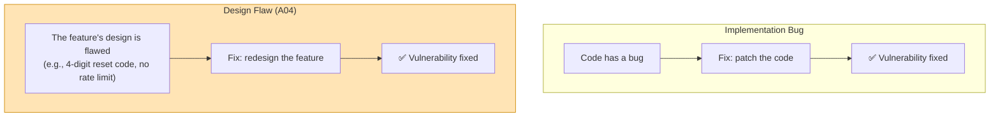
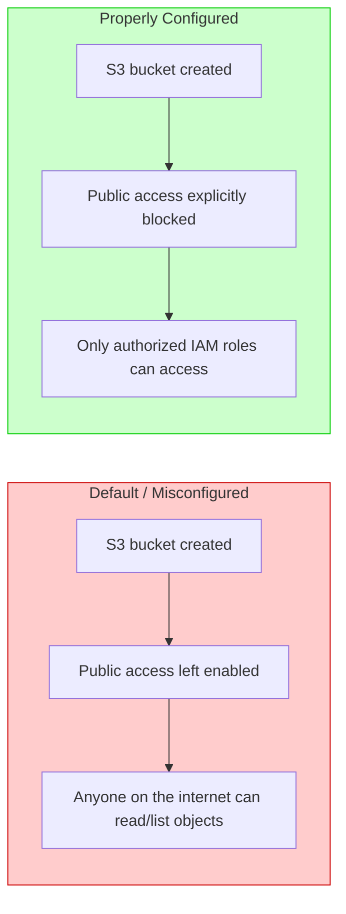
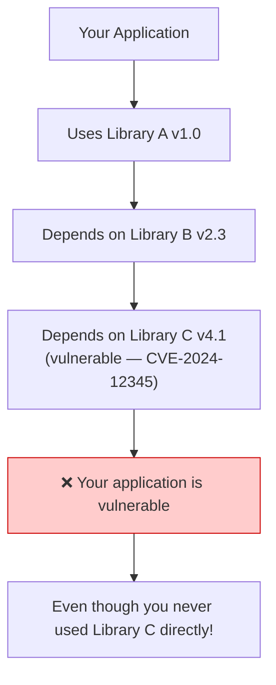
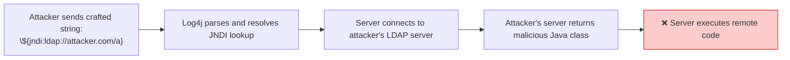
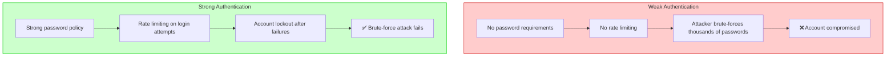
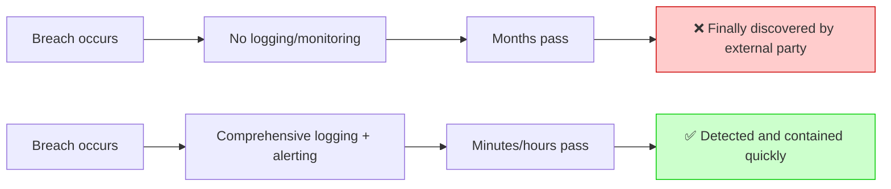
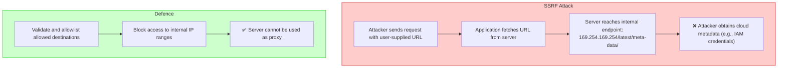

# Security — Section 8: OWASP Top 10 — Part 2

## ✅ Checklist

- [ ] Understand A04: Insecure Design — an architecture-level flaw, not a coding bug
- [ ] Understand A05: Security Misconfiguration and why it's the highest-volume real finding
- [ ] Understand A06: Vulnerable and Outdated Components, with Log4Shell as a case study
- [ ] Understand what a CVE is and how vulnerability tracking works
- [ ] Understand A07: Identification and Authentication Failures as an extension of Section 5
- [ ] Understand A08: Software and Data Integrity Failures, with SolarWinds as a case study
- [ ] Understand A09: Security Logging and Monitoring Failures
- [ ] Understand A10: Server-Side Request Forgery (SSRF)
- [ ] Understand SBOMs (Software Bill of Materials) as a modern defence
- [ ] Hands-on: dependency vulnerability scanning and integrity checks in the Codespace

---

## 8.1 A04: Insecure Design

This category is different from the rest — it's not about a specific coding bug, but about a flaw baked into the _architecture_ before any code was even written. A perfectly implemented, bug-free feature can still be insecure if the underlying design never accounted for abuse in the first place.

**Concrete example:** a password reset flow that sends a 4-digit numeric code via SMS, with no rate limiting on how many times a code can be guessed. There's no coding "bug" here — every line works exactly as written. But the _design_ allows an attacker to simply try all 10,000 possible codes in a short window (a trivial brute-force, since 4 digits = only 10,000 combinations) and take over any account. The fix isn't "patch a bug" — it's redesigning the flow itself: longer codes, rate limiting, account lockouts after repeated failures, and code expiry.

Insecure design is why **threat modeling** — deliberately asking "how could this be abused?" before building a feature — matters as much as writing secure code afterward.

### Visual: Implementation Bug vs Design Flaw



---

## 8.2 A05: Security Misconfiguration

This is exactly what it sounds like: security features exist and work correctly, but were never turned on, or were left at insecure defaults.

**Concrete examples:**

- A cloud storage bucket (AWS S3) left with public read access because the default "block public access" setting was manually disabled and never re-enabled
- A database left accessible on its default port with default admin credentials (`admin`/`admin`) never changed
- Verbose error messages in production revealing internal stack traces, file paths, or database schema — information that should never reach an end user, let alone an attacker probing for weaknesses
- Unnecessary features/services left enabled (an admin API left running on a production server nobody remembered to disable after testing)

This category is consistently one of the highest-volume real-world findings in security audits — not because it's technically sophisticated, but because it's tedious to get every configuration right across every environment, and easy to forget one setting.

### Visual: Misconfiguration — Default vs Hardened



---

## 8.3 A06: Vulnerable and Outdated Components

Modern applications are built on dozens or hundreds of third-party libraries and frameworks. If any one of those has a known, publicly disclosed vulnerability and isn't updated, the application inherits that vulnerability — even if every line of the application's own code is perfectly secure.

### What is a CVE?

**CVE** (Common Vulnerabilities and Exposures) is a dictionary of publicly disclosed cybersecurity vulnerabilities. Each CVE has a unique identifier (e.g., CVE-2021-44228) and a public description. When a vulnerability in a popular library is disclosed with a CVE, it becomes trivial for attackers to scan the internet for applications still running the vulnerable version — the disclosure itself becomes the attack roadmap.

### Visual: Dependency Vulnerability Cascade



**Concrete example — Log4Shell (2021):** a critical remote code execution vulnerability was found in Log4j, an extremely widely-used Java logging library — present, often invisibly, in a huge fraction of enterprise Java applications worldwide. A single log line containing a specially crafted string could let an attacker execute arbitrary code on the server, remotely, with no authentication required. Because Log4j was buried so deep inside so many dependency chains, many organizations didn't even know they were affected until they went looking specifically.

### Visual: Log4Shell Attack Flow



---

## 8.4 A07: Identification and Authentication Failures

This category extends Section 5's authentication concepts into specific failure patterns that show up constantly in practice.

**Concrete examples:**

- Allowing weak passwords with no minimum complexity or length requirements
- No protection against brute-force login attempts (no rate limiting, no account lockout after repeated failures) — an attacker can simply try millions of password guesses against a login form uninterrupted
- Exposing session IDs in URLs (visible in browser history, server logs, and the "Referer" header sent to any third-party resources on the page) instead of secure cookies
- Not invalidating session IDs after logout — the exact same session token remaining valid even after a user explicitly logs out

### Visual: Weak vs Strong Authentication Flow



---

## 8.5 A08: Software and Data Integrity Failures

This covers assumptions of trust that turn out to be misplaced — trusting that code, updates, or data haven't been tampered with, without actually verifying it.

**Concrete example — supply chain attacks:** if a CI/CD pipeline pulls dependencies from a package registry without verifying cryptographic signatures or checksums, an attacker who compromises that registry (or publishes a malicious package with a similar name to a popular one — "typosquatting") can inject malicious code directly into the build, which then gets deployed to production trusted implicitly. This is precisely why package signature verification and lockfiles (pinning exact dependency versions and hashes) matter operationally, not just as a nice-to-have.

### Visual: Supply Chain Attack Flow

```mermaid
flowchart TB
    subgraph Attack["Supply Chain Attack"]
        A1["Attacker compromises build pipeline"] --> A2["Injects malicious code into legitimate update"]
        A2 --> A3["Update signed with legitimate certificate"]
        A3 --> A4["Organizations trust and install the update"]
        A4 --> A5["❌ Malicious code runs in thousands of environments"]
    end
    subgraph Defence["Defence: Verify Integrity"]
        D1["Build pipeline produces artifact"] --> D2["Artifact is signed/hashed"]
        D2 --> D3["Consumers verify signature/hash before installation"]
        D3 --> D4["✅ Only trusted code is executed"]
    end
    style Attack fill:#ffcccc,stroke:#cc0000
    style Defence fill:#ccffcc,stroke:#00cc00
```



**Real-world example — SolarWinds (2020):** attackers compromised SolarWinds' build pipeline itself and inserted malicious code into a legitimate, digitally-signed software update. Because the update was signed with SolarWinds' own legitimate certificate, it was trusted and installed by thousands of organizations — including US government agencies — without any red flags being raised. The trust in the signing process was real; the problem was that the build pipeline producing what got signed had already been compromised upstream.

### SBOM — Software Bill of Materials

An **SBOM** (Software Bill of Materials) is a formal list of all components, libraries, and dependencies used in a software product. It's a critical defence against A06 and A08:

| SBOM Feature               | How it helps                                                                   |
| -------------------------- | ------------------------------------------------------------------------------ |
| **Component inventory**    | Know exactly what's in your application (defence against unknown dependencies) |
| **Version tracking**       | Know which versions are vulnerable when a CVE is disclosed                     |
| **Provenance tracking**    | Know where each component came from                                            |
| **Integrity verification** | Verify components haven't been tampered with                                   |

---

## 8.6 A09: Security Logging and Monitoring Failures

If a breach happens and there's no logging to detect it, the breach can continue undetected for months. The median real-world "time to detect a breach" across the industry has historically been measured in _months_, not hours, and insufficient logging/monitoring is a major reason why.

### Visual: The Monitoring Gap



---

## 8.7 A10: Server-Side Request Forgery (SSRF)

SSRF occurs when an application fetches a URL based on user-supplied input without validating it, allowing an attacker to make the _server itself_ send requests to internal, otherwise-unreachable systems (e.g. cloud metadata endpoints, internal admin panels) that the attacker couldn't reach directly.

### Visual: SSRF Attack Flow



---

## 8.8 Common Pitfalls (A04–A10 Summary)

| Pitfall                                                        | Category | How to avoid                                                                                    |
| -------------------------------------------------------------- | -------- | ----------------------------------------------------------------------------------------------- |
| **No threat modeling before building a sensitive feature**     | A04      | Explicitly ask "how could this be abused?" during design, not just "does it work?"              |
| **Leaving cloud storage/databases at default public settings** | A05      | Explicitly review and lock down every default configuration before production                   |
| **Running outdated dependencies without a patching process**   | A06      | Automated dependency scanning (Dependabot, Snyk) integrated into CI/CD                          |
| **No rate limiting on login attempts**                         | A07      | Implement account lockout / exponential backoff after repeated failed attempts                  |
| **Trusting a package/update without verifying its signature**  | A08      | Verify checksums/signatures, use lockfiles pinning exact versions                               |
| **No alerting on suspicious activity**                         | A09      | Centralized logging (e.g. ELK/Loki) with active alerting, not just passive log storage          |
| **Fetching user-supplied URLs server-side without validation** | A10      | Validate/allowlist destinations before the server makes any outbound request on a user's behalf |
| **No SBOM maintained for application**                         | A06/A08  | Generate and maintain an SBOM for all dependencies                                              |
| **No incident response plan**                                  | A09      | Have a plan for what to do when an alert fires                                                  |

---

## 8.9 Hands-On Practice (Codespace)

### 1. Check installed Python packages for known vulnerabilities

```bash
# Install pip-audit
pip install pip-audit --break-system-packages

# Scan your installed packages against vulnerability databases
pip-audit
# This scans your installed packages against a known-vulnerability database — exactly
# what A06 (vulnerable components) defends against in a real pipeline
```

### 2. Inspect a package's actual pinned version vs "latest"

```bash
# Show currently installed packages with exact versions
pip freeze | head -10

# Compare this to a requirements.txt without pinned versions:
# requests
# flask
# vs pinned:
# requests==2.28.2
# flask==2.2.3
# "latest" dependencies could silently change between builds without anyone noticing
```

### 3. Simulate checking a file's integrity before "trusting" it

```bash
# Create a legitimate update
echo "legitimate update content" > update.sh

# Generate a checksum (the "published hash")
sha256sum update.sh > update.sh.sha256
cat update.sh.sha256

# In a real pipeline, this hash would be compared against a signed, published value
# before the update is ever executed — never trust an update blindly
```

### 4. Search for verbose error handling patterns (A05 hygiene check)

```bash
# Check for DEBUG-level logging or debug mode flags
grep -rn "DEBUG" . 2>/dev/null | head -5
grep -rn "debug=True" . 2>/dev/null | head -5

# Production systems should never run with debug mode enabled — it commonly
# exposes stack traces and internal paths directly to end users
```

### 5. Generate a simple SBOM (Software Bill of Materials)

```bash
# For Python projects, pip freeze is a simple SBOM
pip freeze > requirements.txt.sbom
cat requirements.txt.sbom

# More comprehensive tools exist (CycloneDX, SPDX) but this is the concept
```

---

## 8.10 DevOps Connection

| DevOps context                                                             | Where this OWASP category appears                                                                                            |
| -------------------------------------------------------------------------- | ---------------------------------------------------------------------------------------------------------------------------- |
| **Dependabot / Snyk / pip-audit in CI/CD**                                 | Directly defends against A06 by flagging known-vulnerable dependencies automatically                                         |
| **Infrastructure as Code scanning (tfsec, Checkov)**                       | Catches A05-style misconfigurations (public buckets, open security groups) before they're ever deployed                      |
| **Signed container images (Cosign/Sigstore)**                              | Directly defends against A08-style supply chain attacks by verifying image provenance before deployment                      |
| **Centralized logging stacks (ELK, Loki) + alerting (Prometheus/Grafana)** | The concrete infrastructure answer to A09 — Phase 2's Monitoring pillar covers this in full                                  |
| **Rate limiting at the API gateway / ingress level**                       | An infrastructure-level defense against A07's brute-force login pattern, enforced before requests even reach the application |
| **SLSA framework (Supply-chain Levels for Software Artifacts)**            | An industry framework specifically formalizing defenses against A08-style build pipeline compromise, post-SolarWinds         |
| **SBOM generation in CI/CD**                                               | Tools like Syft, CycloneDX generate SBOMs during builds for vulnerability tracking                                           |
| **Threat modeling tools (e.g., OWASP Threat Dragon)**                      | Formalizing A04's threat modeling process with structured tools                                                              |

---

## Key Takeaways

1. **Insecure design (A04)** is an architecture-level flaw, not a coding bug — threat modeling before building matters as much as secure coding afterward.
2. **Security misconfiguration (A05)** is high-volume in real audits precisely because it's tedious, not because it's sophisticated — checking every default setting matters.
3. **Vulnerable components (A06)** mean your application inherits every flaw in every dependency it uses — Log4Shell showed how deeply and invisibly this can propagate.
4. **CVE** identifiers are how the industry tracks known vulnerabilities — when a CVE is published for a library you use, you need to update, immediately.
5. **Identification/authentication failures (A07)** extend Section 5 into concrete patterns: weak passwords, no rate limiting, exposed session IDs.
6. **Software/data integrity failures (A08)** are about misplaced trust — SolarWinds showed that even a legitimately signed update can carry malicious code.
7. **SBOMs** (Software Bill of Materials) are a critical defence for knowing what's in your application and detecting supply chain attacks.
8. **Logging/monitoring failures (A09)** turn a contained incident into a months-long undetected breach. Have a plan for what to do when an alert fires.
9. **SSRF (A10)** turns the server itself into an attacker's proxy for reaching otherwise-unreachable internal systems.
10. Across both OWASP sections, a consistent theme: most real breaches trace back to a known, well-documented category — the exploited weakness is rarely novel.

**Next:** [Section 9 — Network & System Hardening](Section 9 — Network & System Hardening.md)
