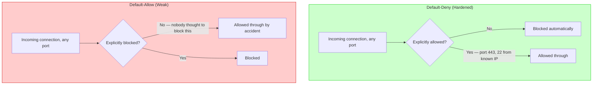
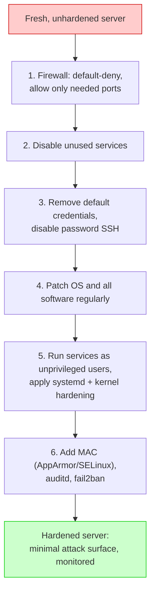
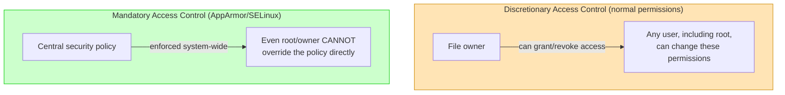

# Security — Section 9: Network & System Hardening

## ✅ Checklist
- [ ] Understand what "hardening" means and why attack surface reduction matters
- [ ] Understand default-deny firewall policy vs default-allow
- [ ] Know the main attack-surface-reduction practices beyond the firewall
- [ ] Understand port hygiene and why unexpected open ports are a common real failure
- [ ] Understand CIS Benchmarks — what they are and why they matter
- [ ] Understand systemd service-level hardening (ProtectSystem, PrivateTmp, NoNewPrivileges)
- [ ] Understand kernel hardening basics (sysctl, ASLR, NX bit)
- [ ] Understand fail2ban / rate-limiting as a practical SSH defence
- [ ] Understand auditd — logging what actually happens on the system
- [ ] Understand Mandatory Access Control (AppArmor/SELinux) and how it differs from normal Linux permissions
- [ ] Common pitfalls — real-world examples (Mirai, MongoDB ransom attacks, Shodan)
- [ ] Hands-on: audit listening ports, SSH config, running services, and try fail2ban/auditd in the Codespace

---

## 9.1 What "Hardening" Means, With a Concrete Scenario

Say you spin up a brand-new Ubuntu server for a side project. Fresh out of the box, it likely has: a handful of unnecessary services running, a root account reachable via SSH with password authentication enabled, default configurations that prioritize ease of use over security, and no firewall actively restricting incoming connections. Within minutes of that server getting a public IP address, automated bots across the internet are already scanning it — this isn't paranoia, it's measurable: honeypot research consistently shows a fresh public IP gets its first unsolicited connection attempt within *seconds to minutes*, not days.

**Hardening** is the deliberate, systematic process of reducing a system's **attack surface** — the total set of points where an attacker could possibly get in — by disabling what isn't needed, restricting what remains, and configuring defenses actively rather than relying on defaults.

**Worth noting up front:** port scanning is not the only threat model here. Phishing — tricking a legitimate user into handing over credentials or running malicious code — bypasses every network-level hardening measure in this section entirely, because it targets the human, not the machine. Hardening reduces the *technical* attack surface; it doesn't replace user security awareness. Both matter, but this section focuses specifically on the systems side.

---

## 9.2 Firewalls, Revisited Through a Security Lens

Section 1 of the Networking pillar covered firewalls at a functional level — stateful vs stateless, ACL rule evaluation. Here, the lens shifts to *policy design*.

**Default-deny is the foundational hardening principle:** block everything by default, then explicitly allow only what's specifically needed. The opposite approach — default-allow, block known-bad things — is fundamentally weaker, because it requires anticipating every possible bad thing in advance, which is impossible. Default-deny only requires knowing what you *do* need, which is a much smaller, more knowable list.

**Concrete example:** a web server genuinely needs inbound port 443 (HTTPS) open, and maybe port 22 (SSH) restricted to a specific known IP range for administration. Every other port — including whatever the server happened to have running by default — should be closed. If a misconfigured service accidentally starts listening on port 8080, default-deny means it's still unreachable from the internet regardless, because the firewall never explicitly allowed that port through in the first place.

### Visual: Default-Deny vs Default-Allow



---

## 9.3 Reducing Attack Surface — Beyond the Firewall

Hardening extends well past network rules into the system itself:

- **Disable unused services** — if a server doesn't need FTP, a mail server, or a database server running locally, those services shouldn't even be installed, let alone running. Every running service is a potential vulnerability waiting to be discovered.
- **Remove default accounts and credentials** — many appliances and software ship with a well-known default admin account. Attackers maintain lists of exactly these defaults and try them automatically against every reachable device — this is precisely how large botnets like **Mirai** (2016) compromised hundreds of thousands of IoT devices: scanning the internet and logging in with factory-default credentials nobody had bothered to change.
- **Disable root SSH login, require key-based authentication** — password-based SSH is subject to brute-forcing (bots constantly try common username/password combinations against port 22 across the entire internet); key-based authentication (the asymmetric cryptography from Section 1, applied here again) is effectively immune to brute-forcing since there's no password to guess.
- **Keep the system patched** — directly connects back to Section 8's A06 (vulnerable/outdated components); unpatched OS-level vulnerabilities are exploited constantly once publicly disclosed.
- **Principle of least privilege at the OS level** — services should run as unprivileged, dedicated users rather than root, so that even if one service is compromised, the attacker doesn't automatically get full system control (directly connects to Section 6).

---

## 9.4 Port Hygiene

A **port scan** is one of the very first things an attacker (or a legitimate penetration tester) does against any target — systematically checking which ports respond, to map out what's running and potentially exploitable.

**Concrete scenario:** running `nmap` against a server reveals port 22 (SSH, expected), port 443 (HTTPS, expected) — but also port 3306 (MySQL) unexpectedly open to the entire internet. That database was likely never meant to be publicly reachable; it's just that nobody explicitly closed it. This single oversight has been the root cause of numerous real breaches where databases were found completely exposed with no authentication at all, simply because "internal" services were never actually firewalled off from the public internet.

### Visual: Reducing Attack Surface, Layer by Layer



---

## 9.5 CIS Benchmarks — What They Are and Why They Matter

Everything covered so far (default-deny, disabling services, key-based SSH) is *correct* advice, but in practice, nobody wants to invent a hardening checklist from scratch for every OS, database, and cloud platform they touch. This is exactly the gap **CIS Benchmarks** fill.

**CIS (Center for Internet Security)** is a nonprofit that publishes detailed, consensus-driven hardening guides — specific, numbered, testable configuration recommendations for a huge range of systems: Ubuntu, Windows Server, Docker, Kubernetes, AWS, and dozens more. Each benchmark item typically includes: the exact setting to check, why it matters, the exact command to verify current state, and the exact command to remediate it.

**Why this matters practically:** rather than a security engineer manually reasoning through "should SSH root login be disabled? Probably?" for every single server, CIS Benchmarks provide an already-vetted, numbered answer — "Ensure permit root login is disabled (CIS Benchmark 5.2.8)" — with the exact config file and setting to check. This turns hardening from subjective judgment calls into an auditable, scorable checklist. Automated tools (like `OpenSCAP` or commercial CSPM tools, covered in 9.10) can scan a system and report a compliance percentage against a specific CIS Benchmark level, which is often what a security audit or compliance requirement (SOC 2, PCI-DSS) actually asks organizations to demonstrate.

CIS Benchmarks typically define two "levels": **Level 1** (safe for nearly any environment, minimal functional impact) and **Level 2** (more restrictive, may affect functionality, intended for higher-security environments).

---

## 9.6 Systemd Service Hardening

Most modern Linux distributions (including Ubuntu) run services under **systemd**, the init system responsible for starting, stopping, and supervising services. Systemd includes a set of hardening directives that can be applied *per service*, sandboxing what that specific service is allowed to do at the OS level — independent of what the service's own code does or doesn't restrict.

| Directive | What it does | Why it matters |
|---|---|---|
| `ProtectSystem=strict` | Mounts the entire filesystem read-only for the service, except explicitly allowed paths | Even if the service is compromised, the attacker can't modify system files |
| `PrivateTmp=true` | Gives the service its own isolated `/tmp` directory, invisible to other processes | Prevents a classic local attack vector: symlink attacks and insecure temp file races in shared `/tmp` |
| `NoNewPrivileges=true` | Prevents the service (and anything it spawns) from gaining more privileges than it started with | Blocks privilege escalation attempts even if a vulnerability in the service would normally allow it |
| `ProtectHome=true` | Makes user home directories inaccessible to the service | Limits what a compromised service can read/exfiltrate |
| `PrivateNetwork=true` | Gives the service its own isolated network namespace | Useful for services that have no legitimate reason to make outbound network calls at all |

**Concrete example:** a systemd unit file for a simple internal API might include:
```ini
[Service]
ExecStart=/usr/bin/my-api
ProtectSystem=strict
PrivateTmp=true
NoNewPrivileges=true
ProtectHome=true
```
Even if `my-api` has an unpatched remote code execution vulnerability (Section 8's A06), these directives mean an attacker who gains code execution inside that service still can't modify system files, escalate privileges, or read other users' home directories — the OS itself enforces these boundaries regardless of what the compromised application tries to do.

---

## 9.7 Kernel Hardening

Some hardening happens below even the service level, at the Linux kernel itself.

- **ASLR (Address Space Layout Randomization):** randomizes where a program's code and data are loaded into memory each time it runs. Many classic memory-corruption exploits (buffer overflows) rely on knowing exact memory addresses in advance to redirect execution to attacker-controlled code. ASLR makes those addresses unpredictable, turning a previously reliable exploit into an unreliable guessing game.
- **NX bit (No-eXecute)**, also called DEP (Data Execution Prevention): marks memory regions used for data as non-executable. A classic buffer-overflow attack works by injecting malicious code into a data region and then tricking the program into executing it; the NX bit makes that specific technique fail outright, since the CPU refuses to execute anything in a memory region marked as data-only.
- **sysctl hardening:** the Linux kernel exposes hundreds of tunable parameters via `sysctl`, several of which are security-relevant. Examples: `net.ipv4.conf.all.rp_filter=1` (enables reverse path filtering, helping prevent IP spoofing — connecting back to Networking pillar concepts), `kernel.dmesg_restrict=1` (prevents unprivileged users from reading kernel logs, which can otherwise leak memory addresses useful for exploitation).

These protections work *together* with everything above — ASLR and the NX bit don't replace patching a vulnerability, but they make many *classes* of vulnerabilities significantly harder to actually exploit even before a patch is available, which matters in the real gap between a vulnerability being disclosed and a patch being applied.

---

## 9.8 Fail2ban / Rate-Limiting — A Practical SSH Defence

Key-based SSH authentication (9.3) already defeats brute-force password guessing outright. But if password authentication must remain enabled for any reason, or simply as a defence-in-depth layer regardless, **fail2ban** provides an important practical safeguard.

**How it works:** fail2ban continuously monitors log files (e.g. `/var/log/auth.log` for SSH) for patterns matching failed login attempts. After a configurable number of failures from the same source IP within a time window, it automatically adds a temporary firewall rule blocking that IP entirely — turning an attacker's brute-force script from "unlimited unattended guesses" into "a handful of guesses, then locked out."

**Concrete example:** default fail2ban SSH configuration might allow 5 failed attempts within 10 minutes before banning the source IP for an hour. A brute-force bot trying thousands of password guesses gets shut down after its 6th attempt — the attack becomes computationally pointless almost immediately, since the ban resets the attacker's guess count effectively to zero, repeatedly.

This is a genuinely different layer of defence than the firewall's default-deny policy (9.2) — that policy decides *which ports* are reachable at all; fail2ban decides *how many times a specific source* gets to try against a port that's intentionally, legitimately open.

---

## 9.9 Auditd — Logging What Actually Happens on the System

Section 8's A09 (Logging and Monitoring Failures) covered *why* logging matters at the application level. **auditd** is the Linux kernel's own auditing subsystem, operating at a lower, OS-wide level — it can log specific system calls, file access attempts, and command executions across the entire system, regardless of which application or user triggered them.

**Concrete example:** an auditd rule can be configured to log every single read or write attempt against `/etc/shadow` (the file storing password hashes) — including exactly which process and user attempted it, and whether it succeeded or was denied. If an unauthorized process ever attempts to read that file, there's now a permanent, tamper-evident record of exactly when it happened and by what — critical for incident response after a suspected breach, since without this, investigators are often left trying to reconstruct "what actually happened" from incomplete or entirely absent evidence.

This connects directly to Section 9.5's compliance angle too — many compliance frameworks (PCI-DSS in particular, relevant to any system handling payment card data) explicitly require this kind of system-level audit logging to be enabled and actively reviewed, not merely available.

---

## 9.10 Mandatory Access Control — AppArmor / SELinux

Everything covered in the Linux pillar's permissions section (and Section 6's ACLs) is **Discretionary Access Control (DAC)** — the resource owner decides who gets access, and that owner (or root) can always change those permissions. **Mandatory Access Control (MAC)** is a fundamentally different, additional layer: a system-wide security policy, defined centrally, that constrains *even the resource owner and root* from actions outside the policy — no individual user, including root, can simply override it on a whim the way they could with normal file permissions.

- **AppArmor** (default on Ubuntu): confines individual programs to a defined profile — a specific list of files, capabilities, and network access that program is allowed to use. If a web server's AppArmor profile doesn't include access to `/etc/shadow`, the web server process cannot read that file, full stop — even if a vulnerability in the web server's own code would otherwise have allowed it, and even though the file's normal DAC permissions might technically permit that user to read it.
- **SELinux** (default on Red Hat/CentOS/Fedora-based systems): a more granular, label-based MAC system — every process and file gets a security label, and policy rules define exactly which labels can interact with which other labels, in which ways.

**Why this is a genuinely distinct hardening layer, not redundant with everything above:** systemd hardening (9.6) restricts what a *specific service* can do at the process/filesystem level; the firewall (9.2) restricts *network* reachability; MAC restricts what a program can do *even if it's been compromised and is now running as a legitimate, otherwise-permitted user* — it's specifically designed to contain the damage from a successful exploit that DAC and systemd sandboxing didn't fully prevent, adding a genuine extra layer rather than duplicating the others.

### Visual: DAC vs MAC



---

## 9.11 Hardening Checklist Summary

| Layer | What to do | Example command / config |
|---|---|---|
| **Firewall** | Default-deny, explicitly allow only needed ports | `ufw default deny incoming` then `ufw allow 443` |
| **SSH** | Disable root login, disable password auth, use keys only | `PermitRootLogin no`, `PasswordAuthentication no` in `sshd_config` |
| **Services** | Disable/remove anything unnecessary | `systemctl disable <service>` |
| **Credentials** | Change every default account/password immediately | Vendor-specific first-boot step, never skipped |
| **Patching** | Automate OS and dependency updates | `unattended-upgrades` (Ubuntu), Dependabot/Snyk for app deps |
| **Systemd hardening** | Sandbox individual services | `ProtectSystem=strict`, `PrivateTmp=true`, `NoNewPrivileges=true` in unit files |
| **Kernel hardening** | Enable ASLR, NX, harden sysctl values | `sysctl kernel.randomize_va_space=2`, `net.ipv4.conf.all.rp_filter=1` |
| **Brute-force defence** | Rate-limit/ban repeated failed logins | `fail2ban` with SSH jail enabled |
| **Auditing** | Log security-relevant system calls/file access | `auditd` rules on sensitive files (`/etc/shadow`, `/etc/passwd`) |
| **Mandatory Access Control** | Confine programs beyond normal permissions | AppArmor profile per service (Ubuntu default), or SELinux policy |
| **Compliance baseline** | Benchmark against an industry standard | CIS Benchmark scan via `OpenSCAP` or a CSPM tool |

---

## 9.12 Common Pitfalls

| Pitfall | Why it happens | How to avoid |
|---|---|---|
| **Leaving default credentials unchanged** | Convenience, forgetting during initial setup | Change every default credential immediately on first boot/install |
| **Password-based SSH left enabled, with no fail2ban either** | Perceived convenience over key-based auth | Disable password auth entirely; if it must remain, add fail2ban as a compensating control |
| **Databases/internal services exposed to 0.0.0.0** | Assuming "it's just for internal use" is sufficient protection | Explicitly bind to internal-only interfaces and firewall accordingly, never rely on assumption alone |
| **Running services as root unnecessarily, no systemd sandboxing** | Simplicity during initial setup, never revisited | Create dedicated, unprivileged users per service; apply systemd hardening directives |
| **"We'll patch it later"** | Patching feels disruptive, gets deprioritized | Automate patching where possible; treat patching as routine maintenance, not an occasional project |
| **No port scanning of your own infrastructure** | Assuming you already know what's open | Periodically scan your own systems — you'll often find exactly this kind of drift |
| **Assuming DAC permissions alone are "enough"** | Not distinguishing DAC from MAC | Layer AppArmor/SELinux for genuine defence-in-depth against a compromised, otherwise-permitted process |
| **No audit logging on sensitive files** | Not considered until after an incident | Configure auditd rules proactively, before an incident forces the question |

### Real-World Examples

- **Mirai botnet (2016):** compromised an estimated 600,000+ IoT devices (cameras, routers, DVRs) purely by scanning the internet and logging in with unchanged factory-default credentials — no sophisticated exploit needed at all. The resulting botnet launched some of the largest DDoS attacks recorded at the time, taking down major internet infrastructure (including a large chunk of Dyn's DNS service, affecting Twitter, Reddit, Netflix, and others).
- **MongoDB ransom attacks (2017 and recurring since):** tens of thousands of MongoDB databases were found completely exposed to the public internet with no authentication configured at all — a pure port-hygiene and default-configuration failure. Attackers simply connected, copied or deleted the data, and left ransom notes demanding payment for its return.
- **Shodan (a real, legal search engine):** indexes exactly this kind of exposed infrastructure across the entire internet — publicly queryable databases, exposed webcams, unsecured industrial control systems. It exists specifically to demonstrate how much unhardened infrastructure is sitting exposed at any given moment; security researchers use it defensively, but it illustrates exactly what attackers are also scanning for.

---

## 9.13 Hands-On Practice (Codespace)

```bash
# 1. Check what ports are actively listening on your Codespace
sudo ss -tulnp
# Every line here is a potential attack surface point — ask for each one: is this necessary?

# 2. Simulate a basic port scan against localhost (nmap, safe against your own machine)
sudo apt-get install -y nmap 2>/dev/null
nmap localhost

# 3. Inspect SSH configuration for hardening opportunities
sudo cat /etc/ssh/sshd_config | grep -E "PermitRootLogin|PasswordAuthentication"
# In a hardened server, PermitRootLogin should be 'no' and PasswordAuthentication should be 'no'

# 4. List all running services, to identify anything unnecessary
systemctl list-units --type=service --state=running

# 5. Check current kernel hardening-relevant sysctl values
sysctl kernel.randomize_va_space   # ASLR status: 2 = fully enabled
sysctl net.ipv4.conf.all.rp_filter # reverse path filtering (anti-spoofing)

# 6. Install and inspect fail2ban (rate-limiting brute-force defence)
sudo apt-get install -y fail2ban 2>/dev/null
sudo systemctl status fail2ban
sudo fail2ban-client status sshd  # shows current ban status for the SSH jail

# 7. Check if auditd is available and inspect example rules
sudo apt-get install -y auditd 2>/dev/null
sudo auditctl -l   # list currently active audit rules

# 8. Check AppArmor status and loaded profiles (Ubuntu default MAC system)
sudo aa-status
# Lists which profiles are enforced vs complain-mode, and which processes are confined
```

---

## 9.14 DevOps Connection (Expanded)

| DevOps context | Where hardening appears |
|---|---|
| **Security Groups (AWS) / Network Policies (Kubernetes)** | The cloud-native equivalent of default-deny firewalls — explicit allow-lists, deny by default |
| **CIS Benchmarks + OpenSCAP / CSPM tools** | Automated compliance scanning against CIS Benchmarks; CSPM (Cloud Security Posture Management) tools like Wiz, Prisma Cloud, or AWS Security Hub continuously check cloud configuration against these baselines |
| **Immutable infrastructure (Terraform + golden AMIs/images)** | Rather than patching servers in place, rebuild from a hardened, versioned base image — reduces configuration drift over time |
| **Container image scanning (Trivy, Grype)** | Extends hardening principles to container images — flags unnecessary packages and known vulnerabilities before deployment |
| **Bastion hosts / jump boxes** | A single, tightly hardened and monitored entry point for SSH access, rather than exposing every server directly |
| **Automated patch management (AWS Systems Manager, Ansible)** | Turns "we'll patch it later" into a scheduled, automated, auditable process |
| **Kubernetes SecurityContext / PodSecurityStandards** | The container-orchestration equivalent of systemd hardening directives — `runAsNonRoot`, `readOnlyRootFilesystem`, dropped Linux capabilities |
| **seccomp / AppArmor profiles in Docker/Kubernetes** | MAC concepts applied directly to containers — restricting exactly which syscalls or files a containerized process can touch |
| **Centralized audit log aggregation (CloudTrail, GuardDuty, ELK)** | The cloud/fleet-scale equivalent of auditd — aggregating audit-relevant events across an entire infrastructure, not just one host |
| **Compliance frameworks (SOC 2, PCI-DSS, ISO 27001)** | Frequently require demonstrable hardening evidence — CIS Benchmark compliance scores and audit logs are exactly the artifacts auditors ask to see |

---

## Key Takeaways

1. **Hardening** is the deliberate reduction of attack surface — disabling what isn't needed, restricting what remains, configuring actively rather than relying on defaults.
2. **Default-deny** is the foundational firewall principle: block everything, explicitly allow only what's needed.
3. **CIS Benchmarks** turn subjective hardening judgment calls into vetted, numbered, auditable, scorable checklists.
4. **Systemd hardening** (`ProtectSystem`, `PrivateTmp`, `NoNewPrivileges`) sandboxes individual services at the OS level, containing damage even if the service's own code is exploited.
5. **Kernel hardening** (ASLR, NX bit, sysctl tuning) makes entire classes of memory-corruption exploits significantly harder, independent of patching any specific vulnerability.
6. **Fail2ban** is a practical, low-effort defence against brute-force login attempts, complementing (not replacing) key-based SSH authentication.
7. **Auditd** provides OS-wide, tamper-evident logging of security-relevant events — essential for incident response and often a compliance requirement outright.
8. **Mandatory Access Control (AppArmor/SELinux)** is a genuinely distinct layer from normal file permissions — it constrains what a program can do even if it's already been compromised and is running as an otherwise-permitted user.
9. Port scanning and technical hardening address the *system* attack surface — phishing and social engineering remain a separate, human-targeted threat vector that hardening alone doesn't address.
10. Real-world incidents (Mirai, MongoDB ransom attacks) show that most large-scale exploitation isn't sophisticated — it's automated scanning finding basic hardening failures at massive scale.
11. This section closes the loop on the entire Security pillar: cryptography (1–4), identity (5–6), and application-level vulnerabilities (7–8) all still depend on the underlying system and network actually being hardened — a perfectly secure application on an unhardened server is still vulnerable.

---

## 🎉 Pillar 3 — Security Concepts: COMPLETE (9/9 sections)